# Vitis HLS Design Flow Lab

## Introduction

This lab provides a basic introduction to high-level synthesis using the Vitis HLS tool flow. You will use Vitis HLS in GUI mode to create a project. You will simulate, synthesize, and implement the provided design.

## Objectives

After completing this lab, you will be able to:

* Create a new project using Vitis HLS in GUI mode
* Simulate a C design by using a self-checking test bench
* Synthesize the design
* Perform design analysis using the Analysis Perspective view
* Perform co-simulation on a generated RTL design by using a provided C test bench
* Implement a design

## Steps

### Create a New Project

#### Create a new project in Vitis HLS targeting PYNQ-Z2 board
1. Launch Vitis HLS: Select **Start > Xilinx Design Tools > Vivado 2021.2 > Vitis HLS 2021.2**

   You can also invoke Vitis HLS from Vitis HLS Command prompt by selecting **Start > Xilinx Design Tools > Vitis HLS 2021.2 Command Prompt** and then typing
   **vitis_hls** in the terminal.

    

    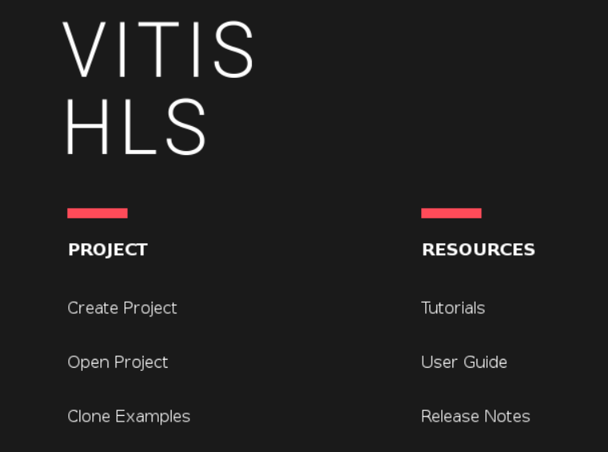
    

    

    <i>Getting Started view of Vitis HLS</i>
    

2. In the Getting Started GUI, click on **Create Project**. The **New Vitis HLS Project** wizard opens.
3. Click the *Browse…* button of the Location field and browse to **{labs}\\lab1** on a Windows machine or **{labs}/lab1** on a Linux machine creating sub-folders as necessary, and then click **OK**.

   Note: From this point onward reference will be made to Linux name.

4. For Project Name, type **matrixmul**.
    

    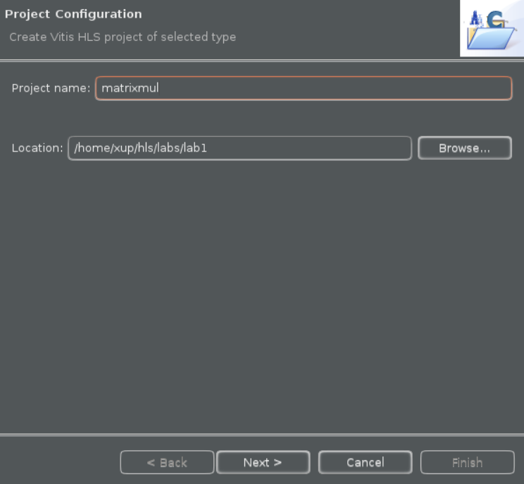
    

    

    <i>New Vitis HLS Project wizard</i>
    

5. Click **Next**.
6. In the *Add/Remove Design Files* window, type **matrixmul** as the *Top Function* name (the provided source file contains the function, called matrixmul, to be synthesized).
7. Click the *Add Files…* button, select **matrixmul.cpp** file from the **{labs}/lab1** folder, and then click **Open**.
8. Click **Next**.
9. In the *Add/Remove Testbench Files* for the testbench, click the *Add Files…* button, select **matrixmul_test.cpp** file from the **/home/xup/hls/labs/lab1** folder and click **Open**.
10. Select the **matrixmul_test.cpp** in the files list window and click the *Edit CFLAG…* button, type **-DHW_COSIM**, and click **OK**. (This defines a compiler flag that will be used later.)
11. Click **Next**.
12. In the *Solution Configuration* page, leave **Solution** Name field as *solution1* and set the clock period as 10.
13. Click the **…** (browse) button of the *Part Selection* section.
14. In the *Device Selection* page, select **Parts Specify** field, enter  **xc7z020clg400-1** in the *Search* field and click **OK**.
    

    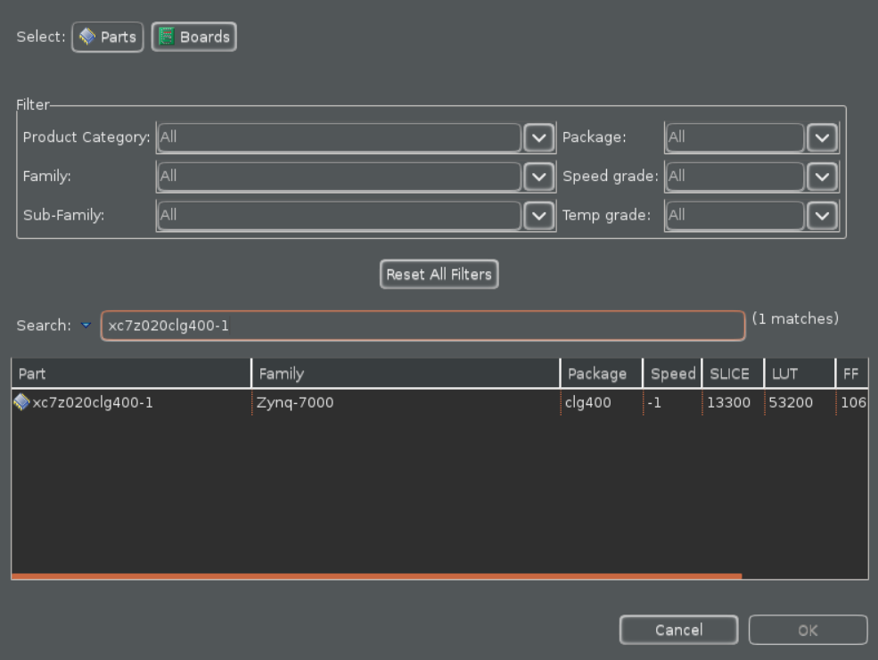
    

    

    <i>Using Parts Specify option in Part Selection Dialog</i>
    

15. Click **Finish**.
    You will see the created project in the *Explorer* view. Expand various sub-folders to see the entries under each sub-folder.
    

    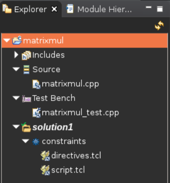
    

    

    <i>Explorer Window</i>
    

16. Double-click on the **matrixmul.cpp** under the source folder to open its content in the information pane.
    

    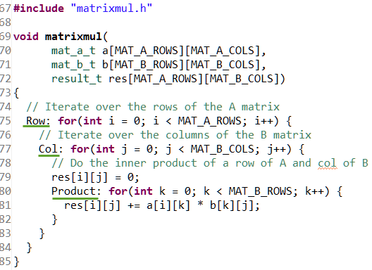
    

    

    <i>The Design under consideration</i>
    

    It can be seen that the design is a matrix multiplication implementation, consisting of three nested loops. The Product loop is the inner most loop performing the actual Matrix elements product and sum. The Col loop is the outer-loop which feeds the next column element data with the passed row element data to the Product loop. Finally, Row is the outer-most loop. The res[i][j]=0 (line 41) resets the result every time a new row element is passed and new column element is used.

### Run C Simulation

1. Select **Project > Run C Simulation**, and click **OK** in the C Simulation Dialog window.
    The files will be compiled and you will see the output in the Console window.
    

    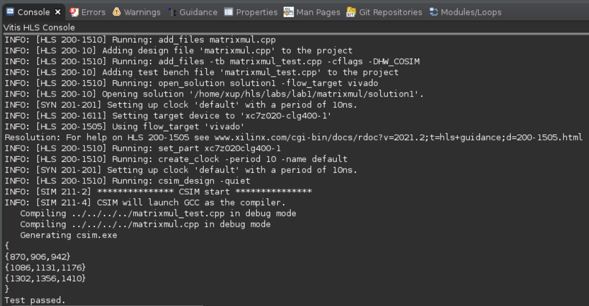
    

    

    <i>Program output</i>
    

2. Double-click on **matrixmul_test.cpp** under **testbench** folder in the Explorer to see the content.

    You should see two input matrices initialized with some values and then the code that executes the algorithm. If HW_COSIM is defined (as was done during the project set-up) then the **matrixmul** function is called and compares the output of the computed result with the one returned from the called function, and prints **Test passed** if the results match.
    If **HW_COSIM** had not been defined then it will simply output the computed result and not call the **matrixmul** function.

### Run Debugger

#### Run the application in debugger mode and understand the behavior of the program.
1. Select **Project > Run C Simulation**. Select the **Launch Debugger** option and click **OK**.

   The application will be compiled with **–g** option to include the debugging information, the compiled application will be invoked, and the debug perspective will be opened automatically.
2. The *Debug* perspective will show the **matrixmul_test.cpp** in the source view, **argc** and **argv** variables defined in the *Variables* view, thread created and the program suspended at the main() function entry point in the *Debug* view.
    

    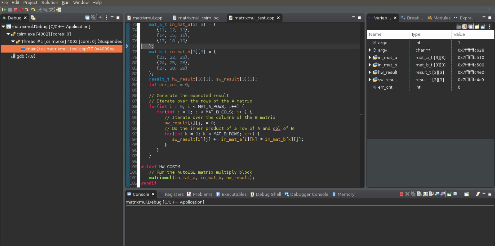
    

    

    <i>A Debug perspective</i>
    

3. Scroll-down in the *source* view, and double-click in the blue margin at line 67 where it is about to output **“{“** in the output console window. This will set a break-point at line 67.

    The breakpoint is marked with a blue circle, and a tick.

    

    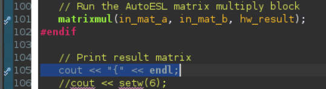
    

    

    

4. Similarly, set a breakpoint at line 63 in the matrixmul() function.
5. Using the **Step Over** (F6) button several times, observe the execution progress, and observe the variable values updating, as well as computed software result.
    

    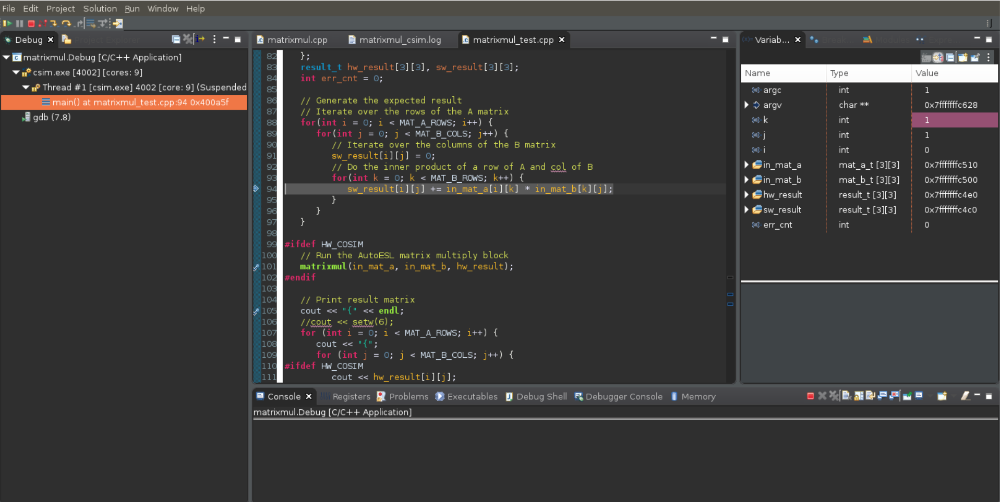
    

    

    <i>Debugger’s intermediate output view</i>
    

6. Now click the **Resume** button or F8 to complete the software computation and stop at line 63.
7. Observe the following computed software result in the variables view.
    

    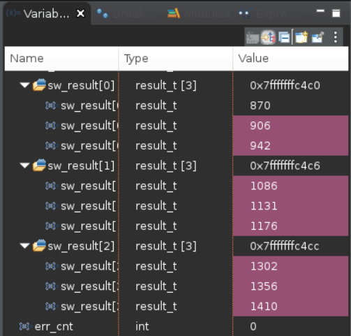
    

    

    <i>Software computed result</i>
    

8. Click on the **Step Into** (F5) button to traverse into the **matrixmul** module, the one that we will synthesize, and observe that the execution is paused on line 37 of the module.
9. Using the **Step Over** (F6) several times, observe the computed results. Once satisfied, you can use the **Step Return** (F7) button to return from the function.
10. The program execution will suspend at line 105 as we had set a breakpoint. Observe the software and hardware (function) computed results in the Variables view.
    

    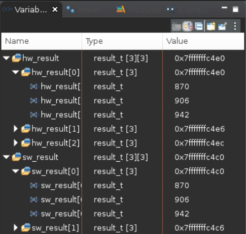
    

    

    <i>Computed results</i>
    

11. Set a breakpoint on line 96 (return err_cnt;), and click on the **Resume** button.
    The execution will continue until the breakpoint is encountered. The console window will show the results as seen earlier (Figure 7).
12. Press the **Resume** button or **Terminate** button to finish the debugging session.

### Synthesize the Design

#### Switch to Synthesis view and synthesize the design with the defaults. View the synthesis results and answer the question listed in the detailed section of this step.

1. Switch to the *Synthesis* view by clicking **Exit Debug** button.
2. Select **Solution > Run C Synthesis > Active Solution** to start the synthesis process.
3. When the synthesis process is completed, the synthesis results will be displayed along with the Outline pane. Using the Outline pane, one can navigate to any part of the report with a simple click.
    

    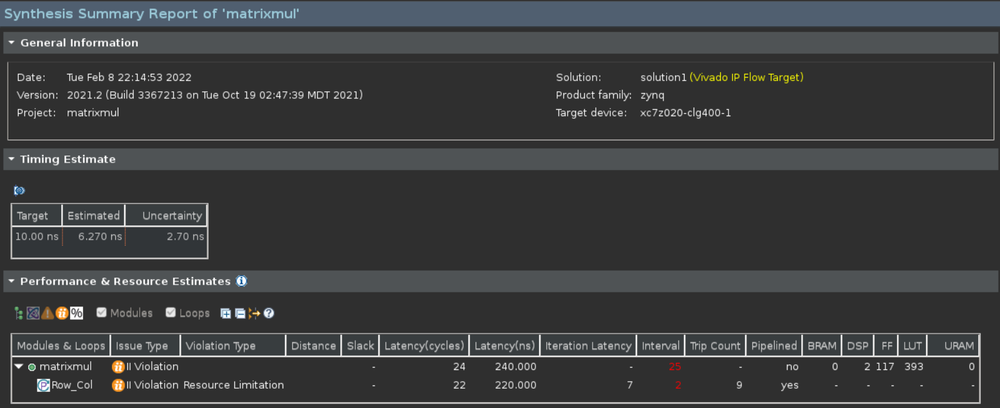
    

    

    <i>Report view after synthesis is completed</i>
    

4. If you expand **solution1** in Explorer, several generated files including report files will become accessible.
    

    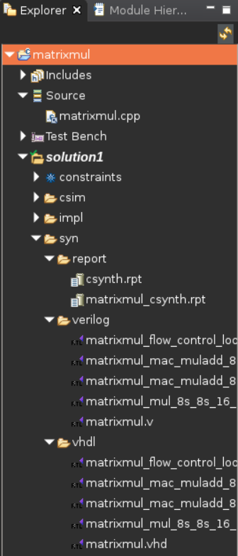
    

    

    <i>Explorer view after the synthesis process</i>
    

    Note that when the **syn** folder under the *Solution1* folder is expanded in the *Explorer* view, it will show *report, verilog,* and *vhdl* sub-folders under which report files, and generated source (vhdl, verilog, header, and cpp) files. By double-clicking any of these entries one can open the corresponding file in the information pane.

    Also note that if the target design has hierarchical functions, reports corresponding to lower-level functions are also created.
5. The *Synthesis Report* shows the performance and resource estimates as well as estimated latency in the design.
6. Using scroll bar on the right, scroll down into the report and answer the following question.

    **Question 1**
    Answer the following question:  
    Estimated clock period:   
    Worst case latency:   
    Number of DSP48E used:   
    Number of FFs used:   
    Number of LUTs used:  

7. The report also shows the top-level interface signals generated by the tools.
    

    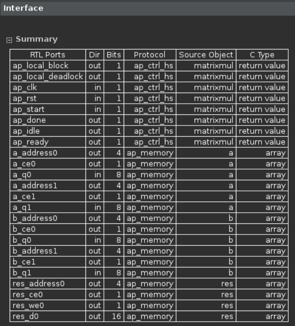
    

    

    <i>Generated interface signals</i>
    

    You can see **ap_clk, ap_rst, ap_ idle** and **ap_ready** control signals are automatically added to the design by default. These signals are used as handshaking signals to indicate when the design is ready to take the next computation command (ap_ready), when the next computation is started (ap_start), and when the computation is completed (ap_done). Other signals are generated based on the input and output signals in the design and their default or specified interfaces.

### Analyze using Analysis Perspective

#### Switch to the Analysis Perspective and understand the design behavior.

1. Select **Solution > Open Schedule Viewer** or click on *Analysis* button on tools bar to open the analysis viewer.

    The Analysis perspective consists of 4 panes as shown below. Note that the module and loops hierarchies are displayed unexpanded by default.
    The **Module Hierarchy** pane shows both the performance and area information for the entire design and can be used to navigate through the hierarchy. The **Performance Profile** pane is visible and shows the performance details for this level of hierarchy. The information in these two panes is similar to the information reviewed earlier in the synthesis report.
    The **Schedule Viewer** is also shown in the right-hand side pane. This view shows how the operations in this particular block are scheduled into clock cycles.

    

    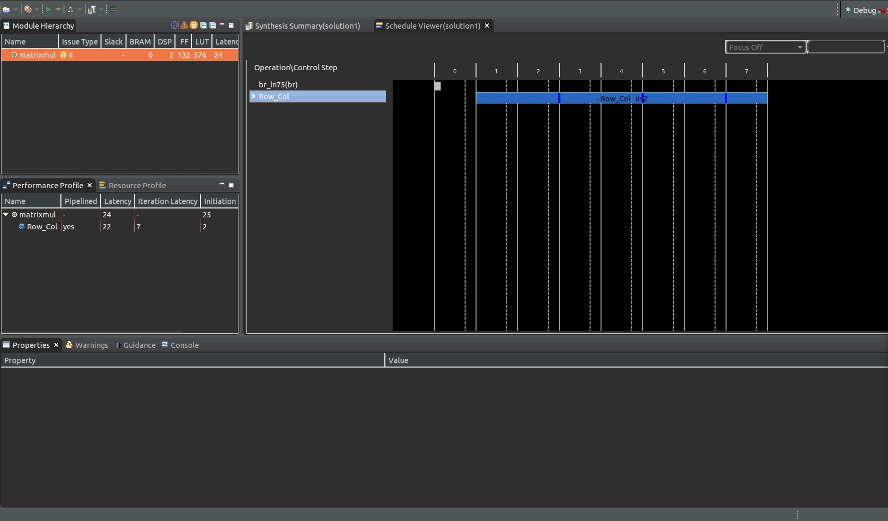
    

    

    <i>Analysis perspective</i>
    

2. Click on **>** of loop *Row_Col* to expand.
    

    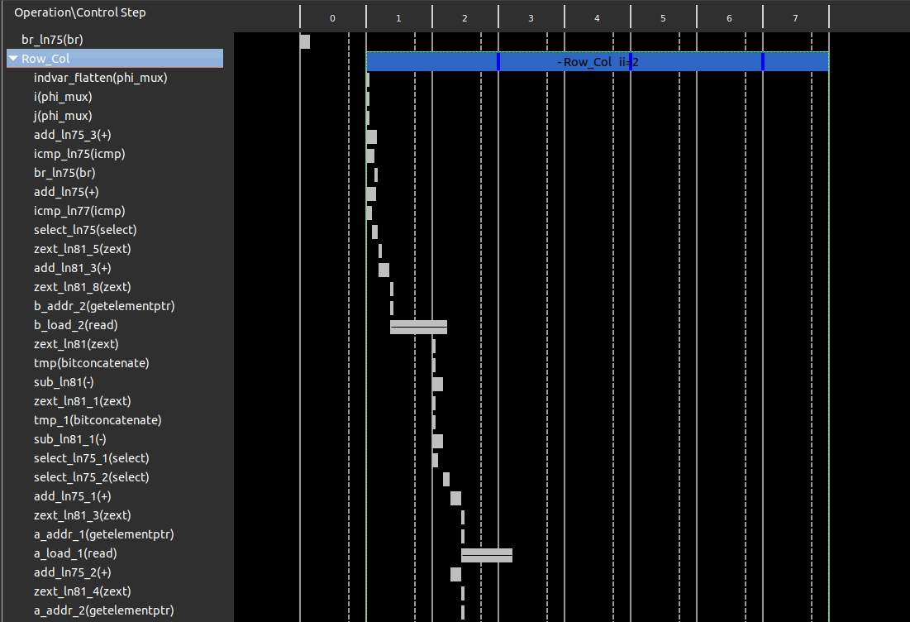
    

    

    <i>Performance matrix showing top-level Row operation</i>
    

    From this we can see that there is an add operation performed. This addition is likely the counter to count the loop iterations, and we can confirm this.
3. Select the block for the **adder** ( **add_in75_3(+)**), right-click and select **Goto Source**.
    The source code pane will be opened, highlighting line 37 where the loop index is being tested and incremented.
    

    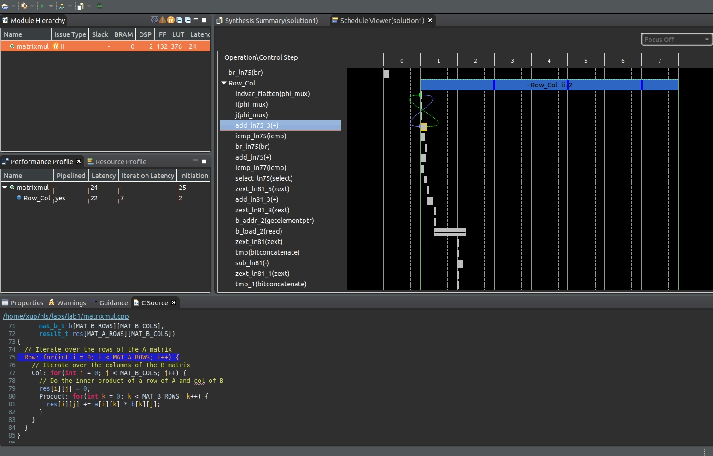
    

    

    <i>Cross probing into the source file</i>
    

4. Click on the **Synthesis** tool bar button to switch back to the *Synthesis* view.

### Run C/RTL Co-simulation

#### Run the C/RTL Co-simulation with the default settings of VHDL. Verify that the simulation passes.
1. Select **Solution > Run C/RTL Cosimulation** to open the dialog box so the desired simulations can be selected and run.
    A **C/RTL Co-simulation Dialog box** will open.
2. Make sure the **VHDL** option is selected.
    This allows the simulation to be performed using VHDL generated model. To perform the verification using Verilog, you can select Verilog.
    

    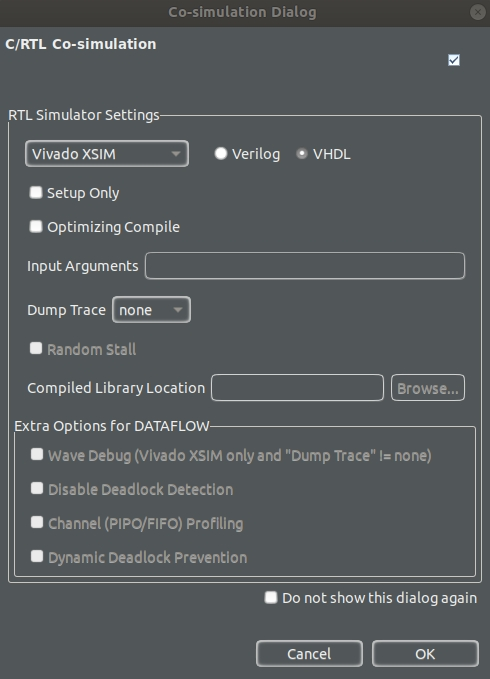
    

    

    <i>A C/RTL Co-simulation Dialog</i>
    

3. Click **OK** to run the VHDL simulation.
    The C/RTL Co-simulation will run, generating and compiling several files, and then simulating the design. It goes through three stages.
    First, the VHDL test bench is executed to generate input stimuli for the RTL design.  
    Second, an RTL test bench with newly generated input stimuli is created and the RTL simulation is then performed.  
    Finally, the output from the RTL is re-applied to the VHDL test bench to check the results.
    In the console window you can see the progress and also a message that the test is passed.  
    This eliminates writing a separate testbench for the synthesized design.

    

    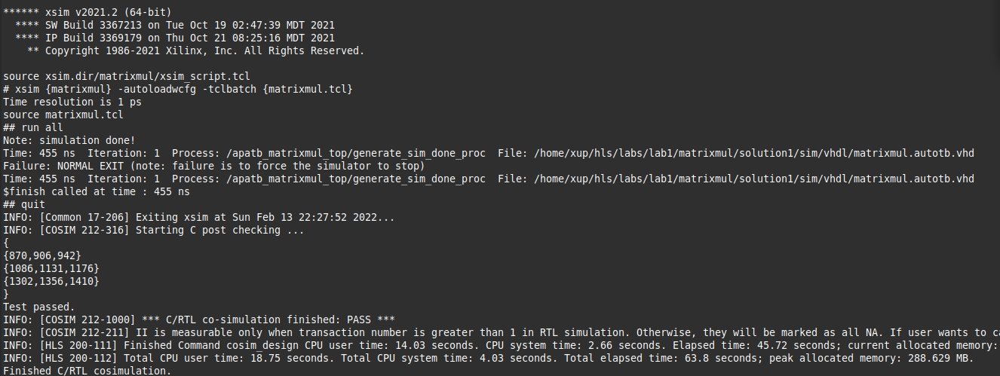
    

    

    <i>Console view showing simulation progress</i>
    

4. Once the simulation verification is completed, the simulation report tab will open showing the results. The report indicates if the simulation passed or failed. In addition, the report indicates the measured latency and interval.
    Since we have selected only VHDL, the result shows the latencies and interval (initiation) which indicates after how many clock cycles later the next input can be provided.

    

    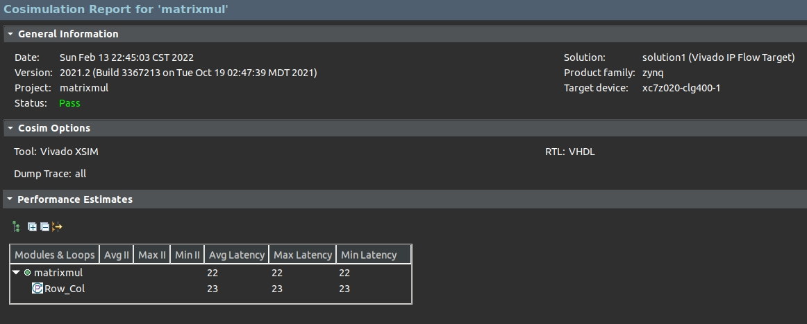
    

    

    <i>Co-simulation results</i>
    

### Viewing Simulation Results in Vivado

#### Run Verilog simulation with Dump Trace option selected.
1. Select **Solution > Run C/RTL Co-simulation** to open the dialog box so the desired simulations can be run.
2. Click on the **Verilog** selection option.

   Optionally, you can click on the drop-down button and select the desired simulator from the available list of Vivado XSim, ModelSim, Xcelium, VCS, and Riviera.
3. Select **All** for the *Dump Trace* option and click **OK**.
    

    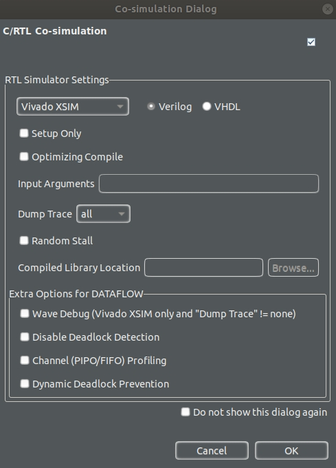
    

    

    <i>Setting up for Verilog simulation and dump trace</i>
    

    When RTL verification completes, the co-simulation report automatically opens showing the Verilog simulation has passed (and the measured latency and interval). In addition, because the *Dump Trace* option was used and Verilog was selected, two trace files entries can be seen in the Verilog simulation directory.

    

    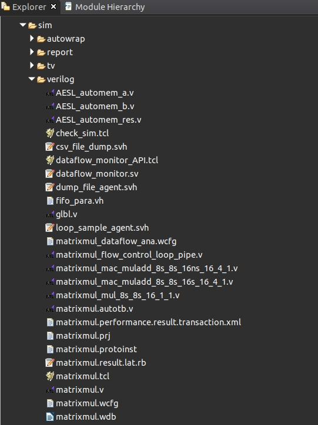
    

    

    <i>Explorer view after the Verilog RTL co-simulation run</i>
    

    The Co-simulation report shows the test was passed for Verilog along with latency and Interval results.
    

    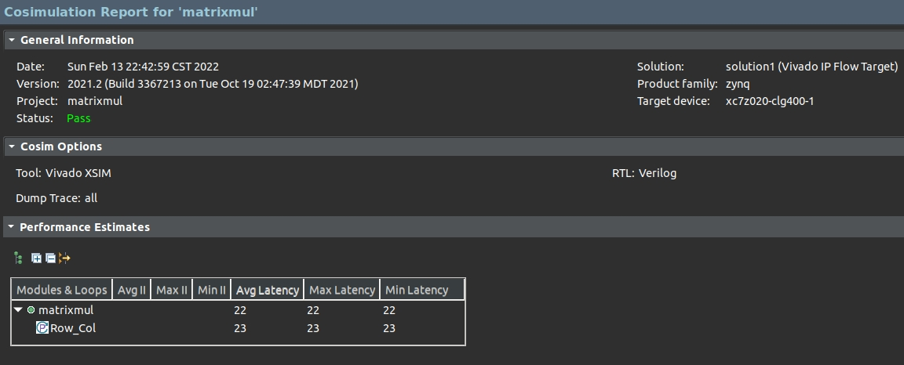
    

    

    <i>Cosimulation report</i>
    

#### Analyze the dumped traces.

1. Click on the  button on tools bar to open the wave viewer. This will start Vivado 2021.2 and open the wave viewer.
2. Click on the zoom fit tool button ( ) to see the entire simulation of one iteration.
3. Select *a_address0* in the waveform window, right-click and select **Radix > Unsigned Decimal**.
    Similarly, do the same for *b_address0*, *a_address1*, *b_address1* and *res_address0* signals.
4. Similarly, set the *a_q0, b_q0, a_q1, b_q1* and *res_d0* radix to **Signed Decimal**.
    You should see the output similar to shown below.
    

    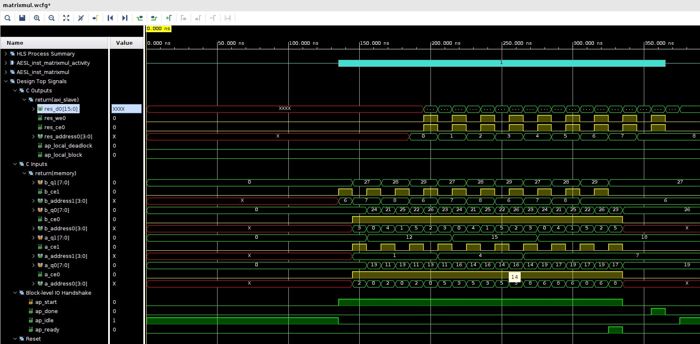
    

    

    <i>Full waveform showing iteration worth simulation</i>
    

    Note that as soon as *ap_start* is asserted, *ap_idle* has been de-asserted indicating that the design is in computation mode. The *ap_idle* signal remains de-asserted until *ap_done* is asserted, indicating completion of the process. This indicates 24 clock cycles latency.
5. View various part of the simulation and try to understand how the design works.
6. When done, close Vivado by selecting **File > Exit**. Click **OK** if prompted, and then **Discard** to close the program without saving.

### Export RTL and Implement

#### In Vitis HLS, export the design, selecting VHDL as a language, and run the implementation by selecting Evaluate option.
1. In Vitis HLS, select **Solution > Export RTL** to open the dialog box.
    An Export RTL Dialog box will open.
    

    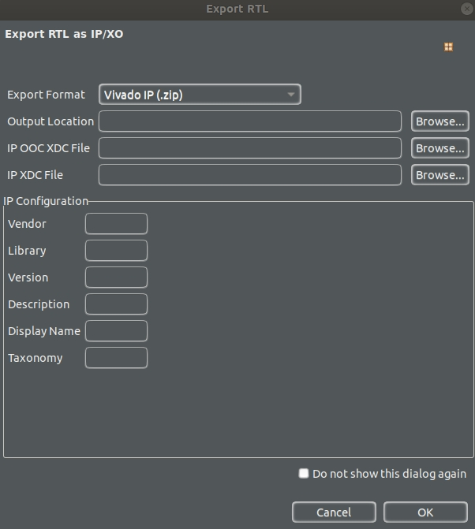
    

    

    <i>A Export RTL Dialog box</i>
    

    With default settings (shown above), the IP packaging process will run and create a package for the Vivado IP Catalog. Another option available from the Export Format drop-down menu, is to create a Vivado IP for System Generator.
2. Select **Solution > Implementation** to open the dialog box..
3. Click on the drop-down menu of the **RTL** field and select **VHDL**.
4. Click on the *RTL Synthesis, Place & Route* check box to run the implementation tool.
    

    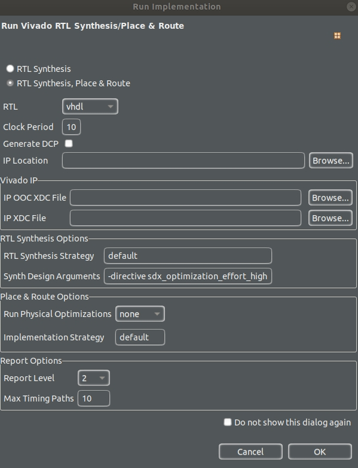
    

    

    <i>Selecting Evaluate options</i>
    

5. Click **OK** and the implementation run will begin.

    You can observe the progress in the Vitis HLS Console window. It goes through several phases:
    * Exporting RTL as an IP in the IP-XACT format
    * RTL evaluation, since we selected Evaluate option, it goes through Synthesis and then through Placement and Routing
    

    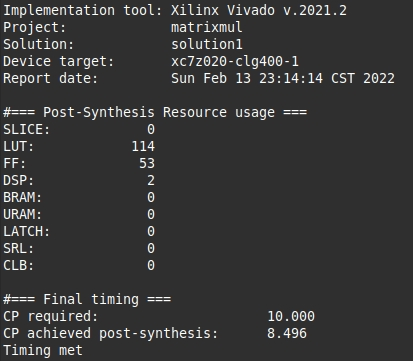
    

    

    <i>Console view</i>
    

    When the run is completed the implementation report will be displayed in the information pane.
    

    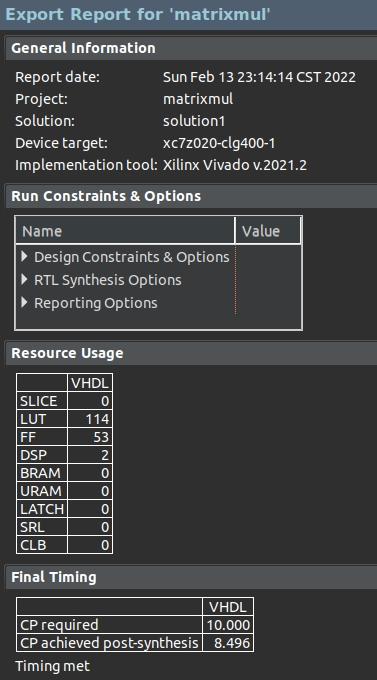
    

    

    <i>Implementation results in Vitis HLS </i>
    

    Observe that the timing constraint was met, the achieved period, and the type and amount of resources used.
    

    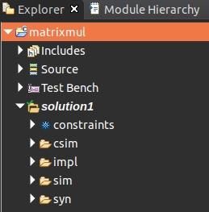
    

    

    <i>Explorer view after the RTL Export run </i>
    

6. Expand the Verilog and vhdl sub-folders and observe that the Verilog sub-folder only has the rtl file whereas the vhdl sub-folder has several files and sub-folders as the synthesis and implementation runs were made for it.

    It includes project.xpr file (the Vivado project file), matrixmul.xdc file (timing constraint file), project.runs folder among others.
    

    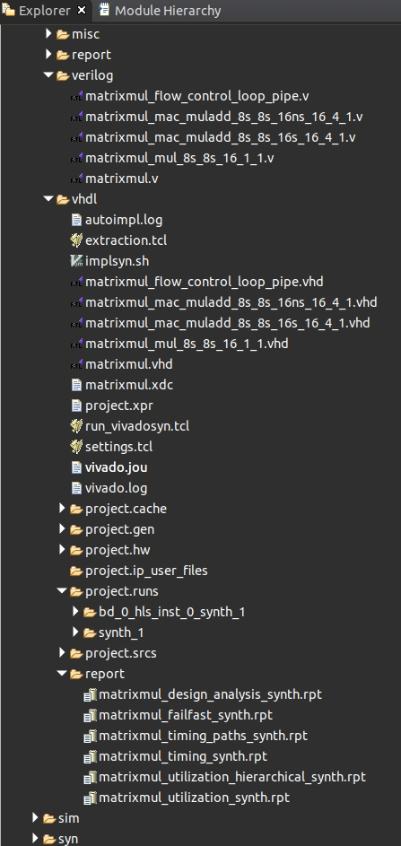
    

    

    <i>The implementation directory</i>
    

7. Expand the **ip** folder and observe the IP packaged as a zip file, **xilinx_com_hls_matrixmul_1_0.zip**, which can be added to the Vivado IP catalog.
    

    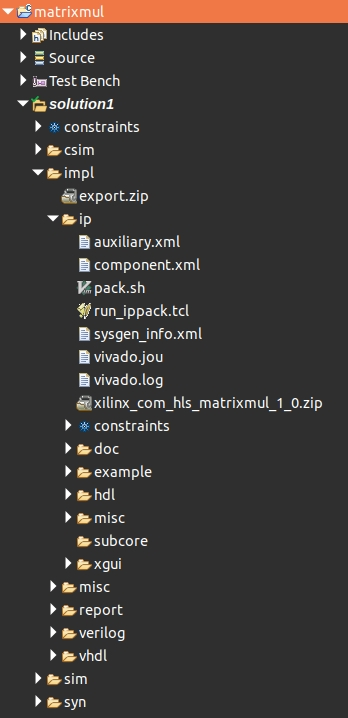
    

    

    <i>The ip folder content</i>
    

8. Close Vitis HLS by selecting **File > Exit**.

## Conclusion
In this lab, you completed the major steps of the high-level synthesis design flow using Vitis HLS. You created a project, adding source files, synthesized the design, simulated the design, and implemented the design. You also learned how to use the Analysis capability to understand the scheduling and binding.

## Answers
**Answers for question 1:**  
Estimated clock period: **6.816 ns**   
Worst case latency: **24 clock cycles**   
Number of DSP48E used: **2**   
Number of FFs used: **66**   
Number of LUTs used: **365**   
------------------------------------------------------

Copyright&copy; 2022, Advanced Micro Devices, Inc.
