# Improving Performance Lab

## Introduction

This lab introduces various techniques and directives which can be used in Vitis HLS to improve design performance. The design under consideration accepts an image in a (custom) RGB format, converts it to the Y’UV color space, applies a filter to the Y’UV image and converts it back to RGB.

## Objectives

After completing this lab, you will be able to:
* Add directives in your design
* Understand the effect of INLINE directive
* Improve performance using PIPELINE directive
* Distinguish between DATAFLOW directive and Configuration Command functionality

## Steps

### Create a Vitis HLS Project from Command Line

#### Validate your design using terminal. Create a new Vitis HLS project from the terminal.
1. Invoke Vitis HLS Command prompt by selecting **Start > Xilinx Design Tools > Vitis HLS 2022.2 Command Prompt** on Windows machine or open a new terminal window on Linux machine.
2. Change directory to **{labs}/lab2**.

   A self-checking program (yuv_filter_test.c) is provided. Using that we can validate the design. A Makefile is also provided. Using the Makefile, the necessary source files can be compiled and the compiled program can be executed. You can examine the contents of these files and the project directory.
3. In the terminal, type **make** to compile and execute the program. (You might need to set up the system environment variable for make command)
    

    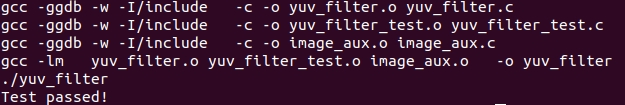
    

    

    <i>Validating the design</i>
    

    Note that the source files (yuv_filter.c, yuv_filter_test.c, and image_aux.c) were compiled, *yuv_filter* executable program was created, and then it was executed.

    The program tests the design and outputs **Test passed** message.

    A Vitis HLS tcl script file (pynq_yuv_filter.tcl) is provided and can be used to create a Vitis HLS project.
4. Type **vitis_hls -f pynq_yuv_filter.tcl** in the terminal to create the project targeting xc7z020clg400-1 part.
    The project will be created and the *vitis_hls.log* file will be generated.
5. Open the **vitis_hls.log** file from *{labs}/lab2* using any text editor and observe the following sections:
* Creating directory and project called yuv_filter.prj within it, adding design files to the project, setting solution name as solution1, setting target device, setting desired clock period, and importing the design and testbench files.
* Synthesizing (Generating) the design which involves scheduling and binding of each functions and sub-function.
* Generating RTL of each function and sub-function in Verilog and VHDL languages.
    

    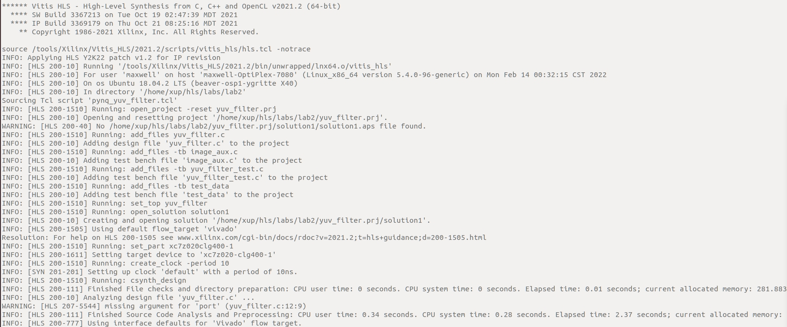
    

    

    <i>Creating project and setting up parameters</i>
    

    

    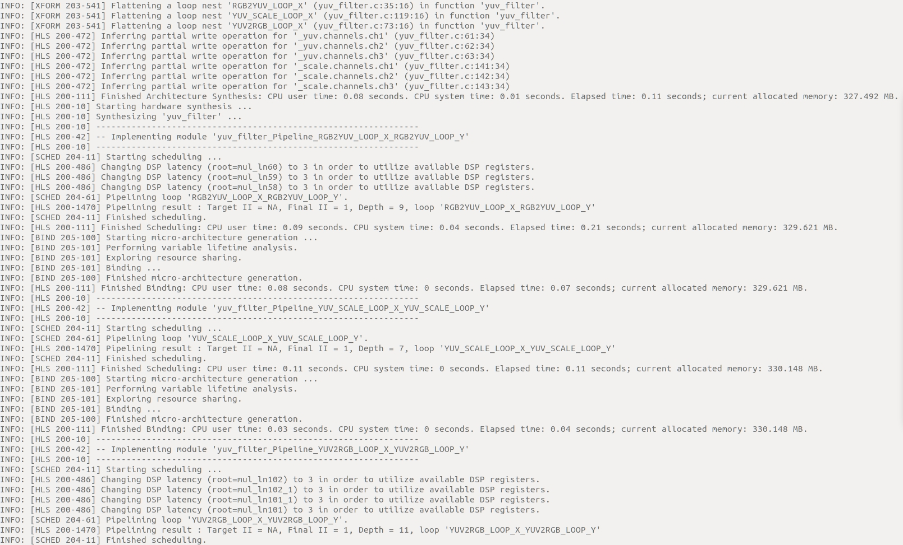
    

    

    <i>Synthesizing (Generating) the design</i>
    

    

    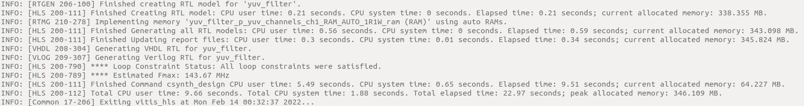
    

    

    <i>Generating RTL</i>
    

6. Open the created project (in GUI mode) from the terminal, by typing **vitis_hls -p yuv_filter.prj**.
    The Vitis HLS will open in GUI mode and the project will be opened.

### Analyze the Created Project and Results

#### Open the source file and note that three functions are used. Look at the results and observe that the latencies are undefined (represented by ?).
1. In Vitis HLS GUI, expand the source folder in the *Explorer* view and double click **yuv_filter.c** to view the content.
* The design is implemented in 3 functions: **rgb2yuv**, **yuv_scale** and **yuv2rgb**.
* Each of these filter functions iterates over the entire source image (which has maximum dimensions specified in image_aux.h), requiring a single source pixel to produce a pixel in the result image.
* The scale function simply applies individual scale factors, supplied as top-level arguments to the Y’UV components.
* Notice that most of the variables are of user-defined (typedef) and aggregate (e.g. structure, array) types.
* Also notice that the original source used malloc() to dynamically allocate storage for the internal image buffers. While appropriate for such large data structures in software, malloc() is not synthesizable and is not supported by Vitis HLS.
* A viable workaround is conditionally compiled into the code, leveraging the __SYNTHESIS__ macro. Vitis HLS automatically defines the __SYNTHESIS__ macro when reading any code. This ensure the original malloc() code is used outside of synthesis but Vitis HLS will use the workaround when synthesizing.
2. Expand the **syn > report** folder in the *Explorer* view and double-click **yuv_filter_csynh.rpt** entry to open the synthesis report.
3. Each of the loops in this design has variable bounds – the width and height are defined by members of input type *image_t*. When variables bounds are present on loops the total latency of the loops cannot be determined: this impacts the ability to perform analysis using reports. Hence, **“?”** is reported for various latencies.
    

    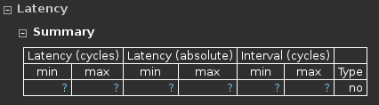
    

    

    <i>Latency computation</i>
    

### Apply TRIPCOUNT Pragma

#### Open the source file and uncomment pragma lines, re-synthesize, and observe the resources used as well as estimated latencies. Answer the questions listed in the detailed section of this step.
1. To assist in providing loop-latency estimates, Vitis HLS provides a TRIPCOUNT directive which allows limits on the variables bounds to be specified by the user. In this design, such directives have been embedded in the source code, in the form of #pragma statements.

2. Uncomment the **#pragma** lines (76, 79, 116, 119, 156, 159) to define the loop bounds and save the file.

3. Synthesize the design by selecting **Solution > Run C Synthesis > Active Solution**. View the synthesis report when the process is completed.
    

    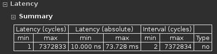
    

    

    <i>Latency computation after applying TRIPCOUNT pragma</i>
    

    **Question 1**  
    Answer the following question pertaining to yuv_filter function.   
    Estimated clock period:   
    Worst case latency:   
    Number of DSP48E used:   
    Number of BRAMs used:   
    Number of FFs used:   
    Number of LUTs used:  

4. Expand the **Module & loop** and note the latency and trip count numbers for the yuv_scale function. Note that the iteration latency of *YUV_SCALE_LOOP_X_YUV_SCALE_LOOP_Y* is 6x the specified TRIPCOUNT, implying that 6 cycles are used for each of the iteration of the loop.
    

    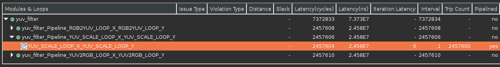
    

    

    <i>Loop latency</i>
    

    Note that *YUV_SCALE_LOOP_X_YUV_SCALE_LOOP_Y* is already pipelined. -pipeline_loops <threshold> specifies the lower limit used when automatically pipelining loops. The default is 64, causing Vitis HLS to automatically pipeline loops with a tripcount of 64, or greater. If the option is applied, the innermost loop with a tripcount higher than the threshold is pipelined, or if the tripcount of the innermost loop is less than or equal to the threshold, its parent loop is pipelined. If the innermost loop has no parent loop, the innermost loop is pipelined regardless of its tripcount.

5. You can verify this by opening the **Schedule Viewer**, and expand the **YUV_SCALE_LOOP_X** entry.
    

    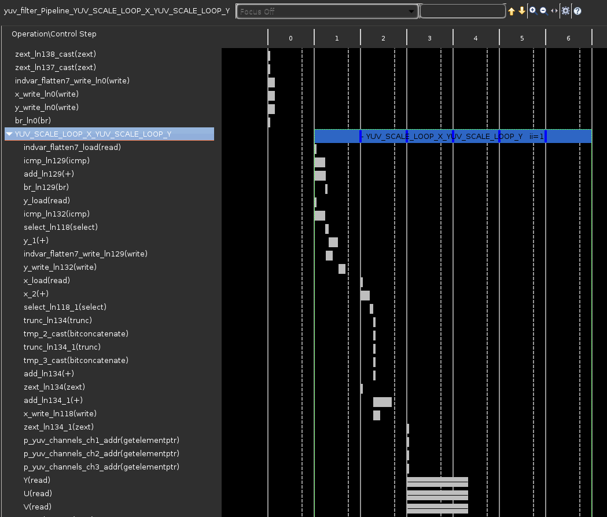
    

    

    <i>Design analysis view of the YUV_SCALE_LOOP_Y loop</i>
    

6. In the report tab, expand and click on the **yuv_filter_Pipeline_RGB2YUV_LOOP_X_RGB2YUV_LOOP_Y** entry to open the report.

    **Question 2**  
    Answer the following question pertaining to rgb2yuv function.  
    Estimated clock period:  
    Worst case latency:  
    Number of DSP48E used:  
    Number of FFs used:  
    Number of LUTs used:  

7. Similarly, open the *yuv2rgb* report.  

    **Question 3**  
    Answer the following question pertaining to yuv2rgb function.   
    Estimated clock period:   
    Worst case latency:   
    Number of DSP48E used:   
    Number of FFs used:   
    Number of LUTs used:  

### Remove the pipeline optimization done by Vitis HLS automatically by adding pipeline off pragma
1. Select **Project > New Solution**.
2. A *Solution Configuration* dialog box will appear. Note that the check boxes of *Copy directives and constraints from solution* are checked with *solution1* selected. Click the **Finish** button to create a new solution with the default settings.
    

    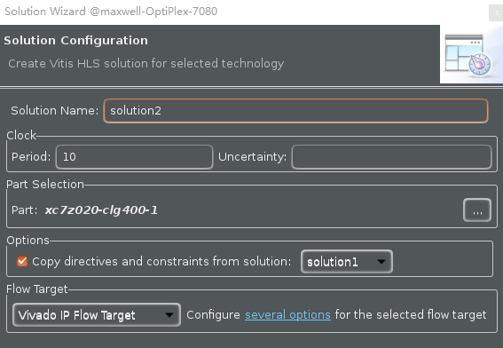
    

    

    <i>Creating a new Solution after copying the existing solution</i>
    

3. Make sure that the **yuv_filter.c** source is opened and visible in the information pane, and click on the **Directive** tab.
4. Select function **RGB2YUV_LOOP_X** in the directives pane, right-click on it, and select **Insert Directive...**
5. Click on the drop-down button of the *Directive* field. A pop-up menu shows up listing various directives. Select **PIPELINE** directive.
6. In the *Vitis HLS Directive Editor* dialog box, click on the **off** option to turn off the automatic pipelining. Make sure that the *Directive File* is selected as destination. Click **OK**.
    

    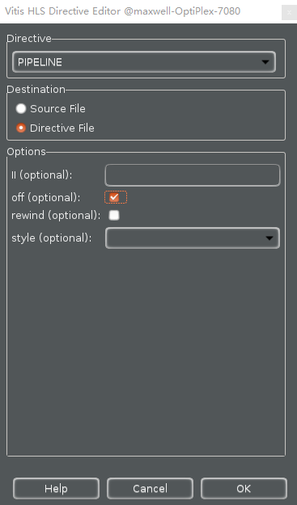
    

    

    <i>Add PIPELINE off directive</i>
    

7. Similarly, apply the **PIPELINE off** directive to **YUV2RGB_LOOP_X**, **YUV2RGB_LOOP_Y**, **YUV_SCALE_LOOP_X**, **YUV_SCALE_LOOP_Y** and **RGB2YUV_LOOP_Y** objects. At this point, the *Directive* tab should look like as follows.
    

    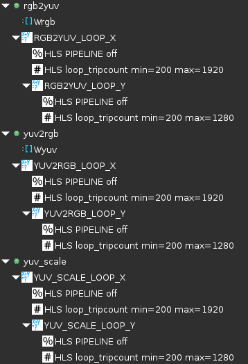
    

    

    <i>PIPELINE off directive applied</i>
    

8. Click on the **Synthesis** button.
9. When the synthesis is completed, report shows the performance and area without the automatic optimization of Vitis HLS.
    

    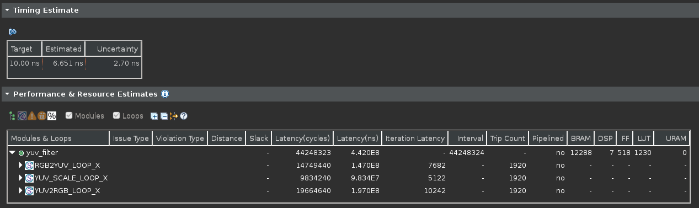
    

    

    <i>Performance after applying PIPELINE off directive</i>
    

### Apply PIPELINE Directive

#### Create a new solution by copying the previous solution settings. Apply the PIPELINE directive. Generate the solution and understand the output.
1. Select **Project > New Solution**.
2. A *Solution Configuration* dialog box will appear. Click the **Finish** button (with copy from Solution2 selected).
3. Make sure that the **yuv_filter.c** source is opened and visible in the information pane, and click on the **Directive** tab.
4. Select the pragma *HLS PIPELINE off* of **RGB2YUV_LOOP_Y** in the directives pane, right-click on it, and select **Modify Directive**
5. In the *Vitis HLS Directive Editor* dialog box, click the **off** option to turn on the pipelining. Make sure that the *Directive File* is selected as destination. Click **OK**.
    

    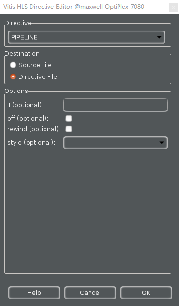
    

    

    <i>Add PIPELINE directive</i>
    

* When an object (function or loop) is pipelined, all the loops below it, down through the hierarchy, will be automatically unrolled.
* In order for a loop to be unrolled it must have fixed bounds: all the loops in this design have variable bounds, defined by an input argument variable to the top-level function.
* Note that the TRIPCOUNT directive on the loops only influences reporting, it does not set bounds for synthesis.
* Neither the top-level function nor any of the sub-functions are pipelined in this example.
* The pipeline directive must be applied to the inner-most loop in each function – the innermost loops have no variable-bounded loops inside which are required to be unrolled and the outer loop will simply keep the inner loop fed with data.
6. Leave *II* (Initiation Interval) blank as Vitis HLS will try for an II=1, one new input every clock cycle.
7. Click **OK**.
8. Similarly, apply the **PIPELINE** directive to **YUV2RGB_LOOP_Y** and **YUV_SCALE_LOOP_Y** objects, but remove the **PIPELINE** directive of **YUV2RGB_LOOP_X**, **YUV_SCALE_LOOP_X** and **RGB2YUV_LOOP_X**. At this point, the *Directive* tab should look like as follows.
    

    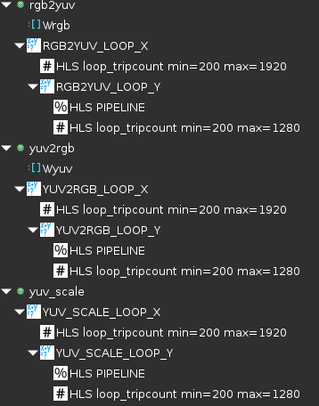
    

    

    <i>PIPELINE directive applied</i>
    

9. Click on the **Synthesis** button.
10. When the synthesis is completed, select **Project > Compare Reports…** to compare the two solutions.
11. Select *Solution2* and *Solution3* from the **Available Reports**, and click on the **Add>>** button.
12. Observe that the latency reduced.
    

    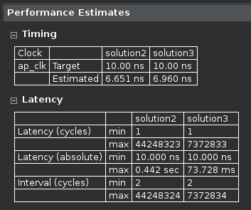
    

    

    <i>Performance comparison after pipelining</i>
    

    In Solution2, the total loop latency of the inner-most loop was loop_body_latency x loop iteration count, whereas in Solution3 the new total loop latency of the inner-most loop is loop_body_latency + loop iteration count.
13. Scroll down in the comparison report to view the resources utilization. Observe that the FFs, LUTs, and DSP48E utilization increased whereas BRAM remained same.
    

    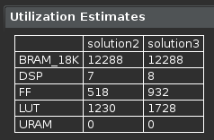
    

    

    <i>Resources utilization after pipelining</i>
    

### Apply DATAFLOW Directive and Configuration Command

#### Create a new solution by copying the previous solution (Solution3) settings. Apply DATAFLOW directive. Generate the solution and understand the output.
1. Select **Project > New Solution**.
2. A *Solution Configuration* dialog box will appear. Click the **Finish** button (with copy from Solution4 selected).
3. Close all inactive solution windows by selecting **Project > Close Inactive Solution Tabs**.
4. Make sure that the **yuv_filter.c** source is opened in the information pane and select the *Directive* tab.
5. Select function yuv_filter in the *Directive* pane, right-click on it and select **Insert Directive...**
6. A pop-up menu shows up listing various directives. Select **DATAFLOW** directive and click **OK**.
7. Click on the **Synthesis** button.
8. When the synthesis is completed, the synthesis report is automatically opened.
9. Observe additional information, **Dataflow** Type, in the *Performance Estimates* section is mentioned.
    

    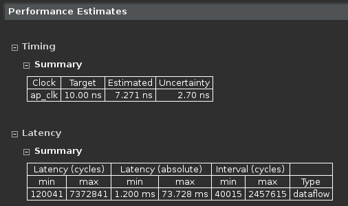
    

    

    <i>Performance estimate after DATAFLOW directive applied</i>
    

* The Dataflow pipeline throughput indicates the number of clocks cycles between each set of
inputs reads. If this throughput value is less than the design latency it indicates the design
can start processing new inputs before the currents input data are output.
* While the overall latencies haven’t changed significantly, the dataflow throughput is showing
that the design can achieve close to the theoretical limit (1920x1280 = 2457600) of
processing one pixel every clock cycle.    
10. Scrolling down into the *Utilization Estimates* section, observe that the number of BRAMs required has doubled. This is due to the default ping-pong buffering in dataflow.
    

    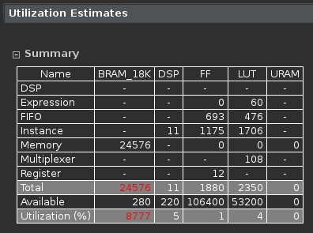
    

    

    <i>Resource estimate with DATAFLOW directive applied</i>
    

* When **DATAFLOW** optimization is performed, memory buffers are automatically inserted
between the functions to ensure the next function can begin operation before the previous
function has finished. The default memory buffers are ping-pong buffers sized to fully
accommodate the largest producer or consumer array.
* Vitis HLS allows the memory buffers to be the default **ping-pong** buffers or **FIFOs**. Since
this design has data accesses which are fully sequential, FIFOs can be used. Another
advantage to using FIFOs is that the size of the FIFOs can be directly controlled (not possible
in ping-pong buffers where random accesses are allowed).
11. The memory buffers type can be selected using Vitis HLS Configuration command.

#### Apply Dataflow configuration command, generate the solution, and observe the improved resources utilization.
1. Select **Solution > Solution Settings…** to access the configuration command settings.
2. In the *Configuration Settings* dialog box, expand **config_dataflow** folder.
3. Set **fifo** as the default_channel. Enter **2** as the fifo_depth. Click OK.
    

    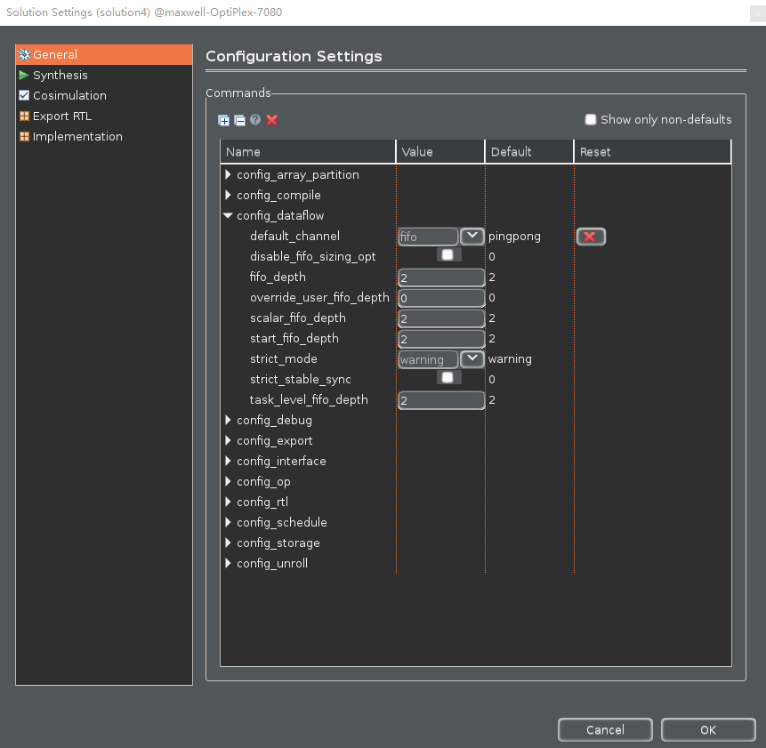
    

    

    <i>Selecting Dataflow configuration command and FIFO as buffer</i>
    

4. Click **OK** again.
5. Click on the **Synthesis** button.
6. When the synthesis is completed, the synthesis report is automatically opened.
7. Note that the latency has reduced. Since this design has data accesses which are fully sequential, the data can flow to next function without waiting all pixels to be processed.
    

    
    

    

    <i>Latency estimation after Dataflow configuration command</i>
    

## Conclusion
In this lab, you learned that even though this design could not be pipelined at the top-level, a strategy of pipelining the individual loops and then using dataflow optimization to make the functions operate in parallel was able to achieve the same high throughput, processing one pixel per clock. When DATAFLOW directive is applied, the default memory buffers (of ping-pong type) are automatically inserted between the functions. Using the fact that the design used only sequential (streaming) data accesses allowed the costly memory buffers associated with dataflow optimization to be replaced with simple 2 element FIFOs using the Dataflow command configuration.

## Answers
1. **Answers for question 1:**  
    Estimated clock period: **6.960 ns**   
    Worst case latency: **7372833**   
    Number of DSP48E used: **8**   
    Number of BRAMs used: **12288**   
    Number of FFs used: **932**   
    Number of LUTs used: **1728**    
2. **Answers for question 2:**  
    Estimated clock period: **6.960 ns**   
    Worst case latency: **2457608**   
    Number of DSP48E used: **3**   
    Number of FFs used: **358**   
    Number of LUTs used: **592**    
3. **Answers for question 3:**  
    Estimated clock period: **6.960 ns**   
    Worst case latency: **2457610**   
    Number of DSP48E used: **4**   
    Number of FFs used: **255**   
    Number of LUTs used: **423**  

Copyright&copy; 2022, Advanced Micro Devices, Inc.
