# Improving Area and Resoudesign.rce Utilization Lab

## Introduction

This lab introduces various techniques and directives which can be used in Vitis HLS to improve design performance as well as area and resource utilization. The design under consideration performs Discrete Cosine Transformation (DCT) on an 8x8 block of data.

This design implements a discrete cosine transformation (DCT), and it is provided as C source. The function leverages a 2D DCT algorithm by first processing each row of the input array via a 1D DCT, then processing the columns of the resulting array through the same 1D DCT. It calls the read_data, dct_2d, and write_data functions.

## Objectives
After completing this lab, you will be able to:
* Add directives in your design
* Improve performance using PIPELINE directive
* Distinguish between DATAFLOW directive and Configuration Command functionality
* Apply memory partitions techniques to improve resource utilization

## Steps

### Validate the Design from Command Line
#### Validate your design in the terminal.
1. Open a terminal.
2. Change directory to **{labs}/lab3**.

  A self-checking program (dct_test.c) is provided. Using that we can validate the design. A Makefile is also provided. Using the Makefile, the necessary source files can be compiled and the compiled program can be executed.
3. Invoke Vitis HLS Command prompt by selecting **Start > Xilinx Design Tools > Vitis HLS 2021.2 Command Prompt**. In the terminal, type **make** to compile and execute the program.
    

    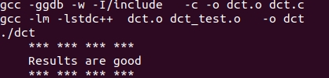
    

    

    <i>Validating the design</i>
    

    Note that the source files (dct.c and dct_test.c are compiled, then dct executable program was created, and then it was executed. The program tests the design and outputs Results are good message.

### Create a New Project
#### Create a new project in Vitis HLS GUI targeting xc7z020clg400-1.
1. Type **vitis_hls** in the terminal.
2. In the Vitis HLS GUI, click on **Create Project**. The **New Vitis HLS Project** wizard opens.
3. Click **Browse…** button of the Location field and browse to **{labs}/lab3** and then click **OK**.
4. For Project Name, type **dct** and click **Next**.
5. In the Add/Remove Files for the source files, type **dct** as the top function name (the provided source file contains the function, to be synthesized, called dct).
6. Click the **Add Files…** button, select **dct.c** file from the **{labs}/lab3** folder, and then click **Open**.
7. Click **Next**.
8. In the *Add/Remove Testbench Files* for the testbench, click the **Add Files…** button, select **dct_test.c**, **in.dat**, **out.golden.dat** files from the **{labs}/lab3** folder and click **Open**.
9. Click **Next**.
10. In the *Solution Configuration* page, leave *Solution Name* field as **solution1** and set the clock period as **10**. Leave *Uncertainty* field blank.
11. Click on *Part*’s Browse button, and select the following filters, using the Parts Specify option, to select **xc7z020clg400-1**.
12. Click **Finish**.
13. Double-click on the **dct.c** under the source folder to open its content in the information pane.
    

    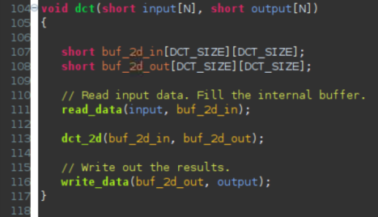
    

    

    <i>The design under consideration</i>
    

    The top-level function *dct*, is defined at line 104. It implements 2D DCT algorithm by first processing each row of the input array via a 1D DCT then processing the columns of the resulting array through the same 1D DCT. It calls read_data, dct_2d, and write_data functions.
    The read_data function is defined at line 80 and consists of two loops – RD_Loop_Row and RD_Loop_Col. The write_data function is defined at line 92 and consists of two loops to perform writing the result. The dct_2d function, defined at line 49, calls dct_1d function and performs transpose.
    Finally, dct_1d function, defined at line 30, uses dct_coeff_table and performs the required function by implementing a basic iterative form of the 1D Type-II DCT algorithm. Following figure shows the function hierarchy on the left-hand side, the loops in the order they are executes and the flow of data on the right-hand side.
    

    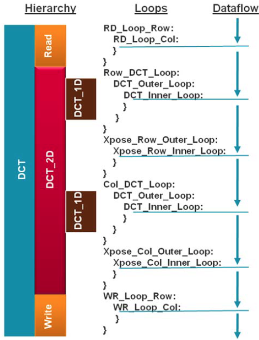
    

    

    <i>Design hierarchy and dataflow</i>
    

### Synthesize the Design

#### Synthesize the design with the defaults. View the synthesis results and answer the question listed in the detailed section of this step.
1. Select **Solution > Run C Synthesis > Active Solution** to start the synthesis process.
2. When synthesis is completed, several report files will become accessible and the *Synthesis Results* will be displayed in the information pane.

    The dct_1d, dct_2d, read_data and write_data functions are inlined. Verify this by scrolling up into the Vitis HLS Console view.
    

    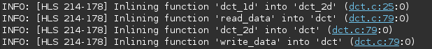
    

    

    <i>Inlining of dct_1d, dct_2d, read_data and write_data functions</i>
    

3. The *Synthesis Report* shows the performance and resource estimates as well as estimated latency in the design. Note that the design is already pipelined.
    

    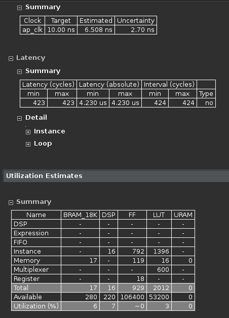
    

    

    <i>Synthesis report</i>
    

4. Using scroll bar on the right, scroll down into the report and answer the following question.

    **Question 1**  
    **Answer the following question:**   
    Estimated clock period:   
    Worst case latency:   
    Number of DSP48E used:   
    Number of BRAMs used:   
    Number of FFs used:   
    Number of LUTs used:   
5. The report also shows the top-level interface signals generated by the tools.
    

    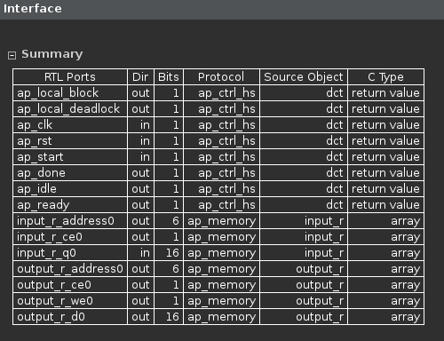
    

    

    <i>Generated interface signals</i>
    

    You can see ap_clk, ap_rst are automatically added. The ap_start, ap_done, ap_idle, and ap_ready are top-level signals used as handshaking signals to indicate when the design is able to accept next computation command (ap_idle), when the next computation is started (ap_start), and when the computation is completed (ap_done). The top-level function has input and output arrays, hence an ap_memory interface is generated for each of them.

### Run Co-Simulation

#### Run the Co-simulation, selecting Verilog. Verify that the simulation passes.
1. Select **Solution > Run C/RTL Co-simulation** to open the dialog box so the desired simulations can be run.
    A C/RTL Co-simulation Dialog box will open.

2. Select the **Verilog** option, and click **OK** to run the Verilog simulation using Vivado XSIM simulator.

   The RTL Co-simulation will run, generating and compiling several files, and then simulating the design. In the console window you can see the progress and also a message that the test is passed.
    

    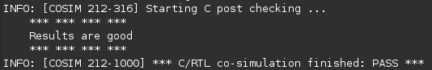
    

    

    <i>RTL Co-Simulation results</i>
    

### Remove the pipeline optimization done by Vitis HLS automatically by adding pipeline off pragma
1. Select **Project > New Solution**.
2. A *Solution Configuration* dialog box will appear. Note that the check boxes of *Copy directives and constraints from solution* are checked with *solution1* selected. Click the **Finish** button to create a new solution with the default settings.
    

    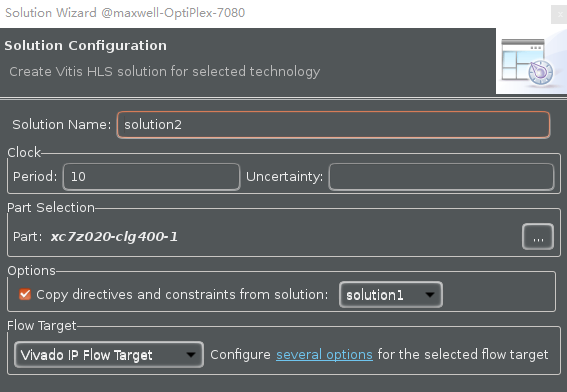
    

    

    <i>Creating a new Solution after copying the existing solution</i>
    

3. Make sure that the **dct.c** source is opened and visible in the information pane, and click on the **Directive** tab.
4. Select function **DCT_Inner_Loop** in the directives pane, right-click on it, and select **Insert Directive...**
5. Click on the drop-down button of the *Directive* field. A pop-up menu shows up listing various directives. Select **PIPELINE** directive.
6. In the *Vitis HLS Directive Editor* dialog box, click on the **off** option to turn off the automatic pipelining. Make sure that the *Directive File* is selected as destination. Click **OK**.
    

    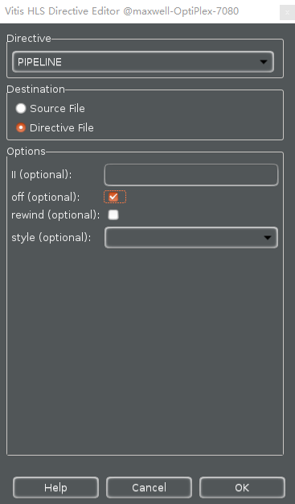
    

    

    <i>Add PIPELINE off directive</i>
    

7. Similarly, apply the **PIPELINE off** directive to **DCT_Outer_Loop**, **Row_DCT_Loop**, **Xpose_Row_Outer_Loop**, **Xpose_Row_Inner_Loop**, **Col_DCT_Loop**, **Xpose_Col_Outer_Loop**, **Xpose_Col_Inner_Loop**, **RD_Loop_Row**, **RD_Loop_Col**, **WR_Loop_Row**, and **WR_Loop_Col** objects. At this point, the *Directive* tab should look like as follows.
    

    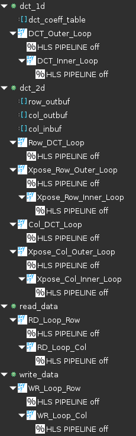
    

    

    <i>PIPELINE off directive applied</i>
    

8. Click on the **Synthesis** button.
9. When the synthesis is completed, report shows the performance and area without the automatic optimization of Vitis HLS.
    

    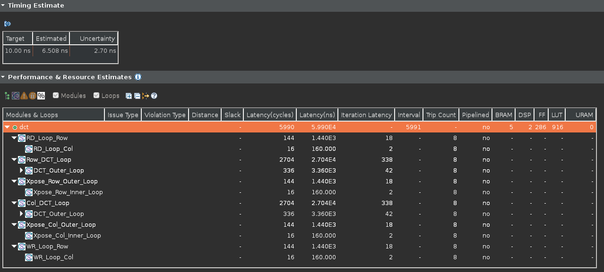
    

    

    <i>Performance after applying PIPELINE off directive</i>
    

### Apply PIPELINE Directive
#### Create a new solution by copying the previous solution settings. Apply the PIPELINE directive to DCT_Inner_Loop, Xpose_Row_Inner_Loop, Xpose_Col_Inner_Loop, RD_Loop_Col, and WR_Loop_Col. Generate the solution and analyze the output.
1. Select **Project > New Solution**.
2. A *Solution Configuration* dialog box will appear. Click the **Finish** button (with copy from Solution2 selected).
3. Make sure that the **dct.c** source is opened in the information pane and click on the **Directive** tab.
4. Select the pragma HLS PIPELINE off of **DCT_Inner_Loop** of the dct_1d function in the *Directive* pane, right-click on it and select **Modify Directive**
5. In the Vitis HLS Directive Editor dialog box, click the **off** option to turn on the pipelining. Make sure that the *Directive File* is selected as destination. Click OK.
6. Leave II (Initiation Interval) blank as Vitis HLS will try for an II=1, one new input every clock cycle.
7. Click **OK**.
8. Similarly, apply the **PIPELINE** directive to **Xpose_Row_Inner_Loop** and **Xpose_Col_Inner_Loop** of the dct_2d function, and **RD_Loop_Col** of the read_data function, and **WR_Loop_Col** of the write_data function. But remove the **PIPELINE** directive of **DCT_Outer_Loop**, **Row_DCT_Loop**, **Xpose_Row_Outer_Loop**, **Col_DCT_Loop**, **Xpose_Col_Outer_Loop**, **RD_Loop_Row** and **WR_Loop_Row**. At this point, the Directive tab should look like as follows.
    

    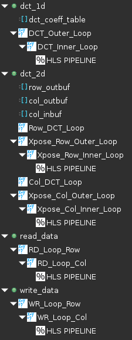
    

    

    <i>PIPELINE directive applied</i>
    

9. Click on the **Synthesis** button.
10. When the synthesis is completed, select **Project > Compare Reports…** to compare the two solutions.
11. Select *Solution2* and *Solution3* from the *Available Reports*, click on the **Add>>** button, and then click **OK**.
12. Observe that the latency reduced from *5990* to *2451* clock cycles.

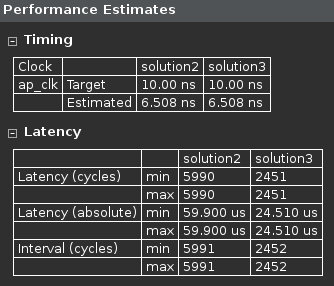

<i>Performance comparison after pipelining</i>

13. Scroll down in the comparison report to view the resources utilization. Observe that the FFs and/or LUTs utilization increased whereas BRAM and DSP48E remained same.
    

    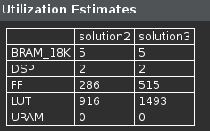
    

    

    <i>Resources utilization after pipelining</i>
    

#### Open the Schedule Viewer and determine where most of the clock cycles are spend, i.e. where the large latencies are.
1. Click on the *Solution > Open Schedule Viewer* .
2. Select the **dct** entry and observe the **RD_Loop_Row_RD_Loop_Col** and **WR_Loop_Row_WR_Loop_Col** entries in the *Performance & Resource Estimates*. These are two nested loops flattened and given the new names formed by appending inner loop name to the outer loop name. You can verify this by looking in the *Console* view message.
    

    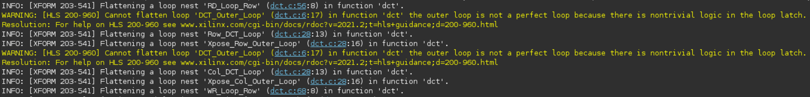
    

    

    <i>The console view content indicating loops flattening</i>
3. In the *Performance & Resource Estimates* pane, expand all items. Notice that the most of the latency occurs is in **Row_DCT_Loop_DCT_Outer_Loop** and **Col_DCT_Loop_DCT_Outer_Loop** function.
    

    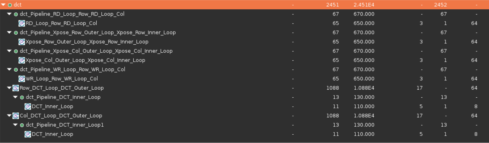
    

    

    <i>The Performance & Resource Estimates of dct</i>
    

5. In the *Schedule Viewer* pane, select the **Col_DCT_Loop_DCT_Outer_Loop** entry, right-click on the **col_outbuf_addr_write_In19** (write) block in the **Schedule Viewer**, and select **Goto Source**. Notice that line 45 is highlighted which is preventing the flattening of the DCT_Outer_Loop.
    

    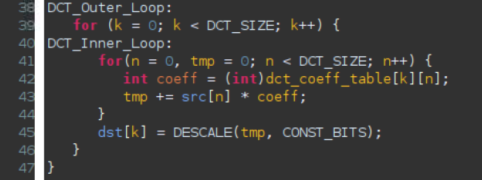
    

    

    <i>Understanding what is preventing DCT_Outer_Loop flattening</i>
    

6. Switch to the *Synthesis* perspective.

#### Create a new solution by copying the previous solution settings. Apply fine-grain parallelism of performing multiply and add operations of the inner loop of dct_1d using PIPELINE directive by moving the PIPELINE directive from inner loop to the outer loop of dct_1d. Generate the solution and analyze the output.
1. Select **Project > New Solution**.
2. A *Solution Configuration* dialog box will appear. Click the **Finish** button (with *Solution3* selected).
3. Select **PIPELINE** directive of **DCT_Inner_Loop** of the **dct_1d** function in the Directive pane, right-click on it and select **Remove** Directive.
4. Select **DCT_Outer_Loop** of the **dct_1d** function in the Directive pane, right-click on it and select **Insert Directive...**
5. A pop-up menu shows up listing various directives. Select **PIPELINE** directive.
6. Click **OK**.
    

    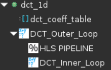
    

    

    <i>PIPELINE directive applied to DCT_Outer_Loop</i>
    

    By pipelining an outer loop, all inner loops will be unrolled automatically (if legal), so there is no need to explicitly apply an UNROLL directive to DCT_Inner_Loop. Simply move the pipeline to the outer loop: the nested loop will still be pipelined but the operations in the inner-loop body will operate concurrently.
7. Click on the **Synthesis** button.
8. When the synthesis is completed, select **Project > Compare Reports…** to compare the two solutions.
9. Select *Solution3* and *Solution4* from the **Available Reports**, click on the **Add>>** button, and then click **OK**.
10. Observe that the latency reduced from *2451* to *643* clock cycles.
    

    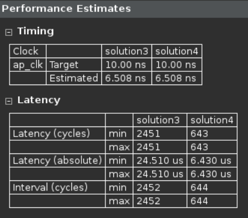
    

    

    <i>Performance comparison after pipelining</i>
    

11. Scroll down in the comparison report to view the resources utilization. Observe that the utilization of DSP and FF increased. Since the DCT_Inner_Loop was unrolled, the parallel computation requires 8 DSP48E.
       

       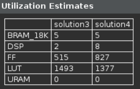
       

       

       <i>Resources utilization after pipelining</i>
       

#### Perform design analysis and look at the dct performance view.
1. Switch to the **Performance & Resource Estimates** in Synthesis Summary.
2. Expand, if necessary, and notice that the DCT_Outer_Loop is now pipelined and there is no DCT_Inner_Loop entry.
    

    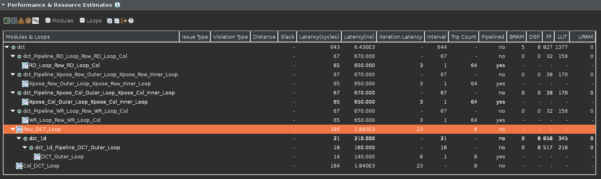
    

    

    <i>DCT_Outer_Loop flattening</i>
    

### Improve Memory Bandwidth

#### Create a new solution by copying the previous solution (Solution3) settings. Apply ARRAY_PARTITION directive to buf_2d_in of dct (since the bottleneck was on src port of the dct_1d function, which was passed via in_block of the dct_2d function, which in turn was passed via buf_2d_in of the dct function) and col_inbuf of dct_2d. Generate the solution.
1. Select **Project > New Solution** to create a new solution.
2. A *Solution Configuration* dialog box will appear. Click the **Finish** button (with Solution4 selected).
3. With *dct.c* open, select **buf_2d_in** array of the dct function in the Directive pane, right-click on it and select **Insert Directive...**

    The buf_2d_in array is selected since the bottleneck was on src port of the dct_1d function, which was passed via in_block of the dct_2d function, which in turn was passed via buf_2d_in of the **dct** function).
4. A pop-up menu shows up listing various directives. Select **ARRAY_PARTITION** directive.
5. Make sure that the type is *complete*. Enter **2** in the dimension field and click **OK**.
    

    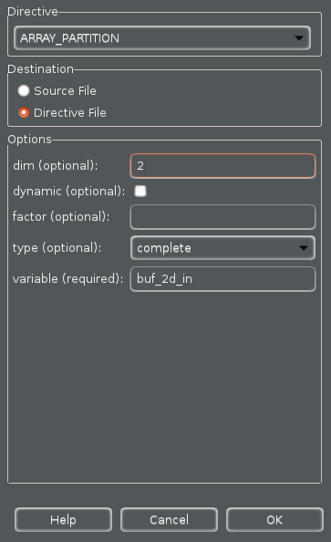
    

    

    <i>Applying ARRAY_PARTITION directive to memory buffer</i>
    

6. Similarly, apply the **ARRAY_PARTITION** directive with dimension of 2 to the **col_inbuf** array.
7. Click on the **Synthesis** button.
8. When the synthesis is completed, select **Project > Compare Reports…** to compare the two solutions.
9. Select *Solution4* and *Solution5* from the Available Reports, and click on the **Add>>** button.
10. Observe that the latency reduced from *643* to *579* clock cycles.
    

    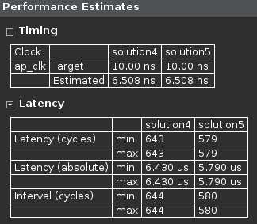
    

    

    <i>Performance comparison after array partitioning</i>
    

11. Scroll down in the comparison report to view the resources utilization. Observe the increase in the FF resource utilization (almost double).
    

    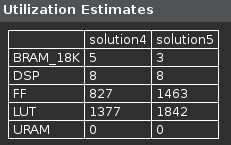
    

    

    <i>Resources utilization after array partitioning</i>
    

12. Expand the Loop entry in the **Performance & Resource Estimates** in *Synthesis Summary* and observe that the Pipeline II is now 1.

### Apply DATAFLOW Directive

#### Create a new solution by copying the previous solution (Solution5) settings. Apply the DATAFLOW directive to improve the throughput. Generate the solution and analyze the output.
1. Select **Project > New Solution**.
2. A *Solution Configuration* dialog box will appear. Click the **Finish** button (with Solution5 selected).
3. Close all inactive solution windows by selecting **Project > Close Inactive Solution Tabs**.
4. Select function **dct** in the directives pane, right-click on it and select **Insert Directive...**
5. Select **DATAFLOW** directive to improve the throughput.
6. Click on the *Synthesis* button.
7. When the synthesis is completed, the synthesis report is automatically opened.
8. Observe that dataflow type pipeline throughput is listed in the "Performance Estimates*
    

    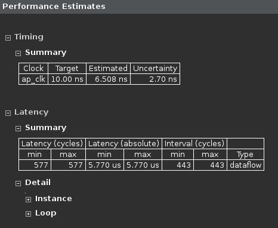
    

    

    <i>Performance estimate after DATAFLOW directive applied</i>
    

 * The Dataflow pipeline throughput indicates the number of clock cycles between each set of
inputs reads (interval parameter). If this value is less than the design latency it indicates the
design can start processing new inputs before the currents input data are output.
 * Note that the dataflow is only supported for the functions and loops at the top-level, not those
which are down through the design hierarchy. Only loops and functions exposed at the toplevel
of the design will get benefit from dataflow optimization.
9. Scrolling down into the *Utilization Estimates*, observe that the number of *BRAM_18K* required at the top-level remained at *3*.
    

    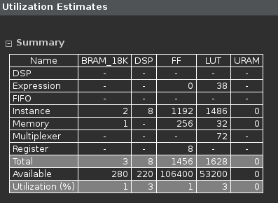
    

    

    <i>Resource estimate with DATAFLOW directive applied</i>
    

10. Look at the console view and notice that **dct_coeff_table** is automatically partitioned in dimension *2*.
11. The *buf_2d_in* and *col_inbuf* arrays are partitioned as we had applied the directive in the previous run. The dataflow is applied at the top-level which created channels between top-level functions *read_data, dct_2d*, and *write_data*.
    

    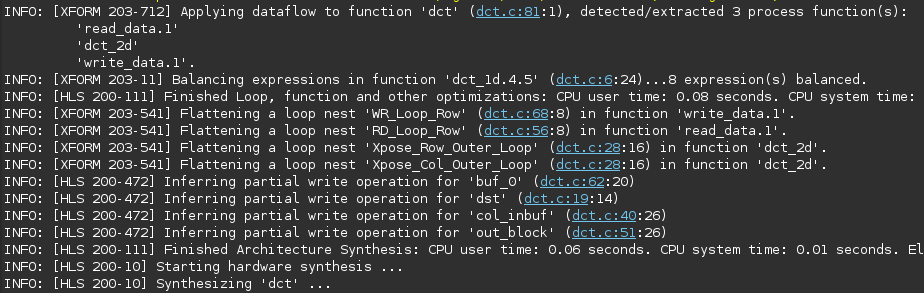
    

    

    <i>Console view of synthesis process after DATAFLOW directive applied</i>
    

#### Perform performance analysis by switching to the Synthesis Summary and looking at the dct Performance & Resource Estimates view.
1. Switch to the *Synthesis Summary* perspective, expand the *Performance & Resource Estimates* entries, and select the **dct_2d**
     entry.
2. Observe that most of the latency and interval (throughput) is caused by the *dct_2d* function. The interval of the top-level function *dct*, is less than the sum of the intervals of the read_data, dct_2d, and write_data functions indicating that they operate in parallel and dct_2d is the limiting factor. It can be seen that dct_2d is not completely operating in parallel as Row_DCT_Loop and Col_DCT_Loop were not pipelined.
    

    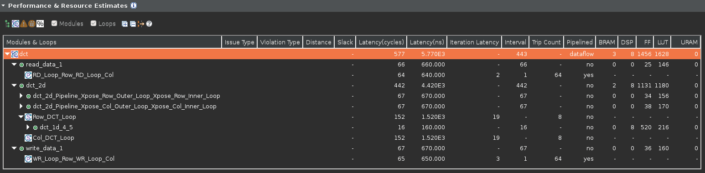
    

    

    <i>Performance analysis after the DATAFLOW directive</i>
    

    One of the limitations of the dataflow optimization is that it only works on top-level loops and functions. One way to have the blocks in dct_2d operate in parallel would be to pipeline the entire function. This however would unroll all the loops and can sometimes lead to a large area increase.
    An alternative is to raise these loops up to the top-level of hierarchy, where dataflow optimization can be applied, by removing the dct_2d hierarchy, i.e. inline the dct_2d function.

### Apply INLINE Directive

#### Create a new solution by copying the previous solution (Solution6) settings. Apply INLINE directive to dct_2d. Generate the solution and analyze the output.
1. Select **Project > New Solution**.
2. A *Solution Configuration* dialog box will appear. Click the **Finish** button (with *Solution6* selected).
3. Select the function *dct_2d* in the directives pane, right-click on it and select **Insert Directive...**
4. A pop-up menu shows up listing various directives. Select **INLINE** directive. The INLINE directive causes the function to which it is applied to be inlined: its hierarchy is dissolved.
5. Click on the *Synthesis* button.
6. When the synthesis is completed, the synthesis report will be opened.
7. Observe that the latency reduced from *577* to *416* clock cycles, and the Dataflow pipeline throughput drastically reduced from *443* to *73* clock cycles.
8. Examine the synthesis log to see what transformations were applied automatically.
   * The dct_1d function calls are now automatically inlined into the loops from which they are called, which allows the loop nesting to be flattened automatically.
   * Note also that the DSP48E usage has doubled (from 8 to 16). This is because, previously a single instance of dct_1d was used to do both row and column processing; now that the row and column loops are executing concurrently, this can no longer be the case and two copies of dct_1d are required: Vitis HLS will seek to minimize the number of clocks, even if it means increasing the area.
    

    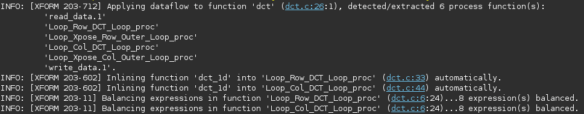
    

    

    <i>Console view after INLINE directive applied to dct_2d</i>
    
   
9. Switch to the *Synthesis Summary* perspective, expand the *Performance & Resource Estimates* entries, and select the **dct** entry.

    Observe that the dct_2d entry is now replaced with dct_Loop_Row_DCT_Loop_proc, dct_Loop_Xpose_Row_Outer_Loop_proc, dct_Loop_Col_DCT_Loop_proc, and dct_Loop_Xpose_Col_Outer_Loop_proc since the dct_2d function is inlined. Also observe that all the functions are operating in parallel, yielding the top-level function interval (throughput) of 73 clock cycles.
    

    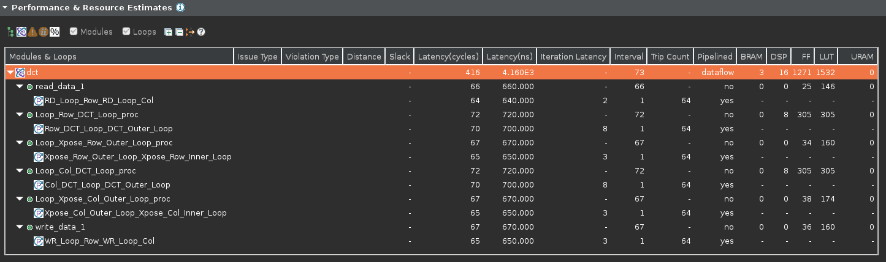
    

    

    <i>Performance analysis after the INLINE directive</i>
    

10. Close Vitis HLS by selecting **File > Exit**.

## Conclusion
In this lab, you learned various techniques to improve the performance and balance resource utilization.
PIPELINE directive when applied to outer loop will automatically cause the inner loop to unroll. When a
loop is unrolled, resources utilization increases as operations are done concurrently. Partitioning memory
may improve performance but will increase BRAM utilization. When INLINE directive is applied to a
function, the lower level hierarchy is automatically dissolved. When DATAFLOW directive is applied, the
default memory buffers (of ping-pong type) are automatically inserted between the top-level functions and
loops. The console logs can provide insight on what is going on.

## Answers
**Answers for question 1:**  
Estimated clock period: **6.508 ns**   
Worst case latency: **423 clock cycles**   
Number of DSP48E used: **17**   
Number of BRAMs used: **16**   
Number of FFs used: **929**   
Number of LUTs used: **2012**

Copyright&copy; 2022, Advanced Micro Devices, Inc.
