# HLS Design Flow – System Integration Lab

## Introduction

This lab illustrates the HLS design flow for generating IP from the Vitis™ HLS tool. The generated IP is then used to create a subsystem with the Arm® processor from a Zynq® UltraScale+™ MPSoC using the Vivado® IP integrator. The hardware from the Vivado Design Suite is imported into the Vitis environment, and the FIR application is then run on the PYNQ-ZU development board. 

## Objectives
After completing this lab, you will be able to:
* Describe the HLS design flow to generate the Vivado IP 
design in Vitis HLS
* Identify the steps and directives involved in creating an IP within the Vitis HLS tool
* Create a system with the Arm processor from a Zynq UltraScale+ MPSoC and IP (fir filter) created with the Vitis HLS tool using the Vivado IP integrator flow
* Use a software application development flow to create and run the application on a development board

## The design
The design consists of a FIR filter to filter a 4 KHz tone added to CD quality (48 KHz) music. The characteristic of the filter is as follows:  
    FS=48000 Hz   
    FPASS1=2000 Hz   
    FSTOP1=3800 Hz   
    FSTOP2=4200 Hz   
    FPASS2=6000 Hz   
    APASS1=APASS2=1 dB   
    ASTOP=60 dB  
This lab requires you to develop a peripheral core of the designed filter that can be instantiated in a processor system. The processor system will acquire a stereo music stream using an on-board CODEC chip and I2C controller, process it through the designed filter (bandstop filter), and output back to the headphone.

## Steps

### Downdload the audio ctrl IP 
Download the audio ctrl IP from https://github.com/Xilinx/PYNQ/tree/master/boards/ip/audio_codec_ctrl_v1.0/src, and put these 10 files into the **{labs}/lab4/ip_repo/zed_audio_ctrl/zed_audio_ctrl.srcs/sources_1/imports/i2s_audio** folder.

### Create a New Project
#### Create a new project in Vitis HLS targeting xczu5eg-sfvc784-1-e device
1. Invoke Vitis HLS Command prompt by selecting **Start > Xilinx Design Tools > Vitis HLS 2021.2 Command Prompt** then type **vitis_hls** in the terminal.
   A **Getting Started GUI** will appear.
2. In the *Getting Started* section, click on *Create Project*. The **New Vitis HLS Project** wizard opens.
3. Click **Browse…** button of the *Location* field, browse to **{labs}/lab4**, and then click **OK**.
4. For *Project* Name, type **fir** and click **Next**.
5. In the *Add/Remove Files* for the source files, type **fir** as the function name (the provided source file contains the function, to be synthesized, called fir).
6. Click the *Add Files…* button, select **fir.c** and **fir_coef.dat** files from the **{labs}/lab4** folder, and then click **Open**.
7. Click **Next**.
8. In the *Add/Remove Testbench Files* for the testbench, click the *Add Files…* button, select **fir_test.c** file from the **{labs}/lab4** folder and click **Open**.
9. Click **Next**.
10. In the *Solution Configuration* page, leave *Solution* Name field as *solution1* and make sure the clock period as **10**. Leave Uncertainty field blank.
11. Click on the Part’s Browse button and using the *Parts Specify* option, select **xczu5eg-sfvc784-1-e**.
12. Click **Finish**.

    You will see the created project in the Explorer view. Expand various sub-folders to see the entries under each sub-folder.
13. Double-click on the *fir.c* under the *source* folder to open its content in the information pane.

       

       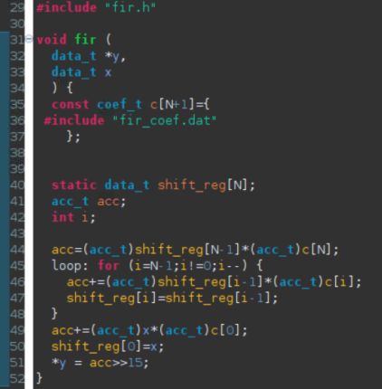
       

       

       <i>The design under consideration</i>
       

       
       The FIR filter expects **x** as a sample input and pointer to the computed sample out **y**. Both of them are defined of data type data_t. The coefficients are loaded in array **c** of type coef_t from the file called *fir_coef.dat* located in the current directory. The sequential algorithm is applied and accumulated value (sample out) is computed in variable acc of type acc_t.
14. Double-click on the **fir.h** in the outline tab to open its content in the information pane.

     

     
     

     

     <i>The header file</i>
     

     
     The header file includes **ap_cint.h** so user defined data width (of arbitrary precision) can be used. It also defines number of taps (N), number of samples to be generated (in the testbench), and data types coef_t, data_t, and acc_t. The coef_t and data_t are short (16 bits). Since the algorithm iterates (multiply and accumulate) over 59 taps, there is a possibility of bit growth of 6 bits and hence acc_t is defined as int38. Since the acc_t is bigger than sample and coefficient width, they have to cast before being used (like in lines 16, 18, and 21 of fir.c).
15. Double-click on the **fir_test.c** under the testbench folder to open its content in the information pane.

    Notice that the testbench opens fir_impulse.dat in write mode, and sends an impulse (first sample being 0x8000).

### Run C Simulation

#### Run C simulation to observe the expected output.
1. Select **Project > Run C Simulation** or click on the button from the tools bar buttons, and click **OK** in the C Simulation Dialog window.
    The testbench will be compiled using apcc compiler and csim.exe file will be generated. The csim.exe will then be executed and the output will be displayed in the console view.
    

    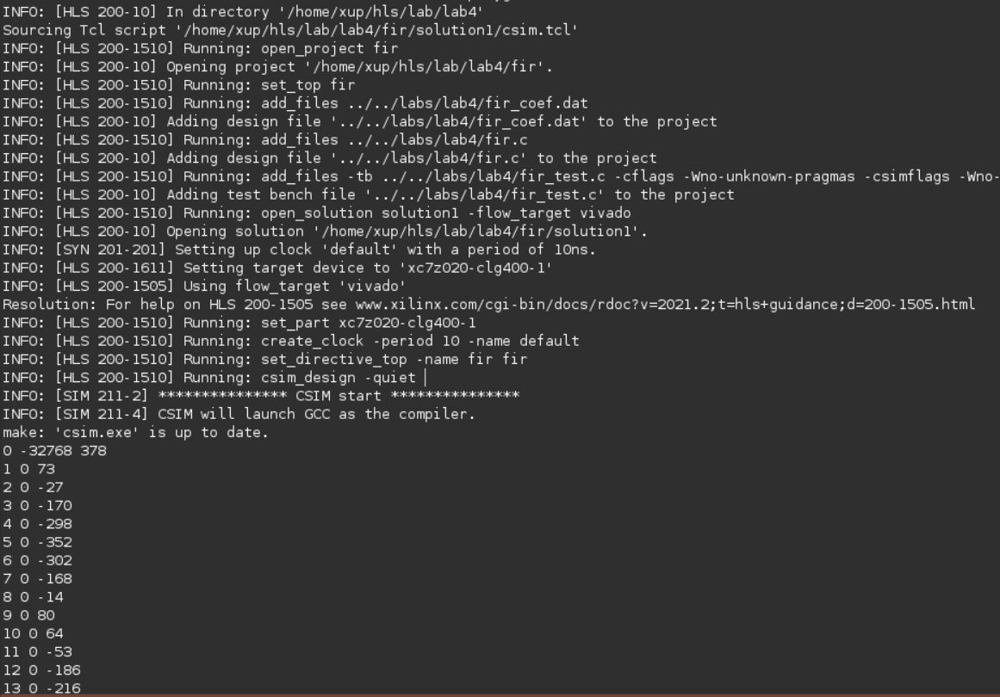
    

    

    <i>Initial part of the generated output in the Console view</i>
    

    You should see the filter coefficients being computed.

### Synthesize the Design with the defaults

#### Synthesize the design with the defaults. View the synthesis results and answer the question listed in the detailed section of this step.
1. Select **Solution > Run C Synthesis > Active Solution** to start the synthesis process.
2. When synthesis is completed, several report files will become accessible and the Synthesis. Results will be displayed in the information pane.
3. The *Synthesis Report* shows the performance and resource estimates as well as estimated latency in the design.
4. Using scroll bar on the right, scroll down into the report and answer the following question.  
    **Question 1**  
    Estimated clock period:   
    Worst case latency:   
    Number of DSP48E used:   
    Number of BRAMs used:   
    Number of FFs used:   
    Number of LUTs used:   
5. The report also shows the top-level interface signals generated by the tools.
    

    
    

    

    <i>Generated interface signals</i>
    

    You can see the design expects x input as 16-bit scalar and outputs y via pointer of the 16-bit data. It also has ap_vld signal to indicate when the result is valid.

### Run RTL/C CoSimulation

#### Run the RTL/C Co-simulation, selecting Verilog. Verify that the simulation passes.
1. Select **Solution > Run C/RTL Co-simulation** to open the dialog box so the desired simulations can be run.
2. Select the *Verilog* option and click **OK**.

   The Co-simulation will run, generating and compiling several files, and then simulating the design. In the console window you can see the progress. When done the RTL Simulation Report shows that it was successful and the latency reported was 68.

### Setting Up the AXI Lite Adapters and Re-synthesizing the Design
#### Add INTERFACE directive to create AXI4LiteS adapters so IP-XACdT adapter can be generated during the RTL Export step.

1. Make sure that **fir.c** file is open and in focus in the information view.
2. Select the **Directive** tab.
3. Right-click *x*, and click on **Insert Directive…**.
4. In the Vitis HLS Directive Editor dialog box, select **INTERFACE** using the drop-down button.
5. Click on the button beside *mode (optional)*. Select **s_axilite**.
6. In the *bundle (optional)* field, enter **fir_io** and click **OK**.
    

    
    

    

    <i>Selecting the AXI4LiteS adapter and naming bundle</i>
    

7. Similarly, apply the **INTERFACE** directive (including bundle) to the *y* output.
    

    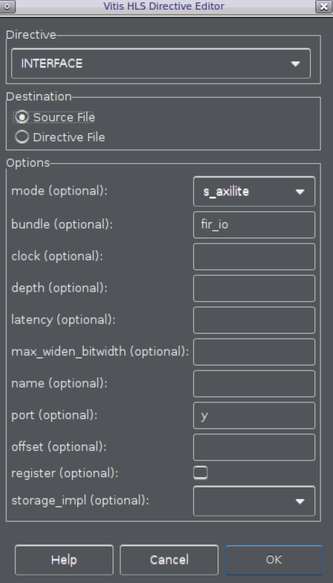
    

    

    <i>Applying bundle to assign y output to AXI4Lite adapter</i>
    

8. Apply the **INTERFACE** directive to the *top-level module fir* to include ap_start, ap_done, and ap_idle signals as part of bus adapter (the variable name shown will be return). Include the bundle information too. **There is a bug in the tool, as it does not update the directives.tcl file with this directive.**
    

    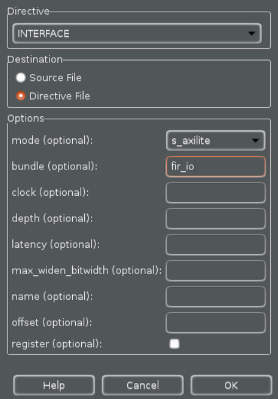
    

    

    <i>Applying bundle to assign function control signals to AXI4Lite adapter</i>
    

    Note that the above steps will create address maps for x, y, ap_start ap_valid, ap_done, and ap_idle, which can be accessed via software. Alternately, ap_start, ap_valid, ap_done, ap_idle signals can be generated as separate ports on the core. These ports will then have to be connected in a processor system using available GPIO IP.

9. Worksaround for this bug is to modify the source code and apply using **pragma**. Enter the following line on line number 11. 

   #pragma HLS INTERFACE s_axilite port=return bundle=fir_io

   Save the file.

### Re-synthesize the design

#### Re-synthesize the design as directives have been added. Run the RTL Export to export the design as an IP.
1. Since the directives have been added, it is necessary to re-synthesize the design. Select **Solution > Run C Synthesis > Active Solution**.

   Check the Interface summary at the bottom of the Synthesis report to see the interface that has been created.
2. Once the design is synthesized, select **Solution > Export RTL** to open the dialog box so the desired IP can be generated.
    An **Export RTL Dialog** box will open.
    

    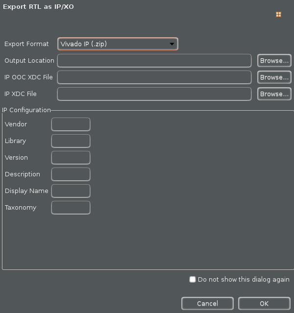
    

    

    <i>Export RTL Dialog</i>
    

3. Click **OK** to export the design as an IP.
4. When the run is completed, expand the **impl** folder in the Explorer view and observe various generated directories, such as ip, misc, verilog and vhdl.
    

    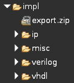
    

    

    <i>IP-XACT adapter generated</i>
    

    Expand the *ip* directory and observe several files and sub-directories. One of the sub-directory of interest is the drivers directory which consists of header, c, tcl, mdd, and makefile files. Another file of interest is the zip file, which is the ip repository file that can be imported in an IP Integrator design
    

    
    

    

    <i>Adapter’s drivers directory</i>
    

5. Close Vitis HLS by selecting **File > Exit**.

### Create a Vivado Project

#### Open a terminal and run the provided tcl script to create an initial system targeting the PYNQ-ZU board.
1. Download the board files of PYNQ-ZU from [/board_files](https://github.com/Xilinx/XilinxBoardStore/tree/master/boards/TUL/pynqzu/1.1), and put it in the folder **<Vivado_2021_2_install>/data/xhub/boards/XilinxBoardStore/boards/Xilinx/** on Linux, while **<Vivado_2021_2_install>\\data\\xhub\\boards\\XilinxBoardStore\\boards\\Xilinx\\** on Windows, where **<Vivado_2021_2_install>** should be replaced by the install_path on your computer.
2. On Linux machine, open a terminal directly. While on Windows machine, open a **Command Prompt** window.
3. Execute **source <Vivado_2021_2_install>/settings64.sh** on Linux, while **<Vivado_2021_2_install>\\settings64-Vivado.bat** on Windows, where **<Vivado_2021_2_install>** should be replaced by the install_path on your computer.
4. Change the directory to **{labs}/lab4** using the *cd* command.
5. Run the provided script file to create an initial system having zed_audio_ctrl and GPIO peripherals by typing the following command:

    **vivado -source pynq_zu_audio_project_create.tcl**
    
    The script will be run and the initial system, shown below, will be created.
    

    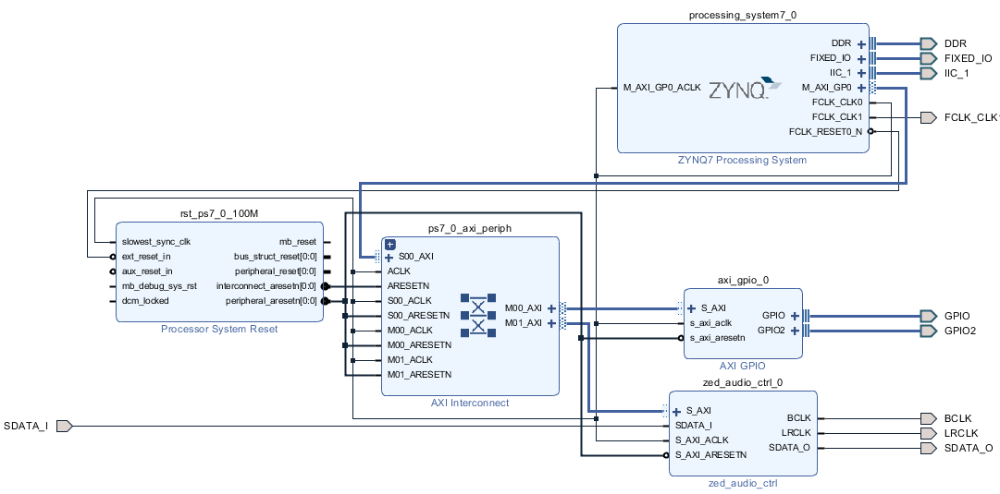
    

    

    <i>Block design made for Pynq</i>
    

#### Add the HLS IP to the IP Catalog
1. Select **Flow Navigator > Project Manager > Settings**
2. Expand **IP > Repository** in the left pane.
3. Click the **+** button (The lab4/ip_repo directory has already been added). Browse to **{labs}/lab4/fir/solution1/impl/ip** and click **Select**.

    The directory will be scanned and added in the IP Repositories window, and one IP entry will be detected.
4. Click **OK**.
    

    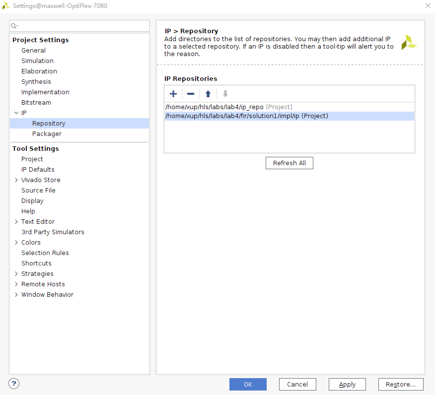
    

    

    <i>Setting path to IP Repositories</i>
    

5. Click **OK** to accept the settings.

#### Instantiate fir_top core twice, one for each channel, into the processing system.
1. Click the *Add IP* icon (plus sign icon) and search for **Fir** in the catalog by typing **Fir** and double-click on the **Fir** entry to add an instance.
    Notice that the added IP has HLS logo in it indicating that this was created by Vitis HLS.
2. Similarly, add another instance of the HLS IP.
3. Click on **Run Connection Automation**, and select **All Automation**.
4. Click on **/fir_0/s_axi_fir_io** and **/fir_1/ s_axi_fir_io**. and verify that they will both be connected to the M_AXI_GP0, and click **OK**.

#### Enable the PS-PL Interrupt ports > IRQ_F2P ports. Add an instance of concat IP with two single-bit input ports. Connect input ports to the interrupt ports of the two FIR instances and the output port to the IRQ_F2P port of the processing_system7_0 instance.
1. Double-click on the *processing_system7_0* instance to open the re-customization form.
2. Select the *Interrupts* entry in the left pane, click on the *Fabric Interrupts* check box in the right.
3. Expand the **Fabric Interrupts > PL-PS Interrupt Ports > IRQ_F2P** entry in the right, and click the check-box of *IRQ_F2P[15:0]*.
4. Click **OK**.
5. Add an instance of the *concat* IP.
6. Connect the interrupt port of each of the FIR instances to the two input ports of the *xlconcat_0* instance.
7. Connect the output port of the *xlconcat_0* instance to the **IRQ_F2P** port of the *processing_system7_0* instance.

    At this stage the design should look like shown below (you may have to click the regenerate button).
    

    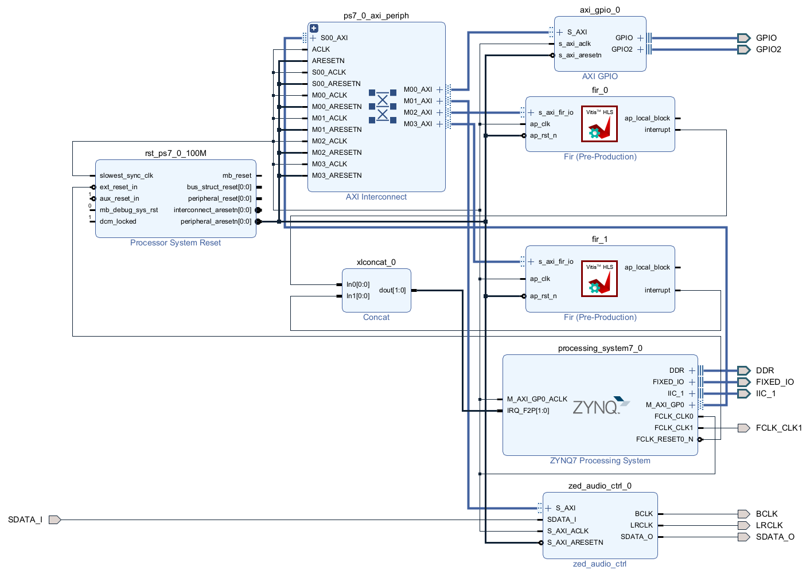
    

    

    

#### Verify addresses and validate the design. Generate the system_wrapper file, and add the provided Xilinx Design Constraints (XDC).
1. Click on the **Address Editor**, and expand the **processing_system7_0 > Data** if necessary. The generated address map should look like as shown below.
    

    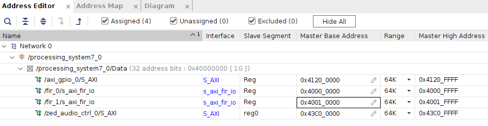
    

    

    <i>Generated address map</i>
    

2. Run *Design Validation* (**Tools > Validate Design**) and verify there are no errors
3. In the *sources* view, right-click on the block diagram file, **system.bd**, and select **Create HDL Wrapper** to update the HDL wrapper file. When prompted, click **OK** with the *Let Vivado manage wrapper and auto-update* option.
4. Click **Add Sources** in the Flow Navigator pane, select **Add or Create Constraints**, and click **Next**.
5. Click the *Add Files* button, browse to the **{labs}/lab4** folder, select **pynq_zu_audio_constraints.xdc**.
6. Click *Copy constraints files into project* and then click **Finish** to add the file.
7. Click on the **Generate Bitstream** in the Flow Navigator to run the synthesis, implementation, and bitstream generation processes.
8. Click **Save, Yes**, and **OK** if prompted to start the process.
9. When the bit generation is completed, a selection box will be displayed with *Open Implemented Design* option selected. Click **Cancel**.

### Export to Vitis and create Application Project
#### Export the hardware along with the generated bitstream to Vitis.
1. Select **File > Export > Export Hardware…**
2. Click **Next**
3. Make sure that *Include Bitstream* option is selected and click **OK**, leaving the target directory set to local project directory {labs}/lab4/audio.
4. Open **Vitis 2021.2**
5. Change the workspace to **{labs}/lab4/audio** and click **Launch**
6. In Vitis, select **File > New > Platform Project**
7. Enter **audio** as the *Platform project name* and click **Next**
8. For *XSA File*, browse to **{labs}/lab4/audio** and select **system_wrapper.xsa**
    

    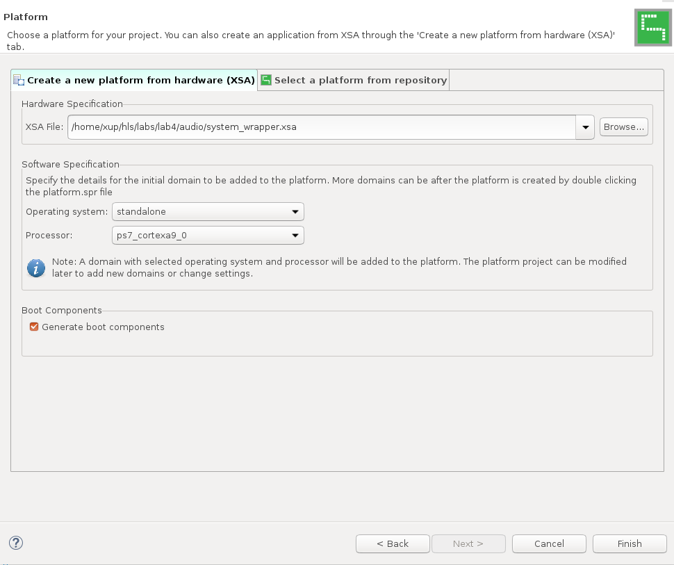
    

    

    <i>Hardware Specification</i>
    

8. Click **Finish** with the default settings (with **standalone operating system**).
9. Select **File > New > Application Project**
10. Click **Next**
11. In **Select a platform from repository** tab, select **audio** as the platform.
12. Click **Next**
13. Enter **Test** as the *Project* Name and click **Next**
14. Click **Next**, select **standalone_domain** for the domain.
    

    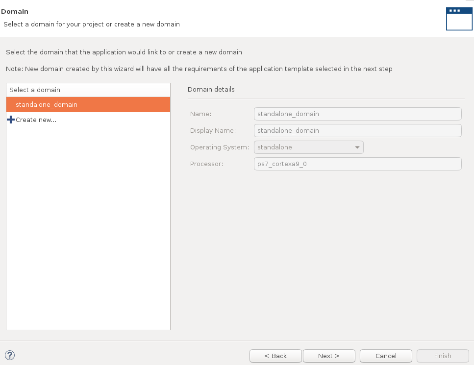
    

    

    <i>Select domain</i>
    

13. Click **Next**, select **Empty Application(C)** and click **Finish**
14. Select *Test* in the project view, right-click the *src* folder, and select **Import Sources...**
15. Browse to **{labs}/lab4** folder.
16. Select both **pynq_zu_testapp.c** and **pynq_zu_audio.h** and click **Finish** to add the files to the project. 
17. Select **Test_system** inn the *Assistant* view, right-click and select **Build**. The program should compile successfully.

### Verify the Design in Hardware

#### Connect a micro-usb cable between a PC and the JTAG port of the board. Connect an audio patch cable between the Line In jack and the speaker (headphone) out jack of a PC. Connect a headphone to the Line Out jack on the board. Power On the board.
1. Connect a micro-usb cable between a PC and the JTAG port of the board.
2. Connect an audio patch cable between the **Line In** jack and the **speaker out** (headphone)  jack of a PC.
3. Connect a headphone to the *HP+MIC* jack on board. Power **ON** the board.
4. Select **Xilinx > Program Device**.
5. Make sure that the **system_wrapper.bit** bitstream is selected.
6. Click **Program**.
    This will configure the FPGA.
7. Double-click **corrupted_music_4KHz.wav** or some other wave file of interest to play it using the installed media player. Place it in the continuous play mode.
8. Right-click on the *Test_system* in the **Assistant** view and select **Run > Run configuration**.
9. Double-click on the *System Project Debug* to create the Run configuration, and then click on **Run**

   The program will be downloaded and run. If you want to listen to corrupted signal then set the **SW0 OFF**. To listened the filtered signal set the **SW0 ON**.
9. When done, power OFF the board.
10. Exit Vitis and Vivado using **File > Exit**.

## Conclusion

In this lab, you developed an IP from the C design of a FIR filter using the Vitis HLS tool. Using the Vivado IP integrator, you next created a system with the Arm processor from the Zynq UltraScale+ MPSoC and the FIR IP. You then used a test application to write into and read from the IP interface registers.

## Answer
**Answers for question 1:**  
Estimated clock period: **1.878 ns**   
Worst case latency: **70**   
Number of DSP48E used:  **3**   
Number of BRAMs used:  **0**   
Number of FFs used: **237**   
Number of LUTs used: **257**   

## Appendix

### Create a Project using Vivado GUI
#### Launch Vivado and create an empty project targeting the Pynq-ZU (xczu5eg-sfvc784-1-e)
1. Open **Vivado 2021.2**
2. Click **Create Project** to start the wizard. You will see the New Project dialog box. Click **Next**.
3. Click the Browse button of the Project Location field of the New Project form, browse to **{labs}/lab4**, and click **Select**.
4. Enter **audio** in the Project Name field. Make sure that the *Create Project Subdirectory* box is checked. Click Next.
    

    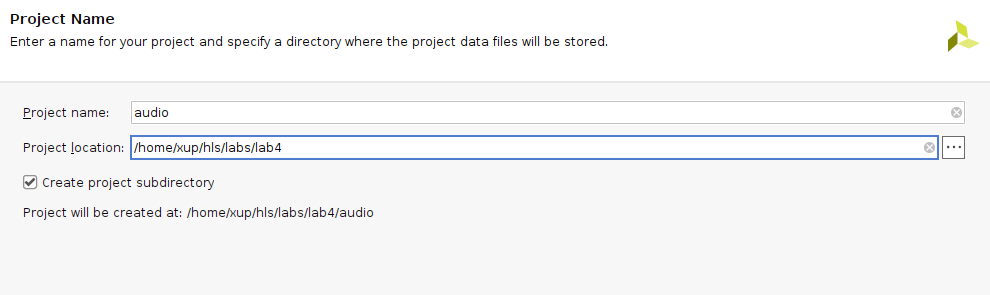
    

    

    <i>Project Name entry</i>
    

5. Select *RTL Project* in the Project Type form, and click **Next**.
6. Select *Verilog* as the Target language in the Add Sources form, and click **Next**.
    

    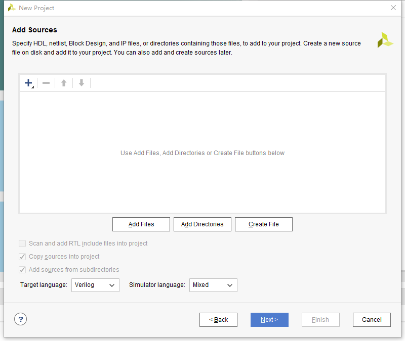
    

    

    <i>Add sources to new project</i>
    

7. Click **Next** two times to skip *Adding Existing IP* and *Add Constraints* dialog boxes
8. In the *Default Part* form, and select pynq-zu. Click **Next**.
    

    
    

    

    <i>Boards and Parts selection</i>
    

9. Check the Project Summary and click **Finish** to create an empty Vivado project.

### Creating the System Using the IP Integrator
#### Use the IP Integrator to create a new Block Design, and generate the ARM Cortex-A9 processor based hardware system.
1. In the *Flow Navigator*, click **Create Block Design** under IP Integrator
    

    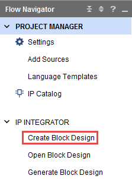
    

    

    <i> Create IP Integrator Block Diagram</i>
    

2. Enter **system** for the design name and click **OK**.
3. IP from the catalog can be added in different ways. Click on *Add IP* in the message at the top of the Diagram panel, or click the Add IP icon in the block diagram side bar, press Ctrl + I, or right-click anywhere in the Diagram workspace and select Add IP.
4. Once the IP Catalog is open, type “zy” into the Search bar, find and double click on **ZYNQ7 Processing System** entry, or click on the entry and hit the Enter key to add it to the design.
    

    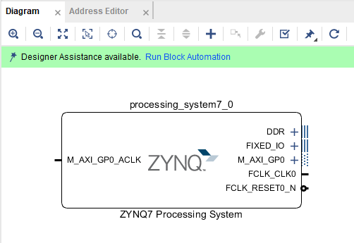
    

    

    <i>The Zynq IP Block</i>
    

5. Notice the message at the top of the Diagram window that Designer Assistance available. Click on **Run Block Automation** and select */processing_system7_0*
6. Click **OK** when prompted to run automation.
    

    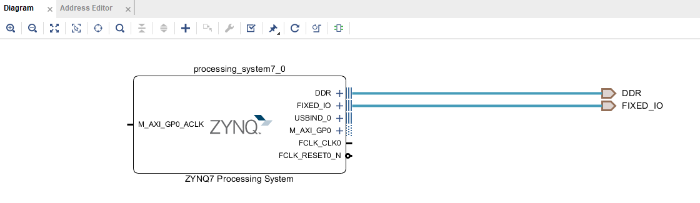
    

    

    <i>Zynq Block with DDR and Fixed IO ports</i>
    
  
7. In the block diagram, double click on the Zynq block to open the Customization window for the
Zynq processing system.
A block diagram of the Zynq should now be open, showing various configurable blocks of the
Processing System.
At this stage, the designer can click on various configurable blocks (highlighted in green) and
change the system configuration.

#### Configure I/O Peripherals block to use UART 1 and I2C 1 peripherals, disabling other unwanted peripherals. Uncheck Timer 0. Enable FCLK_CLK1, the PL fabric clock and set its frequency to 10.000 MHz for the Pynq
1. Select the MIO Configuration tab on the left to open the configuration form and expand I/O Peripheral in the right pane.
2. Click on the check box of the I2C 1 peripheral. Uncheck USB0, SD 0, ENET 0, GPIO > GPIO MIO as we don’t need them.
3. Expand the Application Processing Unit group in the Select the MIO Configuration tab and uncheck the **Timer 0**.
4. Select the **Clock Configuration** in the left pane, expand the PL Fabric Clocks entry in the right, and click the check-box of *FCLK_CLK1*.
5. Change the Requested Frequency value of FCLK_CLK1 to **10.000 MHz**
    

    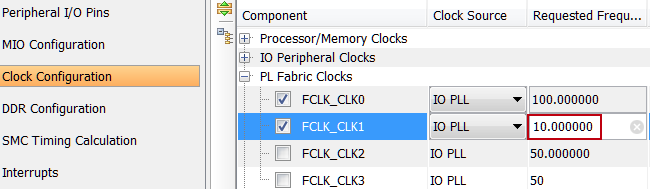
    

    

    <i>Enabling and setting the frequency of FCLK_CLK1</i>
    

6. Click **OK**.
    Notice that the Zynq block only shows the necessary ports.

#### Add the provided I2C-based IP

1. In the Flow Navigator pane, click **Settings** under Project Manager.
    

    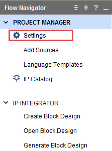
    

    

    <i>Invoking Project Settings</i>
    

2. Expand **IP > Repository** in the left pane.
3. Click the + button. Browse to **{labs}/lab4/ip_repo** and click **Select**.
    The directory will be scanned and added in the IP Repositories window, and two IP entry will be detected.
4. Click **OK** to accept the settings.

#### Instantiate zed_audio_ctrl and GPIO with width of 2 bits on channel 1 and width of 1 bit input only on channel 2. Run connection automation to connect them.
1. Click the **Add IP** button if the IP Catalog is not open and search for AXI GPIO in the catalog by typing *gpi* and double-click on the AXI GPIO entry to add an instance.
2. Double-click on the added instance and the Re-Customize IP GUI will be displayed.
3. Select IP Configuration.
4. Change the GPIO Width to **2**.
5. Check the **Enable Dual Channel** box, set the GPIO Width of GPIO 2 to **1** only, and click **OK**.
6. Similarly add an instance of the **zed_audio_ctrl**.
7. Notice that Design assistance is available. Click on *Run Connection Automation*, and select **/axi_gpio_0/S_AXI**
8. Click **OK** to connect it to the M_AXI_GP0 interface.
    Notice two additional blocks, Proc Sys Reset, and AXI Interconnect have automatically been added to the design.
9. Similarly, click on *Run Connection Automation*, and select **/zed_audio_ctrl_0/S_AXI**.

#### Make IIC_1, GPIO, FCLK_CLK1, and zed_audio_ctrl ports external.
1. Select the GPIO interface of the *axi_gpio_0* instance, right-click on it and select **Make External** to create an external port. This will create the external port named GPIO and connect it to the peripheral.
2. Select the GPIO2 interface of the *axi_gpio_0* instance, right-click on it and select **Make External** to create the external port.
3. Similarly, selecting one port at a time of the *zed_audio_ctrl_0* instance, make them external.
4. Similarly, make the IIC_1 interface and FCLK_CLK1 port of the processing_system7_0 instance external.
5. Change the names of **BCLK_0** to **BCLK**, **LRCLK_0** to **LRCLK**, **SDATA_O_0** to **SDATA_O**, **SDATA_I_0** to **SDATA_I**, **GPIO_0** to **GPIO**, and **GPIO2_0** to **GPIO2** to match the signal names useed in the provided design constraint file.
    At this stage the design should look like shown below (you may have to click the regenerate layout button).
    

    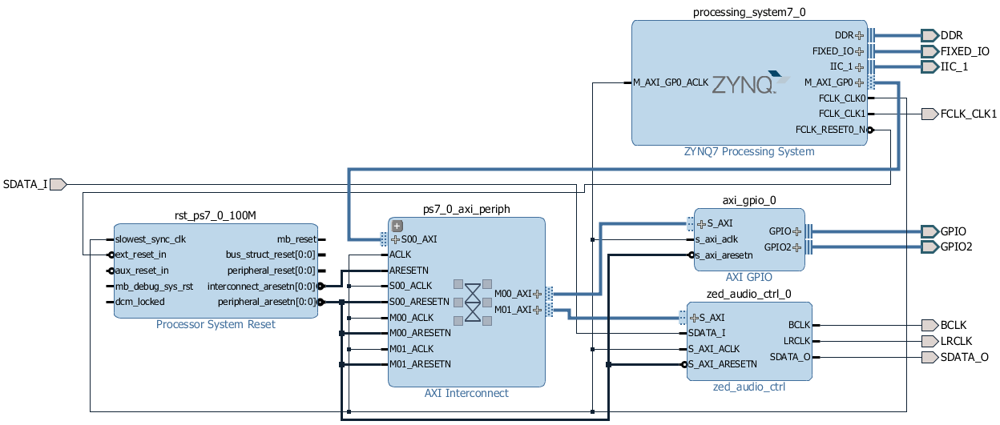
    

    

    <i>Block design after I2C based zed_audio_ctrl core added and connections made for the Pynq</i>
    

