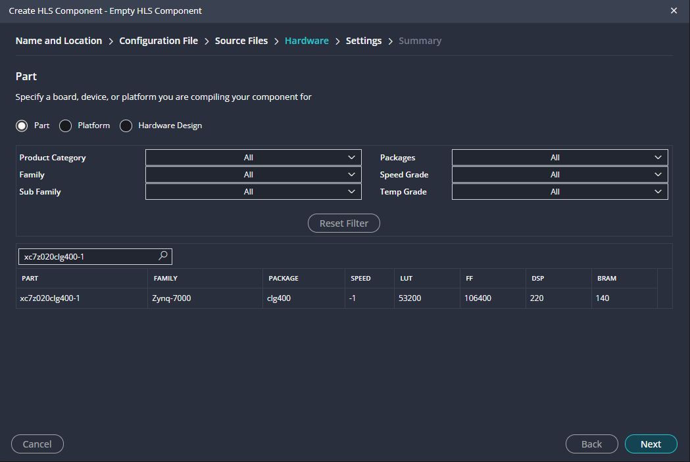
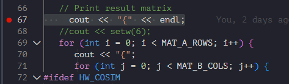

# Vitis Design Flow Lab

## Introduction

This lab provides a basic introduction to high-level synthesis using the Vitis flow. You will use Vitis to create a project. You will simulate, synthesize, and implement the provided design.

## Objectives

After completing this lab, you will be able to:

* Create a new project using Vitis
* Simulate a C design by using a self-checking test bench
* Synthesize the design
* Perform design analysis using the Analysis Perspective view
* Perform co-simulation on a generated RTL design by using a provided C test bench
* Implement a design

## Steps

### Create a New Project

#### Create a new project in Vitis HLS targeting PYNQ-Z2 board
1. Launch Vitis: Select **Create Component... > Create Empty HLS Component**
    

    
    

    

    <i>Getting Started view of Vitis</i>
    

2. Click the *Browse…* button of the Location field and browse to **{labs}\\lab1** on a Windows machine or **{labs}/lab1** on a Linux machine creating sub-folders as necessary, and then click **OK**.
   
   Note: From this point onward reference will be made to Linux name.

3. For Project Name, type **matrixmul**.
    

    
    

    

    <i>New Vitis HLS Project wizard</i>
    

4. Click **Next**.
5. In the *Configuration File* window, select the *Empty File* option and click **Next**.
6. In the *Source Files* window, type **matrixmul** as the *Top Function* name (the provided source file contains the function, called matrixmul, to be synthesized).
7. Click the *Add Files…* button (which in the line of DESIGN FILES), select **matrixmul.cpp** file from the **{labs}/lab1** folder, and then click **Open**.
8. Then we add the test file, in the next block click *Add Files…* button (which in the line of TEST BENCH FILES), select **matrixmul_test.cpp** file from the **/home/xup/hls/labs/lab1** folder and click **Open**.
9.  Select the **matrixmul_test.cpp** in the files list window and click the *Edit CFLAG…* button, type
 **-DHW_COSIM** (there has  a "-" in here, don't forget it), and click **OK**. (This defines a compiler flag that will be used later.)
10. Click **Next**.
    

    
    

    

    <i>Source Files setting</i>
    

11. In the *Hardware* page, select **Part** field, enter  **xc7z020clg400-1** in the *Search* field and click **next**.

here you should select the device that you are using, In my class Zedboard using xc7z020clg484-1
    

    
    

    

    <i>Using Search to selcet the chip</i>
    

12. In the *Settings* page, tpye 10ns in the clock.Click **next**. 
13. Click **Finish**.
    You will see the created project in the *VITIS COMPOMENTS* view. Expand various sub-folders to see the entries under each sub-folder.
    

    
    

    

    <i>Explorer Window</i>
    

14. Double-click on the **matrixmul.cpp** under the source folder to open its content in the information pane.
    

    
    

    

    <i>The Design under consideration</i>
    

    It can be seen that the design is a matrix multiplication implementation, consisting of three nested loops. The Product loop is the inner most loop performing the actual Matrix elements product and sum. The Col loop is the outer-loop which feeds the next column element data with the passed row element data to the Product loop. Finally, Row is the outer-most loop. The res[i][j]=0 (line 41) resets the result every time a new row element is passed and new column element is used.

### Run C Simulation

1. Select **FLOW > C Simulation > Run**.

   it may be have a windows ask if Enable Code Analyzer, click **Yes, enable Code Analyzer**

    The files will be compiled and you will see the output in the Console window.
    

    
    

    

    <i>Program output</i>
    

2. Double-click on **matrixmul_test.cpp** under **testbench** folder in the Explorer to see the content.

    You should see two input matrices initialized with some values and then the code that executes the algorithm. If HW_COSIM is defined (as was done during the project set-up) then the **matrixmul** function is called and compares the output of the computed result with the one returned from the called function, and prints **Test passed** if the results match.
    If **HW_COSIM** had not been defined then it will simply output the computed result and not call the **matrixmul** function.

### Run Debugger

#### Run the application in debugger mode and understand the behavior of the program.
1. Click **Debug** below the **Run** . 
   
   The application will be compiled with **–g** option to include the debugging information, the compiled application will be invoked, and the debug perspective will be opened automatically.
2. The *Debug* perspective will show the **matrixmul_test.cpp** in the source view, **argc** and **argv** variables defined in the **Variables > Local**, thread created and the program suspended at the main() function entry point in the *Debug* view.
    

    
    

    

    <i>A Debug perspective</i>
    

3. Scroll-down in the *source* view, and click in the left size of the line 67 where it is about to output **“{“** in the output console window. This will set a break-point at line 67.

    The breakpoint is marked with a red circle.

    

    
    

    

    

4. Similarly, set a breakpoint at line 63 in the matrixmul() function.
5. Using the **Step Over** (F10) button several times, observe the execution progress, and observe the variable values updating, as well as computed software result.
    

    
    

    

    <i>Debugger’s intermediate output view</i>
    

6. Now click the **Restart** button or *ctrl+shift+F5* and then click the **Continue** or F5 to complete the software computation and stop at line 63.
7. Observe the following computed software result in the variables view.
    

    
    

    

    <i>Software computed result</i>
    

8. Click on the **Step Into** (F11) button to traverse into the **matrixmul** module, the one that we will synthesize, and observe that the execution is paused on line 37 of the module.
9.  Using the **Step Over** (F6) several times, observe the computed results. Once satisfied, you can use the **Restart** and **Continue** back to the line 63.
10. Set a breakpoint on line 96 (return err_cnt;), and click on the **Continue** button.
    The execution will continue until the breakpoint is encountered. The console window will show the results as seen earlier (Figure 11, which is up there).
11. Press the **Continue** button to finish the debugging session.

### Synthesize the Design

#### Switch to Synthesis view and synthesize the design with the defaults. View the synthesis results and answer the question listed in the detailed section of this step.

1. Switch to the *Synthesis* view by clicking **Vitis Components** button.
    

    
    

    

    <i>The botton</i>
    

2. Select **Flow > C SYNTHSIS > Run** to start the synthesis process.
3. When the synthesis process is completed, Select **C SYNTHESIS > REPORTS > Synthesis** to oepn the synthesis page.
    

    
    

    

    <i>Report view after synthesis is completed</i>
    

4. If you expand **Output > syn** in Explorer, several generated files including report files will become accessible.
    

    
    

    

    <i>Explorer view after the synthesis process</i>
    

    Note that when the **syn** folder under the *Output* folder is expanded in the *Explorer* view, it will show *report, verilog,* and *vhdl* sub-folders under which report files, and generated source (vhdl, verilog, header, and cpp) files. By double-clicking any of these entries one can open the corresponding file in the information pane.

    Also note that if the target design has hierarchical functions, reports corresponding to lower-level functions are also created.
5. The *Synthesis Report* shows the performance and resource estimates as well as estimated latency in the design.
6. Using scroll bar on the right, scroll down into the report and answer the following question.

    **Question 1**
    Answer the following question:  
    Estimated clock period:   
    Worst case latency:   
    Number of DSP48E used:   
    Number of FFs used:   
    Number of LUTs used:  

7. The report also shows the top-level interface signals generated by the tools.This can be see in the Synthesis page down below.
    

    
    

    

    <i>Generated interface signals</i>
    

    You can see **ap_clk, ap_rst, ap_ idle** and **ap_ready** control signals are automatically added to the design by default. These signals are used as handshaking signals to indicate when the design is ready to take the next computation command (ap_ready), when the next computation is started (ap_start), and when the computation is completed (ap_done). Other signals are generated based on the input and output signals in the design and their default or specified interfaces.

### Analyze using Analysis Perspective

#### Switch to the Analysis Perspective and understand the design behavior.

1. Select **C SYNTHESIS > REPORTS > Schedule Viewer** to open the analysis viewer.

    The Analysis perspective consists of 4 panes as shown below. Note that the module and loops hierarchies are displayed unexpanded by default.
    The **Module Hierarchy** pane shows both the performance and area information for the entire design and can be used to navigate through the hierarchy. The **Performance Profile** pane is visible and shows the performance details for this level of hierarchy. The information in these two panes is similar to the information reviewed earlier in the synthesis report.
    The **Schedule Viewer** is also shown in the right-hand side pane. This view shows how the operations in this particular block are scheduled into clock cycles.

    

    
    

    

    <i>Analysis perspective</i>
    

2. Click on **>** of loop *Row_Col* to expand.
    

    
    

    

    <i>Performance matrix showing top-level Row operation</i>
    

    From this we can see that there is an add operation performed. This addition is likely the counter to count the loop iterations, and we can confirm this.
3. Select the block for the **adder** ( **add_in75_3(+)**), right-click and select **Goto Source**.
    The source code pane will be opened, highlighting line 37 where the loop index is being tested and incremented.
    

    
    

    

    <i>Cross probing into the source file</i>
    

4. Click on the **Schedule Viewer** tool bar button to switch back to the *Synthesis* view.

### Run C/RTL Co-simulation

#### Run the C/RTL Co-simulation with the default settings of VHDL. Verify that the simulation passes.
1. Select **Flow > C/RTL COSIMULATION > Run**, it will automatically run. Wait for tge COSIMULATION to complete.
    The C/RTL Co-simulation will run, generating and compiling several files, and then simulating the design. It goes through three stages.
    First, the VHDL test bench is executed to generate input stimuli for the RTL design.  
    Second, an RTL test bench with newly generated input stimuli is created and the RTL simulation is then performed.  
    Finally, the output from the RTL is re-applied to the VHDL test bench to check the results.
    In the console window you can see the progress and also a message that the test is passed.  
    This eliminates writing a separate testbench for the synthesized design.

    

    
    

    

    <i>Console view showing simulation progress</i>
    

2. Once the simulation verification is completed, the simulation report tab will open showing the results. Click **C/TRL COSIMULATION > REPORTS > Cosimulation** to see report.The report indicates if the simulation passed or failed. In addition, the report indicates the measured latency and interval.
   
    Since we have selected only VHDL, the result shows the latencies and interval (initiation) which indicates after how many clock cycles later the next input can be provided.

    

    
    

    

    <i>Co-simulation results</i>
    

#### Analyze the dumped traces.

1. You will see the Wave Viewer can't use with the, click it and we search the **wave** in the hls_config.cfg.And set the cosim.wave_debug.Then change the cosim.trace+level from None to all.

And rerun the C/RTL COSIMULATION.
2. The vivado will open.
    

    
    

    

    <i>Change the setting</i>
    

3. You should click the **Run for 1000μs** in the vivado.
    

    
    

    

    <i>Full waveform showing iteration worth simulation</i>
    

4. Click on the  button on tools bar to open the wave viewer. This will start Vivado 2021.2 and open the wave viewer.
5. Click on the zoom fit tool button ( ) to see the entire simulation of one iteration.
6. Select *a_address0* in the waveform window, right-click and select **Radix > Unsigned Decimal**.
    Similarly, do the same for *b_address0*, *a_address1*, *b_address1* and *res_address0* signals.
7. Similarly, set the *a_q0, b_q0, a_q1, b_q1* and *res_d0* radix to **Signed Decimal**.
    Note that as soon as *ap_start* is asserted, *ap_idle* has been de-asserted indicating that the design is in computation mode. The *ap_idle* signal remains de-asserted until *ap_done* is asserted, indicating completion of the process. This indicates 24 clock cycles latency.
8. View various part of the simulation and try to understand how the design works.
9.  When done, close Vivado by selecting **File > Exit**. Click **OK** if prompted, and then **Discard** to close the program without saving.

### Export RTL and Implement

#### In Vitis HLS, export the design, selecting VHDL as a language, and run the implementation by selecting Evaluate option.
1. In Vitis HLS, select **Flow > IMPLEMENTATION** wait for implemntation finished.
    An Export RTL Dialog box will open.
    

    
    

    

    <i>Run Implemntation Done</i>
    

2. Click the **Flow > IMPLEMENTATION > REPORTS > RTL Synthesis** to see the report.
    

    
    

    

    <i>RTL Synthesis report</i>
    

3. You can see the **xilinx_com_hls_matrixmul_1_0.zip** on **impl > ip**.which can be added to the Vivado IP catalog.
    

    
    

    

    <i>The ip folder content</i>
    

4. Close Vitis by selecting **File > Close Window**.

## Conclusion
In this lab, you completed the major steps of the high-level synthesis design flow using Vitis. You created a project, adding source files, synthesized the design, simulated the design, and implemented the design. You also learned how to use the Analysis capability to understand the scheduling and binding.

## Answers
**Answers for question 1:**  
Estimated clock period: **6.816 ns**   
Worst case latency: **24 clock cycles**   
Number of DSP48E used: **2**   
Number of FFs used: **66**   
Number of LUTs used: **365**   
------------------------------------------------------

Copyright&copy; 2024, Advanced Micro Devices, Inc.

