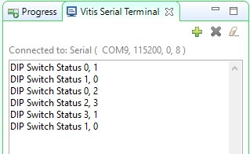
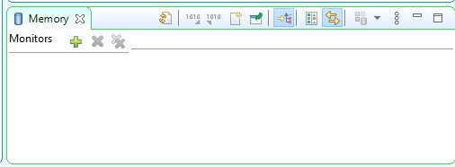
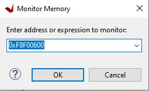
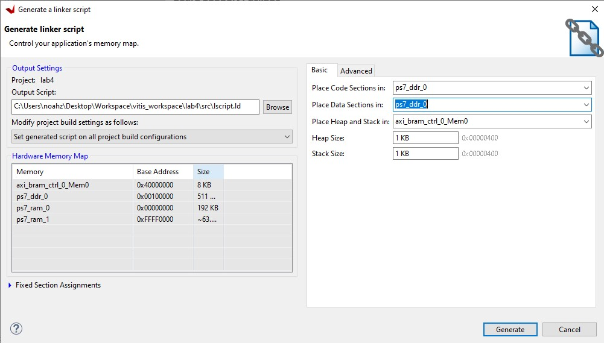

# Software Development Debugging

## Objectives
After completing this lab, you will be able to:
* Use Vitis Debugger to set break points and view the content of variables and memory
* Develop a linker script
* Partition the executable sections into both the DDR3 and BRAM spaces
## Steps

### Open the project in Vivado

1.	Open the lab4 project from the previous lab, and Save it as **lab5** to the **{labs}** directory. Make sure that the **Create Project Subdirectory** and **Include run results** option is checked.

2.	Open the Block Design. You may notice that the status changes to synthesis and implementation out-of-date as the project was saved as. Since the bitstream is already generated and will be in the exported directory, we can safely ignore any warning about this.

3.	In Vivado, select **Tools > Launch Vitis IDE**

    >A warning pop-up window indicating that the design is out of date. Since we have not made any changes, we can ignore this.

4.	Click Yes.

### Create an Application Project

1.	In the Explorer, right click on **lab4_system** and select **Close System Project**
1.	Select **File > New > Application Project**.
1.  Select the **lab4_platform** created in lab4, Click Next
1.	Name the project **lab5**, click Next
1.  Select **standalone on ps7_cortexa9_0** as the domain. Click Next.
1.	Select **Empty Application(C)** and click Finish.
1.	Select **lab5 > src** in the Explorer, right-click, and select **Import Sources**.
1.	Browse to **{sources}\lab5**, click Select Folder.
1.  Select **lab5.c** and click finish.
1.  Build the project by clicking the hammer button.

### Verify Operation in Hardware

1.	Make sure that micro-USB cable(s) is(are) connected between the board and the PC. Change the boot mode to JTAG. Turn ON the power of the board.
1. Open the **Vitis Serial Terminal** and add a connection to the corresponding port.
2. Right-click on the **lab5** project in the Explorer and select **Run as > 1 Launch Hardware (Single Application Debug)**
3. Depending on the switch settings you will see LEDs implementing a binary counter with corresponding delay.
    <p align="center">
    
    </p>
    <p align = "center">
    <i> Terminal window output </i>
    </p>

    > Note: Setting the DIP switches and push buttons will change the results displayed. Flip the DIP switches and verify that the LEDs light with corresponding delay according to the switch settings. Also notice in the Terminal window, the previous and current switch settings are displayed whenever you flip switches.

### Launch Debugger


1.	Right-click on the **lab5** project in the Explorer and select **Debug as > 1 Launch Hardware (Single Application Debug)**. Click OK to relaunch the session if prompted.

3.	Double-click in the left margin to set a breakpoint on various lines in *lab5.c* shown below. A breakpoint has been set when a “tick” and blue circle appear in the left margin beside the line when the breakpoint was set. (The line numbers may be slightly different in your file.)

     The **first** breakpoint is where count is initialized to 0.  The **second** breakpoint is to catch if the timer initialization fails. The **third** breakpoint is when the program is about to read the dip switch settings.  The **fourth** breakpoint is when the program is about to terminate due to pressing of center push button. The **fifth** breakpoint is when the timer has expired and about to write to LED.

    <p align="center">
    
    </p>
    <p align="center">
    
    </p>
    <p align = "center">
    <i>Setting breakpoints</i>
    </p>

4.	Click on the **Resume** button or press **F8** to continue executing the program up until the first breakpoint is reached.

    In the _Variables_ tab you will notice that the count variable may have value other than 0.
5.	Click on the **Step Over** button or press **F6** to execute one statement. As you do step over, you will notice that the count variable value changed to 0.
6.	Click on the **Resume** button again and you will see that several lines of the code are executed and the execution is suspended at the third breakpoint. The second breakpoint is skipped.  This is due to successful timer initialization.
7.	Click on the **Step Over (F6)** button to execute one statement. As you do step over, you will notice that the **dip_check_prev** variable value changed to a value depending on the switch settings on your board.
8.	Click on the memory tab.  If you do not see it, go to **Window > Show View > Memory**.
9.	Click the plus sign to add a **Memory Monitor**

    <p align="center">
    
    </p>
    <p align = "center">
    <i>Monitor memory location</i>
    </p>

10.	Enter the address for the private counter load register (_0xF8F00600_), and click OK.

    <p align="center">
    
    </p>
    <p align = "center">
    <i>Monitoring a Memory Address</i>
    </p>

    You can find the address by looking at the _xparameters.h_ file entry to get the base address (```# XPAR_PS7XPAR_PS7_SCUTIMER_0_BASEADDR1``` ), and find the load offset double-clicking on the xscutimer.h in the outline window followed by double-clicking on the *xscutimer_hw.h* and then selecting **XSCUTIMER_LOAD_OFFSET**.


11.	Make sure the DIP Switches are **not** set to “0000” and click on the **Step Over** button to execute one statement which will load the timer register.

    Notice that the address 0xF8F00604 has become red colored as the content has changed. Verify that the content is same as the value: **dip_check_prev*32500000**. You will see hexadecimal equivalent (displaying bytes in the order 0 -> 3).

    >E.g. for dip_check_prev = 1; the value is 0x01EFE920; (reversed: 0x20E9EF01)
12.	Click on the **Resume** button to continue execution of the program. The program will stop at the writing to the LED port (skipping fourth breakpoint as center push button as has not occurred).

    Notice that the value of the counter register is changed from the previous one as the timer was started and the countdown had begun.
13.	Click on the **Step Over** button to execute one statement which will write to the LED port and which should turn OFF the LEDs as the count=0.
14.	Double-click on the **fifth** breakpoint, the one that writes to the LED port, so the program can execute freely.
15.	Click on the **Resume** button to continue execution of the program. This time it will continuously run the program changing LED lit pattern at the switch setting rate.
16.	Flip the switches to change the delay and observe the effect.
17.	Press a push button and observe that the program suspends at the fourth breakpoint.  The timer register content as well as the **control register** (offset 0x08) is red as the counter value had changed and the control register value changed due to timer stop function call. (In the Memory monitor, you may need to right click on the address that is being monitored and click Reset to refresh the memory view.)
18.	Terminate the session by clicking on the **Terminate** button.

### Generate Linker Script
1. Go back to **Design** perspecive.
1. Right click on **lab5_system > lab5** from the Explorer and click **Generate Linker Script**. Note that all four major sections, code, data, stack and heap are to be assigned to BRAM controller.
1. In the Basic Tab change the Code and Data sections to **ps7_ddr_0**, leaving the Heap and Stack in **axi_bram_ctrl_0_Mem0** and click **Generate**, and click **Yes** to overwrite.
    <p align="center">
    
    </p>
    <p align = "center">
    <i>Generate linker script</i>
    </p>
1. **Rebuild** the project.
1. Right click on **lab5_system > lab5** from the Explorer and click **Run as > 1 Launch Hardware (Single Application Debug)**. Click **Yes** if prompted to relaunch the session.
    >Observe the Vitis Serial Terminal window as the program executes. Play with dip switches and observe the LEDs. Notice that the system is relatively slow in displaying the message and the LED blinks much slower as the stack and heap are from a non-cached BRAM memory.
1. When finished, click on the Terminate button in the Console tab.
19.	**Exit** Vitis and Vivado.
20.	**Power OFF** the board.

## Conclusion

This lab led you through developing software that utilized CPU’s private timer function calls and achieved the desired functionality.  You verified the functionality in hardware. Additionally, you used the Vitis debugger to view the content of variables and memory, and stepped through various part of the code. If needed, you can use a linker script to target various segments in various memories. When the application is too big to fit in the internal BRAM, you can download the application in external memory and then execute the program.
