# Debugging Using Hardware Analyzer

## Objectives 
After completing this lab, you will be able to:

* Add a VIO core in the design
* Use a VIO core to inject stimulus to the design and monitor the response
* Mark nets as debug so AXI transactions can be monitored
* Add an ILA core in Vivado
* Perform hardware debugging using the hardware analyzer
* Perform software debugging using the Vitis IDE

## Steps

## Open the Project

1.  Start Vivado if necessary and open the lab2 project (lab2.xpr) you created in the previous lab
1.  Select **File > Project > Save As …** to open the Save Project As dialog box. Enter **lab6** as the project name.  Make sure that the **Create Project Subdirectory** option is checked, the project directory path is **{labs}** and click **OK.**
1. Click **Settings** in the _Flow Navigator_ pane.
1. Expand **IP** in the left pane of the _Project Settings_ form and select **Repository.**
1. Click on the _plus_ button of the IP Repositories panel, browse to **{sources}\lab6\math_ip** and click **Select.**
    The directory will be scanned and one IP will be detected and reported.   
    <p align="center">
    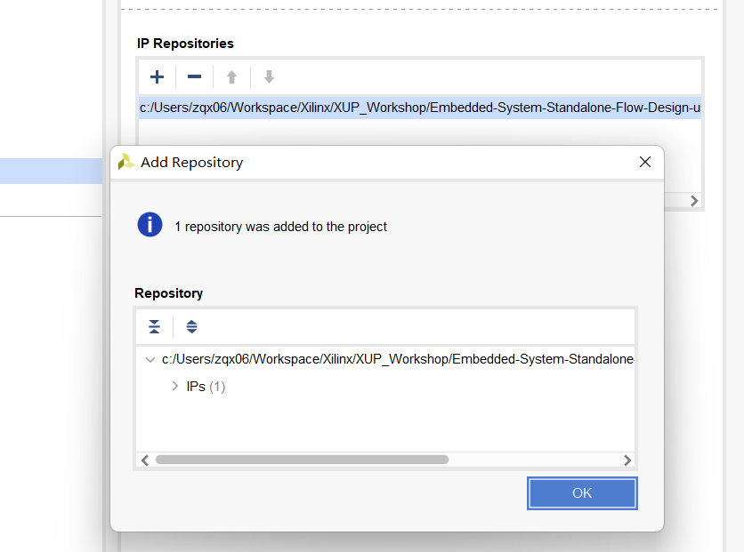
    </p>
    <p align = "center">
    <i>Specify IP Repository</i>
    </p>
1. Click **OK** twice to close the window.

## Add GPIO Instance for LEDs
1. Click **Open Block Design** in the _Flow Navigator_ pane to open the block diagram.
1. Add an _AXI GPIO_ IP by **right clicking on the Diagram window > Add IP** and search for AXI GPIO in the catalog, rename it to **leds**.
1. Double click on the leds block, and select **leds 4bits** for the GPIO interface and click OK.
1. Click **Run Connection Automation**, and select **leds** (which will include GPIO and S\_AXI). Click on **GPIO** and **S_AXI** to check the default connections for these interfaces.
1. Click OK to automatically connect the S_AXI interface to the Zynq GP0 port (through the AXI interconnect block), and the GPIO port to an external interface. Rename the port **leds_4bits** to **leds**.

    At this stage the design should look like as shown below. 
    <p align="center">
    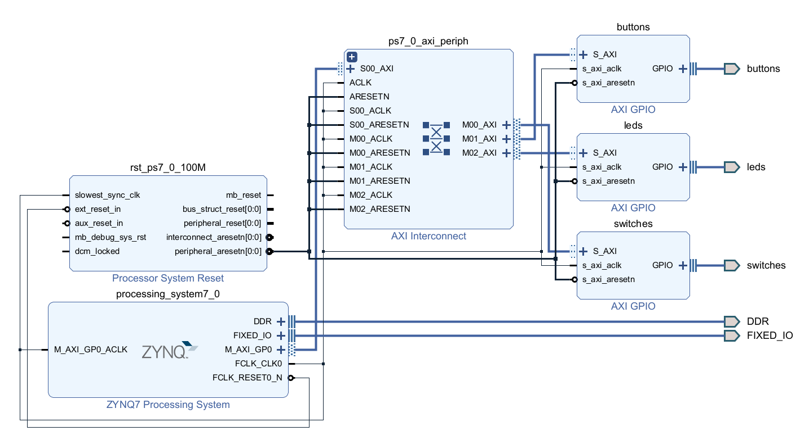
    </p>
    <p align = "center">
    <i>Block Design After add LED</i>
    </p>


## Add the Custom IP
1. Open the block diagram.
1. Click the **Plus** button or right click the Diagram window and select **Add IP**, search for **math** in the catalog.
1. Double-click the **math\_ip\_v1\_0** to add an instance of the core to the design.
1. Click on **Run Connection Automation**, ensure math\_ip\_0 and S\_AXI are selected, and click **OK.**

    The _Math IP_ consists of a hierarchical design with the lower-level module performing the addition. The higher-level module includes the two slave registers.
    <p align="center">
    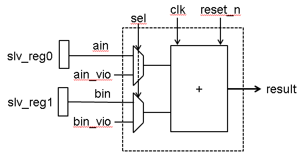
    </p>
    <p align = "center">
    <i>Custom Core's Main Functional Block</i>
    </p>

## Add the ILA and VIO Cores        

We want to connect the ILA core to the LED interface. Vivado prohibits connecting ILA cores to interfaces.  In order to monitor the LED output signals, we need to convert the LED interface to simple output port.

### Disable LEDs interface.
1. Double-click the _leds_ instance to open its configuration form.
1. Click **Clear Board Parameters** and click **OK** to close the configuration form.
1. Select _leds_ port and delete it.
1. Expand the _gpio_ interface of the **leds** instance to see the associate ports.

### Make the gpio\_io\_o port of the leds instance external and rename it as _leds_.
1. Move the mouse close to the end of the _gpio\_io\_o_ port, left-click to select (do not select the main GPIO port), and then right click and select **Make External**.
    <p align="center">
    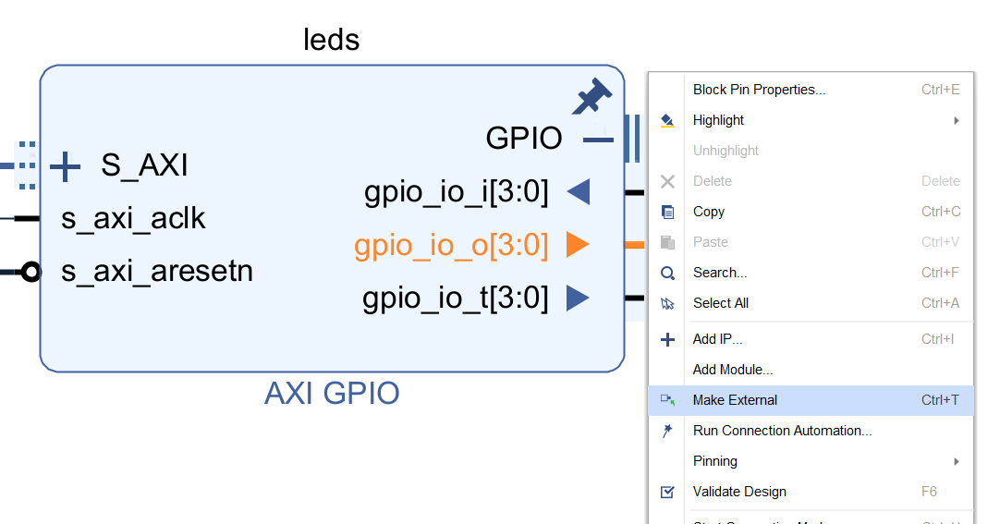
    </p>
    <p align = "center">
    <i>Make the gpio_io_o port External</i>
    </p>
    The port connector named gpio_io_o will be created and connected to the port.

1. Select the port _gpio\_io\_o_ and change its name to **leds** by typing it in the properties form.

### Enable cross triggering between the PL and PS
1. Double click on the _Zynq_ block to open the configuration properties.
1. Click on **PS-PL Configuration**, and enable the **PS-PL Cross Trigger interface**.
1. Expand **PS-PL Cross Trigger interface &gt; Input Cross Trigger**, and select **CPU0 DBG REQ** for _Cross Trigger Input 0._
1. Similarly, expand Output Cross Trigger, and select **CPU0 DBG ACK** for _Cross Trigger Output 0_ and click **OK.**
    <p align="center">
    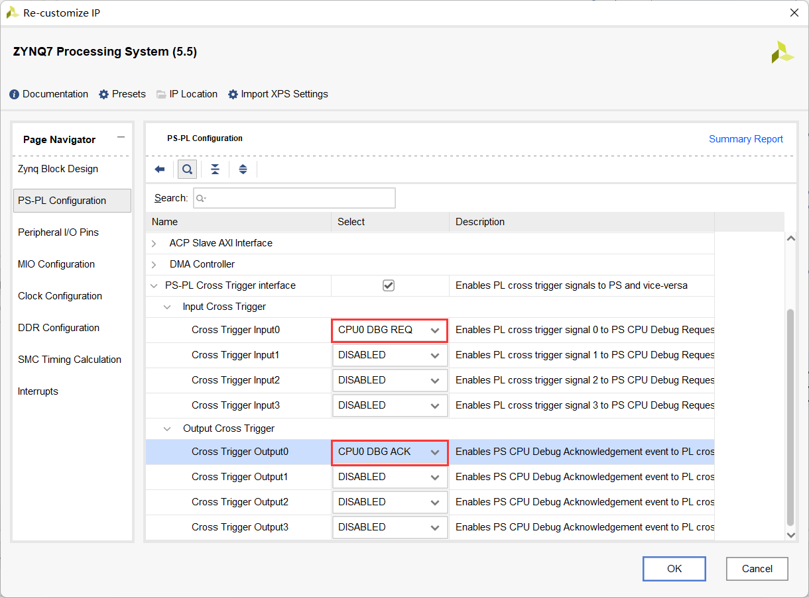
    </p>
    <p align = "center">
    <i>Enabling cross triggering in the Zynq processing system</i>
    </p>

### Add the ILA core and connect it to the LED output port.
1. Click the **Plus** button or right click the Diagram window and select **Add IP**, search for **ila** in the catalog.
1. Double-click on the **ILA (Integrated Logic Analyzer)** to add an instance of it.  The _ila\_0_ instance will be added.
1. Double-click on the _ila\_0_ instance.
1. Select **Native** as the _Monitor type_.
1. Enable **Trigger Out Port**, and **Trigger In port.**
1. Select the **Probe Ports** tab, and set the **Probe Width** of _PROBE0_ to **4** and click **OK**.
1. Using the drawing tool, connect the **probe0** port of the _ila\_0_ instance to the **gpio\_io\_o** port of the _leds_ instance.
1. Connect the **clk** port of the _ila\_0_ instance to the **FCLK\_CLK0** port of the Zynq subsystem.
1. Connect **TRIGG\_IN** of the ILA to **TRIGGER\_OUT\_0** of the Zynq processing system, and **TRIG\_OUT** of the ILA to the **TRIGGER\_IN\_0**.

### Add the VIO core and connect it to the math\_ip ports.
1. Click the **Plus** button or right click the Diagram window and select **Add IP**, search for **vio** in the catalog.
1. Double-click on the **VIO (Virtual Input/Output)** to add an instance of it.
1. Double-click on the _vio\_0_ instance to open the configuration form.
1. In the _General Options_ tab, leave the **Input Probe Count** set to **1** and set the **Output Probe Count** to **3**
1. Select the _PROBE\_IN Ports_ tab and set the _PROBE\_IN0_ width to **9**.
1. Select the _PROBE\_OUT Ports_ tab and set _PROBE\_OUT0_ width to **1** , _PROBE\_OUT1_ width to **8** , and _PROBE\_OUT2_ width to **8**.
1. Click **OK**.
1. Connect the VIO ports to the math instance ports as follows:
   ```
    probe_in -> result
    probe_out0 -> sel
    probe_out1 -> ain_vio
    probe_out2 -> bin_vio
   ```
1. Connect the **CLK** port of the _vio\_0_ to FCLK\_CKL0 net.
1. The block diagram should look similar to shown below.
    <p align="center">
    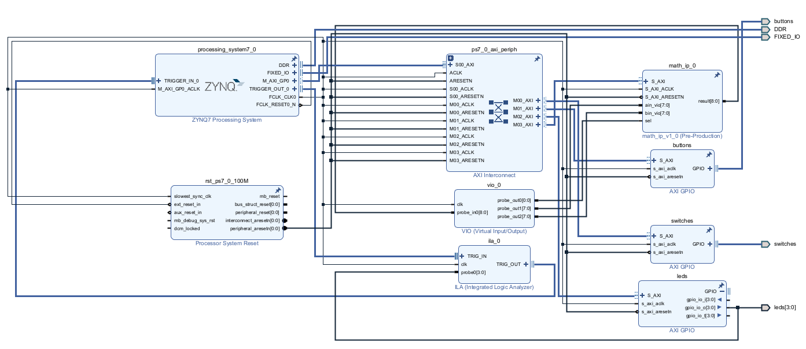
    </p>
    <p align = "center">
    <i>VIO added and connections made</i>
    </p>

### Mark Debug the S\_AXI connection between the AXI Interconnect and math\_0 instance. Validate the design.
1. Select the **S\_AXI** connection between the AXI Interconnect and the _math\_ip\_0_ instance **.**
1. Right-click and select **Debug** to monitor the AXI4Lite transactions.

    Notice that a system\_ila IP instance got added and the M03\_AXI &lt;-&gt; S\_AXI connection is connected to its SLOT\_0\_AXI interface.

1. Click the **Run Connection Automation** link to see the form where you can select the desired channels to monitor.
1. Change _AXI Read Address_ and _AXI Read Data_ channels to **Data** since we will not trigger any signals of those channels.

    This saves resources being used by the design.
    <p align="center">
    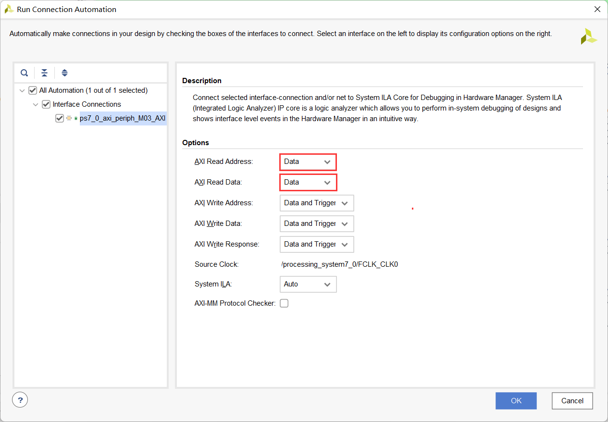
    </p>
    <p align = "center">
    <i>Selecting channels for debugging</i>
    </p>

1. Verify that there are no unmapped addresses shown in the _Address Editor_ tab.
1. Run Design Validation (**Tools -> Validate Design**) and verify there are no errors.

    The design should now look similar to the diagram below
    <p align="center">
    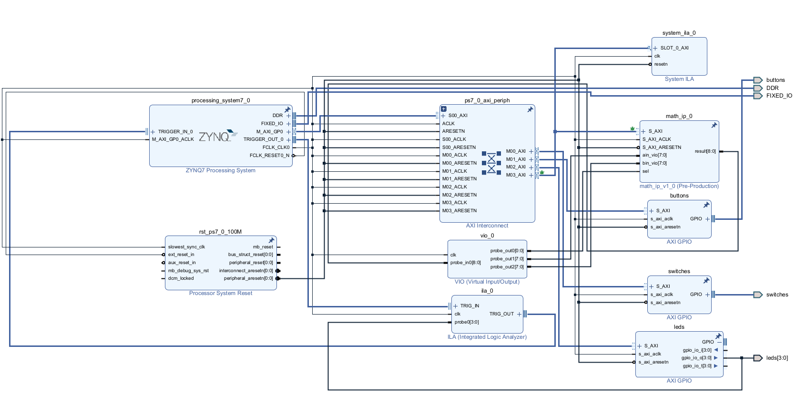
    </p>
    <p align = "center">
    <i>Completed Design</i>
    </p>

## Add Design Constraints and Generate Bitstream        
1. Right click in the _Sources_ panel, and select **Add Sources.**
1. Select **Add or Create Constraints** and click **Next**.
1. Click the _Plus_ button then **Add Files**, browse to **{sources}\lab6** and select **lab6\_pynz2.xdc**.
1. Click **OK** and then click **Finish.**
1. Click on the **Generate Bitstream** to run the implementation and bit generation processes.
1. Click **Save** to save the project (if prompted), **OK** to ignore the warning (if prompted), and **Yes** to launch Implementation (if prompted). Click **OK** to launch the runs.
1. When the bitstream generation process has completed successfully, click **Cancel**.

## Generate an Application in Vitis IDE        
### Export the implemented design and launch Vitis IDE.
1. Export the hardware configuration by clicking **File &gt; Export &gt; Export Hardware…** , click the box to **Include Bitstream**
1. Click **OK** to export and **Yes** to overwrite the previous project created by lab2.
1. Launch Vitis IDE by clicking **Tools > Launch Vitis IDE** and click **OK.**
1. Right-click on any opened system projects, and click **Close System Project**.

### Create an empty application project named lab6, and import the provided lab6.c file.
1. From the File menu select **File > New > Application Project**. Click Next to skip the welcome page if necessary.
1.  In the Platform Selection window, select **Create a new platform from hardware (XSA)** and browse to select the **{labs}\lab6\system_wrapper.xsa** file exported before.
1. Enter **lab6_platform** as the _Platform name_, click **Next.**
1. Name the project **lab6**, click **Next**.
1. In the domain selection window, select **standalone_ps7_cortexa9_0**, click **Next**.
1. In the templates selection window, select **Empty Application(C)**, click **Finish**.
1. Expand **lab6** in the Explorer view, and right-click on the **src** folder, and select **Import Sources...**.
1. Browse to select the **{sources}\lab6** folder, click **Open Folder**.
1. Select **lab6.c** and click **Finish**.  

    A snippet of the part of the source code is shown in the following figure. It shows that two operands are written to the custom core, the result is read, and printed out.  The write transaction will be used as a trigger condition in the Vivado Logic Analyzer.
    <p align="center">
    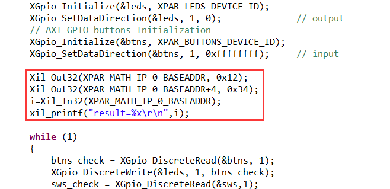
    </p>
    <p align = "center">
    <i>Source Code snippet</i>
    </p>

1. Right click on **lab6** from the Explorer View, and select **Debug As &gt; Debug Configurations**
1. Right click on **Single Application Debug** and select **New Configuration** to create a new configuration.
1. In the **Target Setup** tab, check the **Enable Cross-Triggering** option, and click the Browse button.
    <p align="center">
    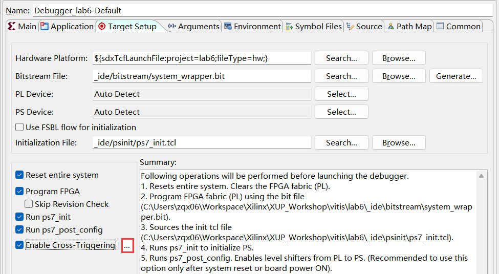
    </p>
    <p align = "center">
    <i>Enable cross triggering in the software environment</i>
    </p>
1. When the _Cross Trigger Breakpoints_ dialog box opens, click **Create**
1. Select the options as shown below and click **OK** to set up the cross-trigger condition for _Processor to Fabric_.
    <p align="center">
    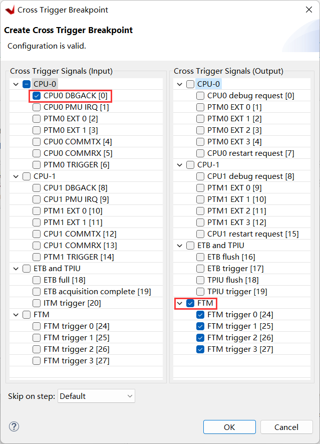
    </p>
    <p align = "center">
    <i>Enabling CPU0 for request from PL</i>
    </p>

1. In the _Cross Trigger Breakpoints_ dialog box click **Create** again.
1. Select the options as shown below and click **OK** to set up the cross trigger condition for _Fabric to Processor_.
    <p align="center">
    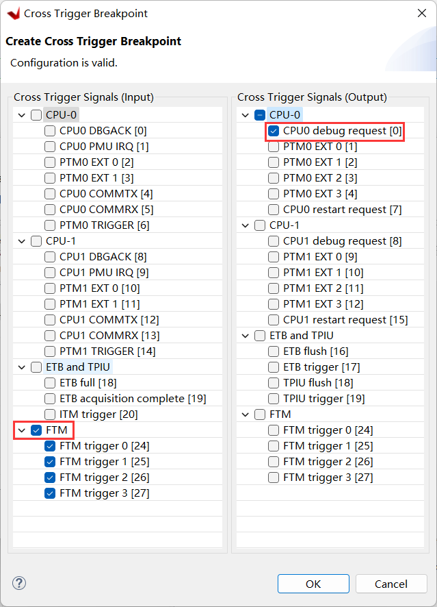
    </p>
    <p align = "center">
    <i>Enabling CPU0 for request to PL</i>
    </p>
1. Click **OK** , then click **Apply,** then **Close**
1. Build the project either by clicking the Hammer button or right-clicking on **lab6** from Explorer View and selecting **Build Project**.

## Test in Hardware        
### Start the debug session and establish serial communication.
1. Connect and power up the board with JTAG mode.
1. Select the **lab6** project in _Explorer View_, right-click and select **Debug As &gt; Launch Hardware (Single Application Debug)** to download the application. The program execution starts and suspends at the entry point.
1. Click **Window > Show View**, search and open **Vitis Serial Terminal**.
1. Click the Add button to connect to a port.
    <p align="center">
    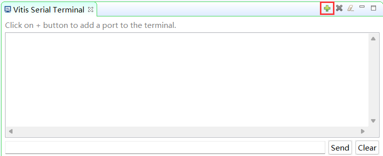
    </p>
    <p align = "center">
    <i>Add a Serial Port</i>
    </p>
1. Select the **Port** from the dropdown menu. Keep the Advanced Settings as-is. Click **OK**.
    <p align="center">
    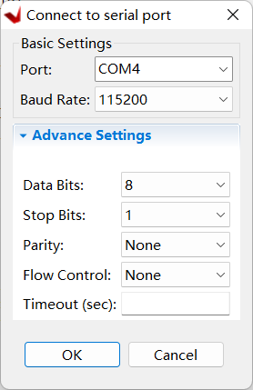
    </p>
    <p align = "center">
    <i>Connect to Serial Port</i>
    </p>

### Start the hardware session from Vivado.
1. Switch to Vivado.
1. Click on **Open Hardware Manager** from the _Flow Navigator_ pane to invoke the analyzer.
1. Click on the **Open Target &gt; Auto connect** to establish the connection with the board.
1. Select **Window &gt; Debug Probes**

    The hardware session will open showing the **Debug Probes** tab in the **Console** view.
    <p align="center">
    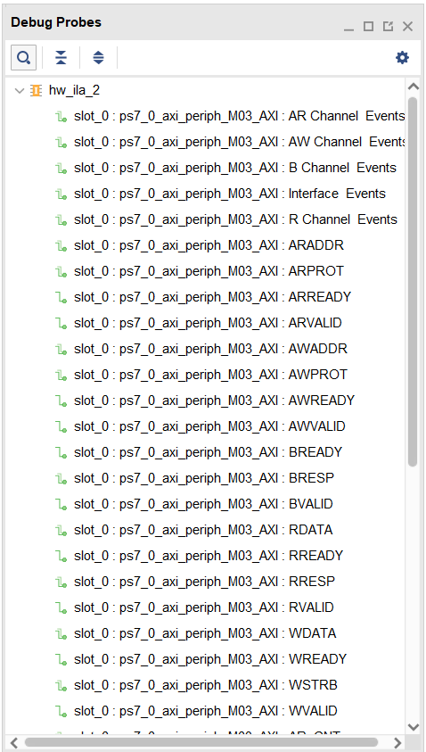
    </p>
    <p align = "center">
    <i>Debug probes</i>
    </p>

    The hardware session status window also opens showing that the FPGA is programmed (we did it in Vitis IDE), there are three cores out of which the two ila cores are in the idle state.
    <p align="center">
    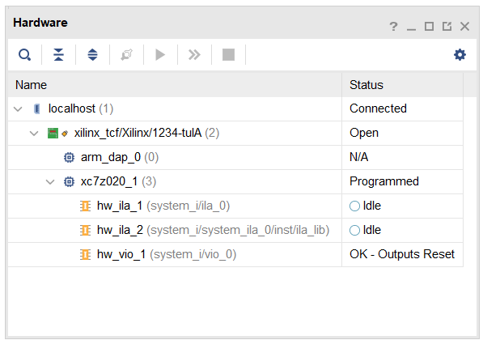
    </p>
    <p align = "center">
    <i>Hardware session status</i>
    </p>
1. Select the XC7Z020, and click on the **Run Trigger Immediate** button to see the signals in the waveform window.
    <p align="center">
    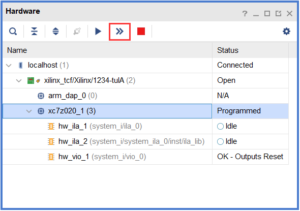
    </p>
    <p align = "center">
    <i>Opening the waveform window</i>
    </p>

### Setup ILA Trigger Conditions for hw_ila_a
1. Click on the **hw\_ila\_2** tab to select it. In the **Debug Probes** window, under _hw\_ila\_2_, drag and drop the **WDATA** signal to the **Trigger setup** window.
1. Set the value to **XXXX\_XX12** (HEX) (the value written to the math\_0 instance at line 24 of the lab6.c).
    <p align="center">
    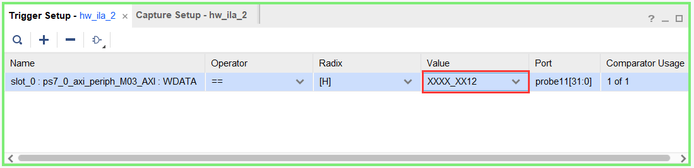
    </p>
    <p align = "center">
    <i>Trigger Setup</i>
    </p>

1. Similarly, add **WREADY, WSTRB,** and **WVALID** to the **Trigger Setup** window.
1. Change the radix to **[B]\(binary\)** for **WSTRB**, and change the value from **XXXX** to **XXX1**
1. Change the value of **WVALID** and **WREADY** to **1**.
1. Set the trigger position of the _hw\_ila\_2_ to **512** in the window _**Settings** – hw\_ila\_2_
    <p align="center">
    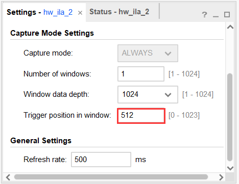
    </p>
    <p align = "center">
    <i>Setting up the ILA</i>
    </p>
1. Similarly, set the trigger position in the _**Settings** – hw\_ila\_1_ window to **512**.
1. Select **hw\_ila\_2** in the _Hardware_ window and click on the **Run Trigger** button and observe that the _hw\_ila\_2_ core is armed and showing the status as **Waiting For Trigger**.
    <p align="center">
    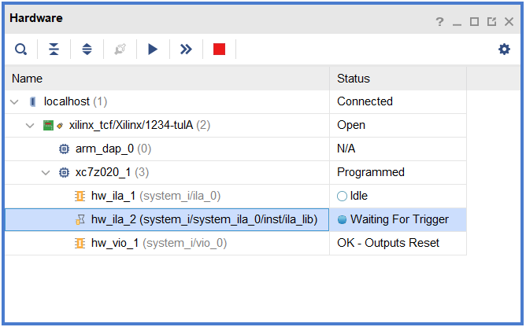
    </p>
    <p align = "center">
    <i>Hardware analyzer running and in capture mode</i>
    </p>

1. Switch to Vitis IDE.
1. Near line 27, double click on the left border on the line where xil\_printf statement is defined in the lab6.c to set a breakpoint.
    <p align="center">
    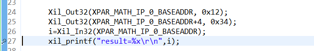
    </p>
    <p align = "center">
    <i>Setting a breakpoint</i>
    </p>
1. Click on the **Resume (F8)** button to execute the program and stop at the breakpoint.
1. Back to Vivado, notice that the **hw\_ila\_2** status changed from **Waiting for Trigger** to **Idle**, and the waveform window shows the triggered output (select the _hw\_ila\_data\_2.wcfg_ tab if necessary).
1. Move the cursor to closer to the trigger point and then click on the **Zoom In** button to zoom at the cursor. Click on the **Zoom In** button couple of times to see the activity near the trigger point. Similarly, you can see other activities by scrolling to right as needed.
    <p align="center">
    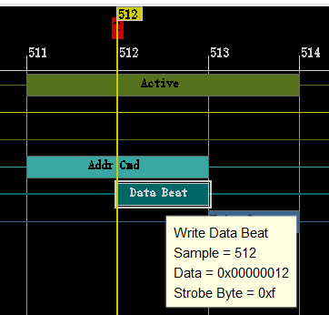
    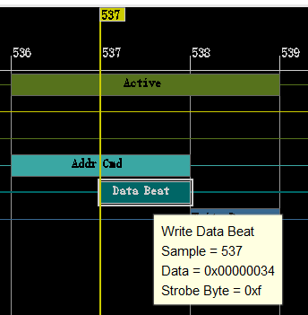
    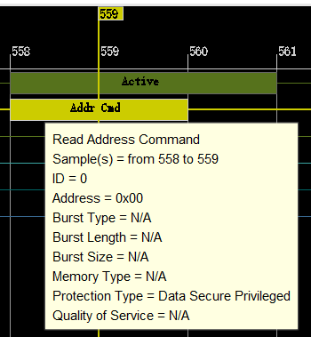
    </p>
    <p align = "center">
    <i>Zoomed waveform view of the three AXI transactions</i>
    </p>
    Observe the following:

    Around the 512th sample WDATA being written is 0x012 at offset 0 (AWADDR=0x0).
    At the 536th sample, offset is 0x4 (AWADDR), and the data being written is 0x034.
    At the 559th sample, data is being read from the IP at the offset 0x0 (ARADDR), and at 561th mark the result (0x46) is on the RDATA bus.

### Interact with the VIO Cores in Vivado
1. In Vivado, select the **hw\_vio\_1** core in the _Dashboard Options_ panel.
1. Click on the **Add** button and select all vio signals to stimulate and monitoring.  Change the **vio\_0\_probe\_out0** value to **1** so the math\_ip core input can be controlled via the VIO core.
    <p align="center">
    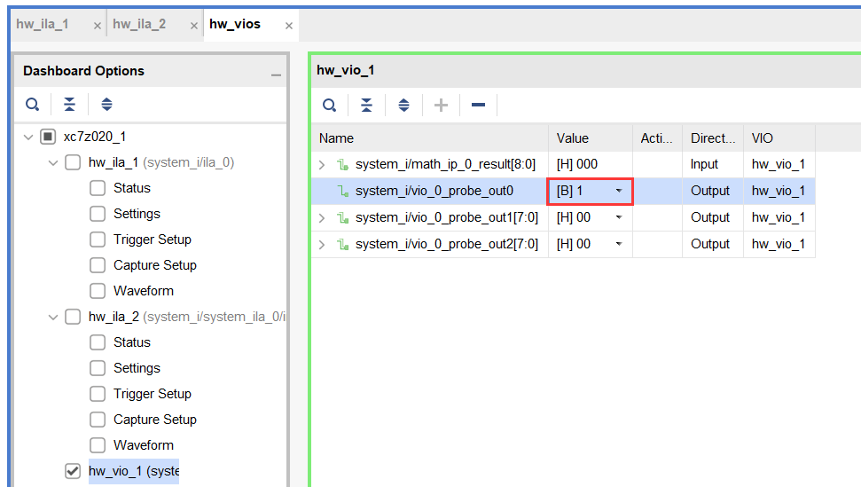
    </p>
    <p align = "center">
    <i>VIO probes</i>
    </p>
1. Change **vio\_0\_probe\_out1** value to **55** (in Hex), and similarly, **vio\_0\_probe\_out2** value to **44** (in Hex). Notice that for a brief moment a blue-colored up-arrow will appear in the Activity column and the result value changes to **099** (in Hex).
    <p align="center">
    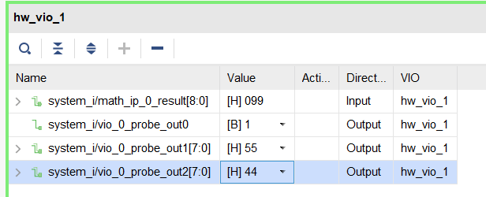
    </p>
    <p align = "center">
    <i>Input stimuli through the VIO core's probes</i>
    </p>
1. Try a few other inputs and observe the outputs.
1. Once done, set the _vio\_0\_probe\_out0_ to **0** to isolate the vio interactions with the math\_ip core.

### Setup the ILA Trigger Conditions for hw_ila_1
1. Select the **hw\_ila\_1** in the _Dashboard Options_ panel.
1. Add the LEDs to the **Trigger Setup**, and set the trigger condition of the _hw\_ila\_1_ to trigger at LED output value equal to **0x5** for the PYNQ-Z2.
    <p align="center">
    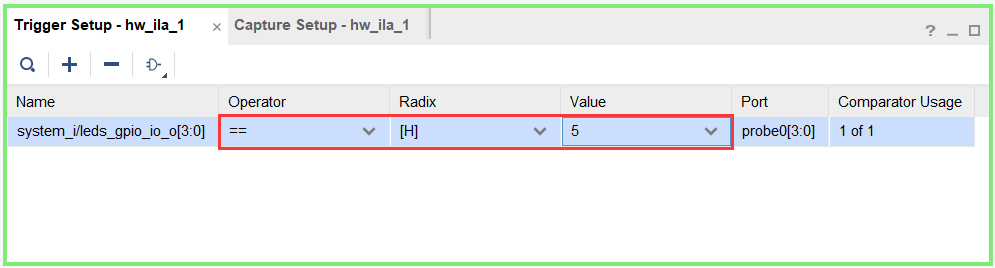
    </p>
    <p align = "center">
    <i>Setting up Trigger for hw_ila_1</i>
    </p>
1. Ensure that the trigger position for the _hw\_ila\_1_ is set to **512**.

    >Make sure that the switches are not set to 11 on PYNQ-Z2 as this is the exit pattern.

1. Right-click on the **hw\_ila\_1** in the _hardware_ window, and arm the trigger by selecting **Run Trigger.** The hardware analyzer should be waiting for the trigger condition to occur.

1. In the Vitis IDE Debug window, click on the **Resume (F8)** button.
1. Press the push-buttons and see the corresponding LED turning ON and OFF.
1. When the condition is met, the waveform will be displayed.
    <p align="center">
    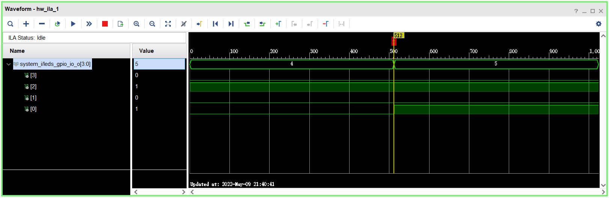
    </p>
    <p align = "center">
    <i>ILA waveform window after Trigger</i>
    </p>

### Cross trigger a debug session between the hardware and software
1. In Vivado, select **hw\_ila\_1**
1. In the **ILA properties** window, expand the **CONTROL**, set the _TRIGGER_MODE_ to **BASIC\_OR\_TRIGG\_IN** , and the _TRIG\_OUT\_MODE_ to **TRIGGER\_OR\_TRIG\_IN**
    <p align="center">
    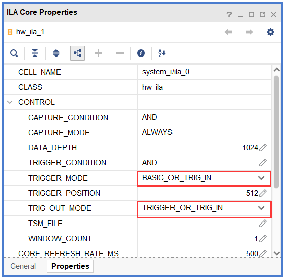
    </p>
    <p align = "center">
    <i>ILA Core Properties</i>
    </p>

1. In Vitis IDE, in the Design view, relaunch the software by right clicking on the lab6 project, and selecting **Debug As &gt; Launch Hardware (Single Application Debug)**. Click **OK** if prompted to relanuch.

    The program will be loaded and the excution will suspend at the entry point

1. Arm the _hw\_ila\_1_ trigger by clicking **Run Trigger**.
1. In Vitis IDE continue execution of the software to the next breakpoint (line 27).

    When the next breakpoint is reached, return to Vivado and notice the ILA has triggered.

### Trigger the ILA and cause the software to halt
1. Click **Step Over (F6)** button twice to pass the current breakpoint
1. Arm the _hw\_ila\_1_ trigger by clicking **Run Trigger**.
1. **Resume (F8)** the software until it enters the while loop
1. Press the push-buttons to **0x5**, and notice that the application in Vitis IDE will break at some point (This point will be somewhere within the while loop)
1. Click on the **Resume** button. The program will continue execution. Flip switches until it is **0x03**.
1. Click the **Disconnect** button in Vitis IDE to terminate the execution.
1. Close the Vitis IDE by selecting **File &gt; Exit**.
1. In Vivado, close the hardware session by selecting **File &gt; Close Hardware Manager**, and click **OK**.
1. Close Vivado by selecting **File &gt; Exit**.
1. Turn OFF the power on the board.

## Conclusion

In this lab, you added a custom core with extra ports so you can debug the design using the VIO core. You instantiated the ILA and the VIO cores into the design. You used Mark Debug feature of Vivado to debug the AXI transactions on the custom peripheral. You then opened the hardware session from Vivado, setup various cores, and verified the design and core functionality using Vitis IDE and the hardware analyzer.
