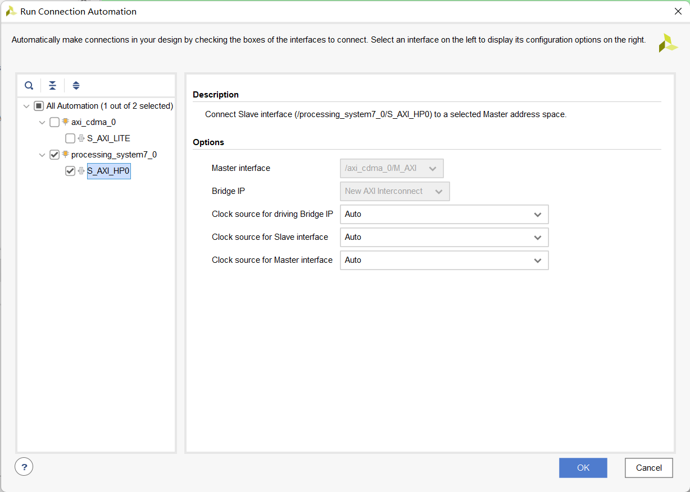
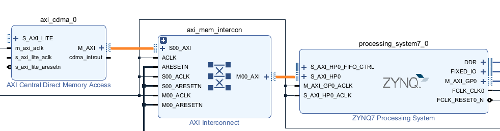
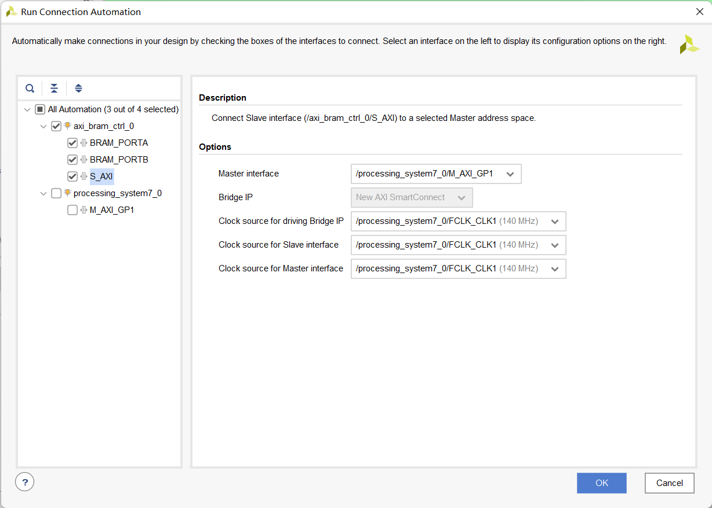
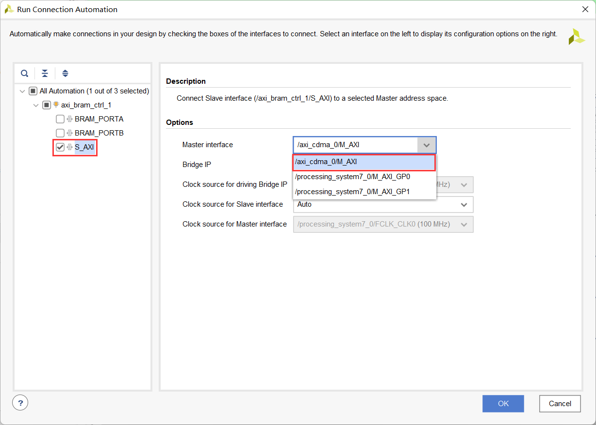
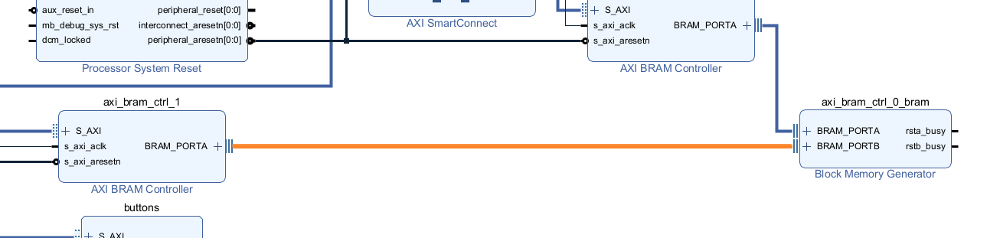
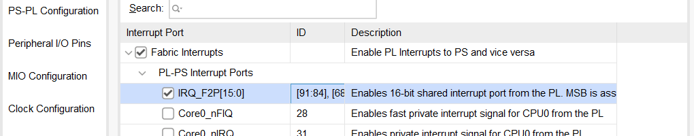
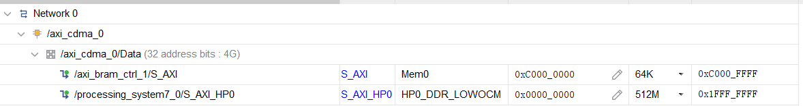
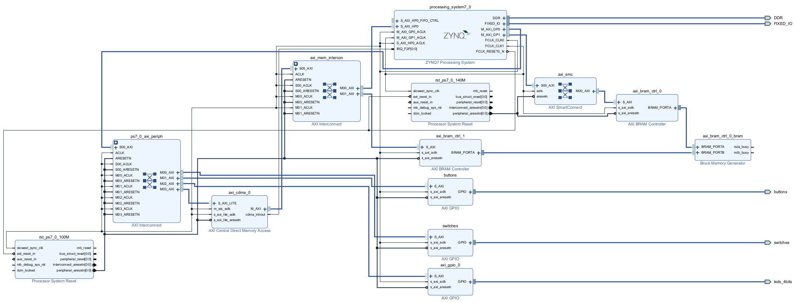

# Direct Memory Access using CDMA

## Objectives

After completing this lab, you will be able to:

* Enable a High Performance (HP) port of the processing system.
* Add and connect the CDMA controller in the programmable logic.
* Perform DMA operation between various memories.

## Steps
## Open the Project        
1. Start Vivado if necessary and open the lab2 project (lab2.xpr) you created in the previous lab.
1. Select **File > Project > Save As …** to open the Save Project As dialog box. Enter **lab7** as the project name.  Make sure that the **Create Project Subdirectory** option is checked, the project directory path is **{labs}** and click **OK.**

## Add GPIO Instance for LEDs
1. Click **Open Block Design** in the _Flow Navigator_ pane to open the block diagram.
1. Add an _AXI GPIO_ IP by **right clicking on the Diagram window > Add IP** and search for AXI GPIO in the catalog, rename it to **leds**.
1. Double click on the leds block, and select **leds 4bits** for the GPIO interface and click OK.
1. Click **Run Connection Automation**, and select **leds** (which will include GPIO and S\_AXI). Click on **GPIO** and **S_AXI** to check the default connections for these interfaces.
1. Click OK to automatically connect the S_AXI interface to the Zynq GP0 port (through the AXI interconnect block), and the GPIO port to an external interface. Rename the port **leds_4bits** to **leds**.

## Configure the Processor
1. Double-click on the _Zynq processing system_ instance to open its configuration form.
1. Select **PS-PL Configuration** in the Page Navigator window in the left pane, expand **HP Slave AXI Interface** on the right, and click on the check-box of the **S AXI HP0 Interface** to enable it.
1. Expand **AXI Non Secure Enablement > GP Master AXI Interface** and enable the **M AXI GP1 Interface**.
1. Select **Clock Configuration** in the Page Navigator window in the left pane, expand **PL Fabric Clocks** on the right, enable the **FCLK\_CLK1**. Enter the **Requested Frequency** for the FCLK_CLK1 as **140 MHz**.
1. Click **OK** to accept the settings and close the configuration form.

## Add CDMA and BRAM        
### Instantiate the AXI central DMA controller.
1. Click the **Plus** button or right click the Diagram window and select **Add IP**, search for **Central** in the catalog. Double-click the **AXI Central Direct Memory Access** to add an instance to the design.
1. Double-click on the _axi\_cdma\_0_ instance and uncheck the **Enable Scatter Gather** option.
1. Change the _Write/Read Data Width_ to **64** and click **OK**.

    >Note the burst size changes from 16 to 8. You can increase this up to 256 to improve the performance. Here we are using smallest number since the application allows small number of words transfer.

### Run connection automation
Connection automation could be run on all unconnected ports simultaneously. For the purposes of this lab, each port will be connected separately so that the changes made by the automation process are easier to follow.

1. Click on **Run Connection Automation** and select **processing\_system7\_0/S\_AXI\_HP0**
1. Check that this port will be connected to the _/axi\_cdma\_0/M\_AXI_ port and click **OK**.
    

    
    

    

    <i>Connection automation</i>
    

1. Verify the CDMA connection through the AXI SmartConnect to the HP0 port
    

    
    

    

    <i>Connecting AXI Central DMA controller to S_AXI_HP0</i>
    

    >Notice that an instance of AXI SmartConnect (axi_smc_1) is added, S_AXI_HP0 of the processing_system7_0 is connected to M00_AXI of the axi_smc_1, S00_AXI of the axi_smc_1 is connected to the m\_axi of the axi_cdma_0 instance.  Also, m_axi_aclk of the axi_cdma_0 is connected to the net originating from FCLK_CLK0 of the processing_system7_0.

1. Click on **Run Connection Automation** again, and select **/axi\_cdma\_0** (which includes **S\_AXI\_LITE** ). Click **OK**.

    >Notice that the axi\_cdma\_0/M\_AXI port is no longer available to select. This is because it was connected to the processing system in the previous step.

### Instantiate two BRAM Controllers and BRAMs.
1. Click the **Add** button or right click the Diagram window and select **Add IP**, search for **BRAM** in the catalog. Double-click the **AXI BRAM Controller** to add an instance to the design.
1. Click on **Run Connection Automation** , and select **axi_bram_ctrl_0**
1. Click on **BRAM_PORTA** and **BRAM_PORTB** check boxes.
1. Click **S\_AXI** , and change the _Master Interface_ option to **/processing\_system7\_0/M\_AXI\_GP1**, change the _Clock source for driving interconnect IP, Clock source for Master interface,_ and _Clock source for Salve interface_ to **/processing\_system7\_0/FCLK\_CLK1 (140 MHz)** as they all run in the same clock domain, and click **OK**.
    

    
    

    

    <i>Connecting AXI BRAM Controller to M_AXI_GP1 to run at faster clock speed</i>
    

    > Notice that an instance of AXI SmartConnect and Processor System Reset are added, and the M_AXI_GP1_ ACLK is connected to FCLK_CLK1.

1. Add another **AXI BRAM Controller** by Clicking the **Add** button and search for **BRAM**.
1. Click on **Run Connection Automation** , and select **/axi\_bram\_ctrl\_1/S\_AXI** only.
1. For the _Master_ connection, select **axi\_cdma\_0/M\_AXI** from the dropdown box.
    

    
    

    

    <i>BRAM Connection Automation</i>
    

1. Click **OK** to make the connection.
1. Double-click the _axi\_bram\_ctrl\_1_ instance and change the _Number of BRAM Interface_ to **1**. Change the _Data Width_ to **64** and click **OK**.
1. Double-click the _axi\_bram\_ctrl\_0_ instance and also change the _Number of BRAM Interface_ to **1** and change the _Data Width_ to **64**. Click **OK**.
1. Using the wire tool, connect the **BRAM\_PORTA** of the _axi\_bram\_ctrl\_1_ instance to the **BRAM\_PORTB** of the Block Memory Generator _axi\_bram\_ctrl\_0\_bram_ instance.
    

    
    

    

    <i>Connect the second BRAM controller</i>
    

### Connect the CDMA interrupt out port to the port of the processor.
1. Double-click on the _processing\_system7\_0 instance_ to open its configuration form.
1. Select **Interrupts** in the Page Navigator window in the left pane, check the **Fabric Interrupts** box.
1. Expand **Fabric Interrupts &gt; PL-PS Interrupts Ports**, and click on the check-box of the **IRQ\_F2P**.
    

    
    

    

    <i>Enabling the processor interrupt</i>
    

1. Click **OK**.
1. Using wiring tool, connect the **cdma\_introut** to the **IRQ\_F2P** port. (Click on the _cdma\_introut_ port and drag to the _IRQ\_F2P_ port)

### Set the BRAM controller size to 64KB.
1. Select the **Address Editor** tab.
1. Expand the _axi\_cdma\_0&gt; Data_ section, and change the memory size of _axi\_bram\_ctrl\_1_ to **64K**.
    

    
    

    

    <i>Address space</i>
    

1. The design should look similar to the figure below.
    

    
    

    

    <i>Completed design</i>
    

1. Select the _Diagram_ tab, and click on the **Validate Design (F6)** button to make sure that there are no errors.

## Generate the Bitstream        
1. Click on the **Generate Bitstream** to run the synthesis, implementation, and bit generation processes.
1. Click **Save** to save the project, and **Yes** if prompted to run the processes. Click **OK** to launch the runs.
1. When the bitstream generation process has completed successfully, click **Cancel**.

## Generate an Application in Vitis IDE
### Export the implemented design, and start SDK
1. Export the hardware configuration by clicking **File &gt; Export &gt; Export Hardware…**
1. Click the box to **Include Bitstream** and click **OK** (Click Yes if prompted to overwrite a previous module).
1. Launch Vitis IDE by clicking **Tools &gt; Launch Vitis IDE** and click **OK**.
1. To clean the workspace, right-click on each opened system project and select **Close System Project**.

### Create an empty application project, named lab7, and import the provided lab7.c file.
1. From the File menu select **File > New > Application Project**. Click Next to skip the welcome page if necessary.
1.  In the Platform Selection window, select **Create a new platform from hardware (XSA)** and browse to select the **{labs}\lab7\system_wrapper.xsa** file exported before.
1. Enter **lab7_platform** as the _Platform name_, click **Next.**
1. Name the project **lab7**, click **Next**.
1. In the domain selection window, select **standalone_ps7_cortexa9_0**, click **Next**.
1. In the templates selection window, select **Empty Application(C)**, click **Finish**.
1. Expand **lab7** in the Explorer view, and right-click on the **src** folder, and select **Import Sources...**.
1. Browse to select the **{sources}\lab7** folder, click **Open Folder**.
1. Select **lab7.c** and click **Finish**. 
1. Build the project either by clicking the Hammer button or right-clicking on **lab7** from Explorer View and selecting **Build Project**.

## Test in Hardware
### Establish serial communication   
1. Connect and power up the board with JTAG mode.
1. Click **Window > Show View**, search and open **Vitis Serial Terminal**.
1. Click the **Add** button to connect to a port.
    

    
    

    

    <i>Add a Serial Port</i>
    

1. Select the **Port** from the dropdown menu. Keep the Advanced Settings as-is. Click **OK**.
    

    
    

    

    <i>Connect to Serial Port</i>
    

### Run the lab7 application from the DDR3 memory.
1. Right-click on **lab7** from the Explorer View and select **Run as > Launch Hardware (Single Application Debug)**.
1. Follow the menu in the terminal emulator window and test transfers between various memories.
1. Select option 4 in the menu to complete the execution.
1. Close Vitis IDE and Vivado
1. Turn OFF the power on the board.

## Conclusion

This lab led you through adding a CDMA controller to the PS so that you can perform DMA transfers between various memories. You used the high-performance port so DMA could be done between the BRAM residing in the PL section and DDR3 connected to the PS. You verified the design functionality by creating an application and executing it from the DDR3 memory.
