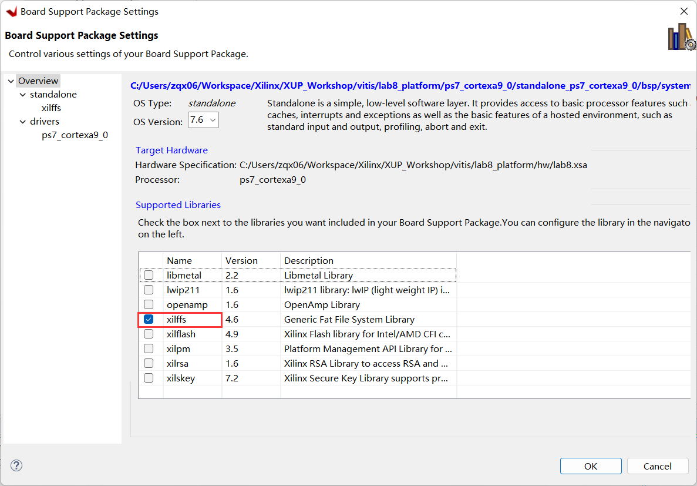
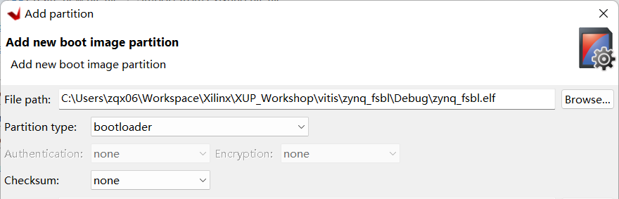
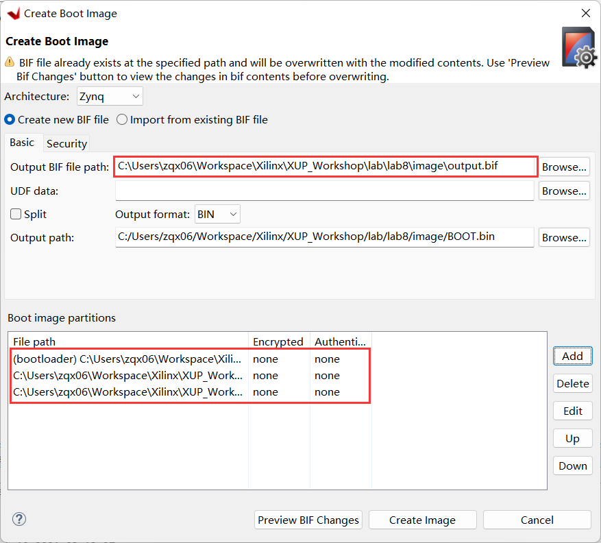
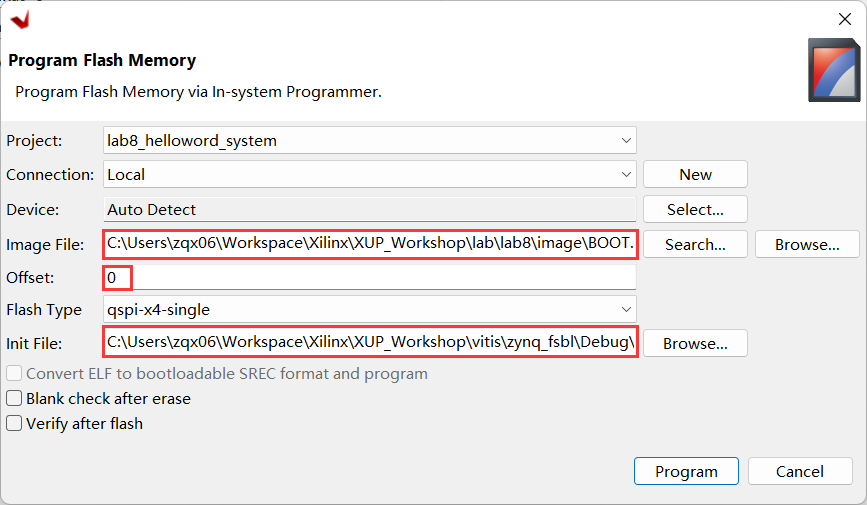
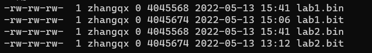
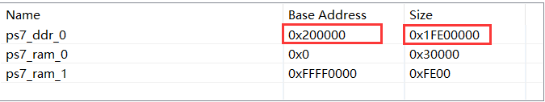
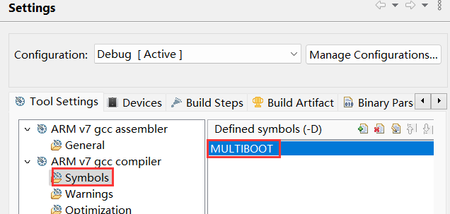

# Configuration and Booting

## Objectives

After completing this lab, you will be able to:

* Create a bootable system capable of booting from the SD card.
* Create a bootable system capable of booting from the QSPI flash.
* Load the bitstream stored on the SD card or in the QSPI flash memory.
* Configure the PL section using the stored bitstream through the PCAP resource.
* Execute the corresponding application.

## Steps
## Create a Vivado Project
1. Open Vivado and click **Create New Project** and click **Next**.
1. Click the Browse button of the _Project Location_ field of the **New Project** form, browse to **{labs}** , and click **Select**.
1. Enter **lab8** in the _Project Name_ field.  Make sure that the _Create Project Subdirectory_ box is checked.  Click **Next**.
1. Select the **RTL Project** option and uncheck the **Do not specify sources at this time** option, click **Next**.
1. Select **Verilog** as the _Target Language_ in the _Add Sources_ form, and click **Next**.
1. Click **Next** to escape adding constraints.
1. Search and select **pynq-z2** board under _board_ tag, click **Next**.
1. Click **Finish** to create an empty Vivado project.

## Creating the Hardware System Using IP Integrator
### Create a block design to generate the ARM Cortex-A9 processor based hardware system.
1. In the Flow Navigator, click **Create Block Design** under IP Integrator.
1. Name the block **system** and click **OK**.
1. Click the **Add** button or **right clicking on the Diagram window > Add IP** and search for **zynq** in the catalog.
1. Double click on **ZYNQ7 Processing System** entry to add it to the design.
1. Click on **Run Block Automation** in the message at the top of the _Diagram_ panel. Leave the default option of _Apply Board Preset_ checked, and click **OK**.
1. Double click on the Zynq block to open the _Customization_ window.

    >A block diagram of the Zynq should now be open, showing various configurable blocks of the Processing System.

### Configure the I/O Peripherals block to only have QSPI, UART 0, and SD 0 support.
1. Click on **MIO Configuration** on the left.
1. Expand the **IO Peripherals** on the right, uncheck _ENET 0_, _USB 0_, and _GPIO &gt; GPIO MIO,_ leaving _UART 0_ and _SD 0_ selected.
1. Click **OK**. The configuration form will close and the block diagram will be updated.

1. Using wiring tool, connect **FCLK\_CLK0** to **M\_AXI\_GP0\_ACLK**.
1. Select the _Diagram_ tab, and click on the **Validate Design (F6)** button to make sure that there are no errors.

## Export the Design to Vitis IDE and create the software projects        
### Create the top-level HDL of the embedded system, and generate the bitstream.
1. In Vivado, select the _Sources tab_, expand the _Design Sources,_ right-click the _system.bd_ and select **Create HDL Wrapper** and click **OK.**
1. Click on **Generate Bitstream** and click **Generate**. Click **Save** to save the project, and **Yes** if prompted to run the processes. Click **OK** to launch the runs.
1. When the bitstream generation process has completed successfully, click **Cancel**.

### Export the design to Vitis IDE   and create the Hello World application.
1. Export the hardware configuration by clicking **File &gt; Export &gt; Export Hardware…**.
1. Click the box to _Include Bitstream_, then click **OK**.
1. Launch Vitis IDE by clicking **Tools &gt; Launch VITIS IDE** and click **OK**.
1. In Vitis IDE, select **File** &gt; **New** &gt; **Application Project.**
1. In the _Platform_ window, click on the tag **Create a new platform from hardware (XSA)** and browse to select the exported **.xsa** file. Enter **lab8_platform** as the _Platform name_. Click **Next**.
1. In the _Application Project Details_ window, enter **lab8_helloworld** as the _Application project name_. Click **Next**.
1. In the _Domain_ window, leave the settings as defaults, and click **Next**.
1. In the _Templates_ window, select **Hello World** and click **Finish**.
1. Expand **lab8_platform** in the _Explorer_ view, double-click on **platform.spr** to open the platform project.
1. On the left panel, click on **Board Support Package**, and click on **Modify BSP Settings...** on the right.
1. Check the box to include **xilffs** and click **OK**.
    <p align="center">
    
    </p>
    <p align = "center">
    <i>Include xilffs in BSP</i>
    </p>
1. Build the platform project. (Right-click on **lab8_platform** form the _Explorer_ view and select **Build Project** or click on the hammer button).
1. Build the system project. (Right-click on **lab8_helloworld_system** form the _Explorer_ view and select **Build Project** or click on the hammer button).


### Create a first stage bootloader (FSBL).
1. Select **File** &gt; **New** &gt; **Application Project.**
1. In the _Platform_ window, click on the tag **Select a platform from repository** and select **lab8_platform**. Click **Next**.
1. In the _Application Project Details_ window, enter **zynq_fsbl** as the _Application project name_. Click **Next**.
1. Click **Next** again.
1. In the _Templates_ window, select **Zynq FSBL** and click **Finish**.
1. Build the FSBL project by Right-clicking on **zynq_fsbl_system** form the _Explorer_ view and select **Build Project** or clicking on the hammer button.

    >A zynq\_fsbl project will be created which will be used in creating the BOOT.bin file.  The BOOT.bin file will be stored on the SD card which will be used to boot the board.

## Create the Boot Images and Test
### Create the BOOT.bin file
1. Using the System Explorer, create a directory under the **{labs}\lab8** directory and name it **image**.
1. In Vitis IDE, select **Xilinx > Create Boot Image > Zynq and Zynq Ultrascale**.
1. Select **Create new BIF file**
1. Click on the Browse button of the **Output BIF file path** field, browse to **{labs}\lab8\image** and click **Save** (leaving the default name of output.bif)
1. Click on the **Add** button of the _Boot image partitions,_ click the Browse button in the _File path_ field, browse to **{Vitis_Workspace}\zynq_fsbl\Debug** directory (this is where the FSBL was created), select **zynq\_fsbl.elf** and click **Open**.
1. Make sure the partition type is bootloader, then click **OK.**
    <p align="center">
    
    </p>
    <p align = "center">
    <i>Adding FSBL partition</i>
    </p>
1. Click on the **Add** button of the _Boot image partitions_ and add the bitstream, **system\_wrapper.bit** , from **{Vitis_Workspace}\lab8_platform\hw** and click **OK**.
1. Click on the **Add** button of the _Boot image partitions_ and add the software application, **lab8_helloworld.elf** , from **{Vitis_Workspace}\lab8_helloworld\Debug** and click **OK**.
1. Click the **Create Image** button.

    >The BOOT.bin and the output.bif files will be created in the **{labs}\lab5\image** directory.  We will use the BOOT.bin for the SD card boot up.

    <p align="center">
    
    </p>
    <p align = "center">
    <i>Creating BOOT.bin image file</i>
    </p>
1. Insert a blank MicroSD card (**FAT32** formatted) in a Card reader, and copy the **BOOT.bin** file from the **image** folder into the MicroSD card.

### Test the functionality by booting from SD card.
1. Insert the MicroSD card into the board.
1. Set the board to SD card boot mode and power ON the board.
1. Connect your PC to the UART port with the provided micro-USB cable, and start Vitis Serial Terminal or other Terminal emulator programs setting it to the current COM port and 115200 baudrate.
1. You should see the **Hello World** message in the terminal window.  If you don&#39;t see it, then press the **RST/SRST** button on the board.
1. Once satisfied, power OFF the board and remove the SD card.

### Test the functionality by booting from QSPI flash.
1. Set the board to JTAG mode and power ON the board.
1. Select **Xilinx > Program Flash**.
1. Click the **Browse** button of the Image File field, browse to the **{labs}\lab8\image** directory, select **BOOT.bin** file, and click **Open**.
1. Click the **Browse** button of the Init File field, browse to the **{Vitis_Workspace}\zynq_fsbl\Debug** directory, select **zynq_fsbl.elf** file, and click **Open**.
1. In the _Offset_ field enter **0** as the offset and click the **Program** button.

    <p align="center">
    
    </p>
    <p align = "center">
    <i>Program Flash Memory form</i>
    </p>

1. Power OFF the board, change the board to QSPI mode, and Power On the board
1. Disconnect and reconnect the Terminal window.
1. Press the **RST\SRST** to see the "Hello World" message in the terminal window.
1. Once satisfied, power OFF the board.
## Prepare for the Multi-Applications Boot Using SD Card        
>The lab1 and lab2 executable files are required in the .bin format before copying to the SD card. The area in memory allocated for each application need to be modified so that they do not overlap each other, or with the main application. The prepared bin files (**lab1elf.bin** and **lab2elf.bin**) provided in the directory: **{sources}\lab8\SD_image** can be used for copying to the SD card. Follow steps in **Appendix A-1** and **Appendix A-2** if you want to generate by yourself.

### Create the lab8\_sd application
1. Select **File** &gt; **New** &gt; **Application Project.**
1. In the _Plarform_ window, click the tag **Select a platform from repository** and select **lab8_platform**
1. Enter **lab8\_sd** as the project name, click **Next**.
1. Select **standalone_ps7_cortexa9_0** as the domain. Click **Next**.
1. Select **Empty Application (C)** in the _Templates_ window and click **Finish**.
1. Expand **lab8_sd_system > lab8_sd** in the project view and right-click in the **src** folder and select **Import Sources...**
1.  Browse to select the **{sources}\lab8** folder, click Open Folder.
1.	Select **lab8_sd.c, devcfg.c, devcfg,h, load_elf.s**, click **Finish** to add these files to the project.
1. Change, if necessary, **LAB1\_ELFBINFILE\_LEN**, **LAB1\_ELFBINFILE\_LEN**, **LAB2\_ELF\_EXEC\_ADDR**, **LAB2\_ELF\_EXEC\_ADDR** values and save the file.
1. Build the project.

## Create the SD Card Image and Test
### Create the bin files from lab1 and lab2.
1. Using the System Explorer, create directory called **SD\_image** under the **{labs}\lab8** directory.
1. In System Explorer, copy the **system\_wrapper.bit** of the lab1 project into the **SD\_image** directory and rename it **lab1.bit**, and do similar for lab2

    **{labs}/lab1/lab1.runs/impl\_1/system\_wrapper.bit -&gt; SD\_image/lab1.bit**

    **{labs}/lab2/lab2.runs/impl\_1/system\_wrapper.bit -&gt; SD\_image/lab2.bit**

    >The _bootgen_ command of Vitis Shell will be used to convert the bit files into the required binary format. The _bootgen_ requires a .bif file which has been provided in the sources/lab8 directory. The .bif file specifies the target .bit files.

1. Open a command prompt by selecting **Xilinx &gt; Vitis Shell.**
1. In the command prompt window, change the directory to the bitstreams directory using _cd_ command.
    ```bash
    cd {labs}/lab8/SD_image
    ```
1. Generate the partial bitstream files in the BIN format using the provided ".bif" files located in the _{sources}_ directory. Use the following command:
    ```bash
    bootgen -image {sources}/lab8/lab1_bit_files.bif -w -process\_bitstream bin
    ```
    ```bash
    bootgen -image {sources}/lab8/lab2_bit_files.bif -w -process\_bitstream bin
    ```
1. Rename the files **lab1.bit.bin** and **lab2.bit.bin** to **lab1.bin** and **lab2.bin**
1. The size of the file needs to match the size specified in the **lab8\_sd.c** file. The size can be determined by checking the file&#39;s properties. If the sizes do not match, then make the necessary change to the source code and save it (The values are defined as **LAB1\_BITFILE\_LEN** and **LAB2\_BITFILE\_LEN**).

    <p align="center">
    
    </p>
    <p align = "center">
    <i>Checking the size of the generate bin file</i>
    </p>

    >Note that the lab1.bin and lab2.bin files should be the same size.

### Create the BOOT.bin file
1. In the SDK, select **Xilinx > Create Boot Image > Zynq and Zynq Ultrascale**.
1. Select **Create new BIF file**.
1. For the _Output BIF file path_, click on the Browse button and browse to **{labs}\lab8\SD_image** directory and click **Save**.
1. Click on the **Add** button of the _boot image partitions_ field and browse to **{Vitis_Workspace}/lab8_platform/zynq_fsbl** , select **fsbl.elf** , click **Open** , and click **OK**.
1. Click on the **Add** button of the _boot image partitions_ field and browse to **{Vitis_Workspace}/lab8_platform/hw** , select **system_wrapper.bit** , click **Open** , and click **OK**.
1. Click on the **Add** button of the _boot image partitions_ field and browse to **{Vitis_Workspace}/lab8_sd/Debug** , select **lab8_sd.elf** , click **Open** , and click **OK**.
1. Click the **Create Image** button.

    >The BOOT.bin file will be created in the **{labs}lab8\SD_image** directory.

### Test the design functionality by booting from SD card
1. In Windows explorer, copy the **lab1elf.bin** and **lab2elf.bin** files either from the **{sources}\lab8\SD_image** directory or from the individual directories (if you did the optional parts in the previous step) and place them in the **{labs}\lab8\SD\_image** directory.

    **{Vitis_Workspace}\lab1\Debug\lab1elf.bin -&gt; SD\_image**

    **{Vitis_Workspace}\lab2\Debug\lab2elf.bin -&gt; SD\_image**


1. Insert a blank MicroSD card (**FAT32** formatted) in an SD Card reader, and using the System Explorer, copy the two ".bin" files, the two "elf.bin" files, and BOOT.bin from the **SD\_image** folder in to the SD card.
1. Place the SD card in the board, and set the mode pins to boot the board from the SD card. Connect your PC to the UART port with the provided micro-USB cable.
1. Power ON the board.
1. Start the terminal emulator program and follow the menu. Press the **RST/SRST** button if you don&#39;t see the menu.
1. When finished testing one application, either power cycle the board and verify the second application&#39;s functionality, or press the **RST/SRST** button on the board to display the menu again.
1. When done, power OFF the board.

## Create the QSPI application and image 
>The prepared bin files provided in the directory: **{sources}\lab5\QSPI_image** can be used for creating the MCS. **Appendix B-1** and **Appendix B-2** lists the steps of how to create such BIN files.

### Create the lab8_qspi application
1. Select **File** &gt; **New** &gt; **Application Project.**
1. In the _Plarform_ window, click the tag **Select a platform from repository** and select **lab8_platform**
1. Enter **lab8_qspi** as the project name, click **Next**.
1. Select **standalone_ps7_cortexa9_0** as the domain. Click **Next**.
1. Select **Empty Application (C)** in the _Templates_ window and click **Finish**.
1. Expand **lab8_qspi_system > lab8_qspi** in the project view and right-click in the **src** folder and select **Import Sources...**
1.  Browse to select the **{sources}\lab8** folder, click Open Folder.
1.	Select **lab8_qspi.c**, click **Finish** to add it to the project.
1. Build the project.


### Create the lab8.mcs file
1. Using the System Explorer, create the **QSPI\_image** directory under the **lab8** directory.
1. Select **Xilinx > Create Boot Image > Zynq and Zynq Ultrascale**.
1. Select **Create new BIF file** option, click the _Browse_ button of the _Output BIF file path_ field and browse to **{labs}\lab8\QSPI_image** directory, with default name _output.bif_, and click **Save**.
1. Click on the **Add** button of the _boot image partitions_ field and add the fsbl file, **fsbl.elf** , from **{Vitis_Workspace}\lab8_platform\zynq_fsbl** and click **OK**
1. Click on the **Add** button of the _boot image partitions_ field and add the bitstream file, **system_wrapper.bit** , from **{Vitis_Workspace}\lab8_platform\hw** and click **OK**
1. Click on the **Add** button of the _boot image partitions_ field and add the **lab8_qspi.elf** file , from **{Vitis_Workspace}\lab8_qspi\Debug** and click **OK**

1. Click on the **Add** button of the _Boot image partition_ field again and add the **lab1.bin** , either from created boot image of the lab1 project (in **{labs}\lab1**) or from the provided **{sources}\lab8\QSPI_image** directory. Enter **0x400000** in the _Offset_ field and click **OK**.
1. Similarly, add the **lab2.bin** , either from the created boot image of the lab2 project (in **{labs}\lab2**) or from the provided **{sources}\lab8\QSPI_image** directory. Enter **0x800000** in the _Offset_ field and click **OK**.
1. Change the output filename to **lab8.mcs** and the location to **lab8\QSPI_image**.
1. Click the **Create Image** button. The lab8.mcs file will be created in the **lab8\QSPI_image** directory.

### Program the QSPI using the Flash Writer utility.
1. Set the board in JTAG mode. Power ON the board.
1. Select **Xilinx > Program Flash**.
1. Click the **Browse** button of the _Image File_ field, and browse to the **{labs}\lab8\QSPI_image** directory, select **lab8.mcs** file, and click **Open**.
    >A solution mcs file is provided in the **{sources}\lab8\QSPI_image** directory, use it if you have skipped the previous step of generate QSPI image.
 
1. In the _Offset_ field enter **0** as the offset and click the **Program** button. The QSPI flash will be programmed. It may take up to 4 minutes.

### Test the QSPI Multi-Applications
1. Power OFF the board and change it to QSPI mode, and power ON the board.      
1. Start the terminal emulator session and press **RST/SRST** button to see the menu.
1. Follow the menu and test the functionality of each lab.

    > Press 1 to load and execute lab2 or press 2 to load and execute lab2. Return to the menu by returning the board OFF and ON.

1. Once satisfied, power OFF the board.
1. Close Vitis IDE and Vivado

## Conclusion

This lab led you through creating the boot images which can boot standalone applications from either the SD card or the QSPI flash memory.  You then created the design capable of booting multiple applications and configurations which you developed in the previous labs.

## Appendix A-1
### Use objcopy command to convert the elf file of lab1 into the binary file
1. Start the Vitis IDE and browse to the workspace pointing to **lab1_system** and click **OK.**
1. Right-click on the **lab1_system > lab1** project, select the _Generate Linker Script_ option, change the _code, data, heap, and stack_ sections to use the _ps7\_ddr\_0_, and click **Generate**. Click **Yes** to overwrite the linker script.
1. Expand the **lab1_system > lab1 > src** entry in the Explorer, and double-click on the **lscript.ld** to open it.
1. In the lscript editor view, change the Base Address of the _ps7\_ddr\_0\_AXI\_BASEADDR_ from **0x00100000** to **0x00200000** , and the Size from **0x1FF00000** to **0x1FE00000**.

    <p align="center">
    
    </p>
    <p align = "center">
    <i>Changing the Base address and the size</i>
    </p>
1. Press **Ctrl-S** to save the change.
1. Build the system project.

1. Select **Xilinx > Vitis Shell** to open the shell session.
1. In the shell window, change the directory to **{Vitis_Workspace}\lab1\Debug** using the **cd** command.
1. Convert the _lab1.elf_ file to _lab1elf.bin_ file by typing the following command.
    ```bash
     arm-none-eabi-objcopy -O binary lab1.elf lab1elf.bin
    ```

1. Type `ls –l` in the shell window and note the size of the file.  In this case, it is **32776** , which is equivalent to **0x8008** bytes.
1. Determine the entry point "main()" of the program using the following command in the shell window.
    ```
    arm-none-eabi-objdump -S lab1.elf | grep "<main>"
    ```
    It should be in the **0x0020074C**.

     > Make a note of these two numbers (length and entry point) as they will be used in the lab8_sd application.

1. Close the Shell window.

## Appendix A-2
### Use objcopy command to convert the elf file of lab2 into the binary file
1. Start the Vitis IDE and browse to the workspace pointing to **lab2_system** and click **OK.**
1. Right-click on the **lab2_system > lab2** project, select the _Generate Linker Script_ option, change the _code, data, heap, and stack_ sections to use the _ps7\_ddr\_0_, and click **Generate**. Click **Yes** to overwrite the linker script.
1. Expand the **lab2_system > lab2 > src** entry in the Explorer, and double-click on the **lscript.ld** to open it.
1. In the lscript editor view, change the Base Address of the _ps7\_ddr\_0\_AXI\_BASEADDR_ from **0x00100000** to **0x00600000** , and the Size from **0x1FF00000** to **0x1FA00000**.

    <p align="center">
    
    </p>
    <p align = "center">
    <i>Changing the Base address and the size</i>
    </p>
1. Press **Ctrl-S** to save the change.
1. Build the system project.

1. Select **Xilinx > Vitis Shell** to open the shell session.
1. In the shell window, change the directory to **{Vitis_Workspace}\lab2\Debug** using the **cd** command.
1. Convert the _lab2.elf_ file to _lab2elf.bin_ file by typing the following command.
    ```bash
     arm-none-eabi-objcopy -O binary lab2.elf lab2elf.bin
    ```

1. Type `ls –l` in the shell window and note the size of the file.  In this case, it is **32776** , which is equivalent to **0x8008** bytes.
1. Determine the entry point "main()" of the program using the following command in the shell window.
    ```
    arm-none-eabi-objdump -S lab2.elf | grep "<main>"
    ```
    It should be in the **0x00600584**.

     > Make a note of these two numbers (length and entry point) as they will be used in the lab8_sd application.

1. Close the Shell window.

## Appendix B-1
> This step bring in MULTIBOOT register related code in Lab1. It then convert the lab1 executable file to the required (.bin) format. 

1. Start Vitis IDE and browse to the workspace pointing to **lab1** and click **OK.**
1. Right-click on the **lab1** entry, select the _C/C++ Build Settings_ option.
1. Select _Symbols_ in the left pane under the _ARM gcc compiler_ group, click the _+_ button on the right, enter **MULTIBOOT** in open form, click **OK** and click **OK** again.
    <p align="center">
    
    </p>
    <p align = "center">
    <i>Setting user-defined symbol</i>
    </p>
1. Rebuild the system project.
1. Select **Xilinx > Create Boot Image > Zynq and Zynq Ultrascale**.
1. Select **Create new BIF file** option, click the _Browse_ button of the _Output BIF file path_ field and browse to **{labs}\lab1** directory, set filename as **lab1**, and click **Save**.
1. Add below three files in the _Boot image partitions_ field
    1. {Vitis_Workspace}\lab8_platform\zynq_fsbl\fsbl.elf
    1. {Vitis_Workspace}\lab1_platform\hw\system_wrapper.bit
    1. {Vitis_Workspace}\lab1\Debug\lab1.elf
1. Change the output filename to **lab1.bin** making sure that the output directory is **{labs}\lab1**.
1. Click the **Create Image** button. The lab1.bin will be created in the lab1 directory.

## Appendix B-2
> This step bring in MULTIBOOT register related code in Lab2. It then convert the lab1 executable file to the required (.bin) format. 

1. Start Vitis IDE and browse to the workspace pointing to **lab2** and click **OK.**
1. Right-click on the **lab2** entry, select the _C/C++ Build Settings_ option.
1. Select _Symbols_ in the left pane under the _ARM gcc compiler_ group, click the _+_ button on the right, enter **MULTIBOOT** in open form, click **OK** and click **OK** again.
1. Rebuild the system project.
1. Select **Xilinx > Create Boot Image > Zynq and Zynq Ultrascale**.
1. Select **Create new BIF file** option, click the _Browse_ button of the _Output BIF file path_ field and browse to **{labs}\lab2** directory, set filename as **lab2**, and click **Save**.
1. Add below three files in the _Boot image partitions_ field
    1. {Vitis_Workspace}\lab8_platform\zynq_fsbl\fsbl.elf
    1. {Vitis_Workspace}\lab2_platform\hw\system_wrapper.bit
    1. {Vitis_Workspace}\lab2\Debug\lab2.elf
1. Change the output filename to **lab2.bin** making sure that the output directory is **{labs}\lab2**.
1. Click the **Create Image** button. The lab2.bin will be created in the lab2 directory.
