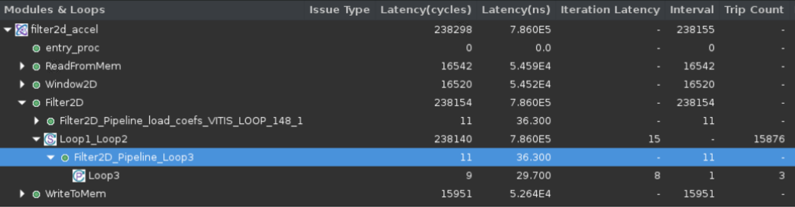

# Achieving the Performance Optimization Goals from Micro Perspective

At this point, the developer has created a dataflow architecture with data motion and processing functions intended to sustain the throughput goal of the kernel. The next step is to make sure that each of the processing functions are implemented in a way that deliver the expected throughput.

- Enable Pipelining with II = 1 (Tasks parallelism)
- Scaling/Unroll (Data Parallelism)
- Maximize Memory efficiency

Looking back to the convolution filter example, When a loop or function is pipelined, any loop in the hierarchy below the loop or function being pipelined must be unrolled. The level at which **PIPELINE** directive is placed in a nested loop affects the unroll factor of the entire loop. The unroll factor of the loop affects the throughput and latency of the overall design. So these issues have to be addressed from the top down.

Run the teaching optimized HLS application to measure performance as follows:

```bash
cd /BEST_PRACTICE_REPO_PATH/src/opt_128
vitis_hls -f script.tcl

```

## Step 1: Scaling/Unroll - Determine the Unroll factor

#### **Question1**: How to calculate the unroll factor? How many MACs should be processed within one clock cycle?

**Answer**: The unroll factor of the inner loop determines how many MACs are computed in a cycle, and the MACs per cycle is closely related to the throughput of the design. Therefore, it is generally necessary to determine the unroll factor according to the target throughput.

#### **Question2**：What if the unroll factor is set to the maximum and still does not meet the throughput requirements?

**Answer**: This can be done by increasing hardware $F_{MAX}$ or increasing the number of kernel to further improve throughput.

As can be seen from the following table, for single-channel image data source, under the premise that the HLS kernel can be designed to reach the frequency of 300Mhz, the unroll factor should be at least 9 to achieve the throughput target with only one computing unit. For the 3-channel image data source without compression conversion, three HLS kernel computing units are needed for parallel computation.

<table border="0" width="100%">
    <tbody>
        <tr>
		    <td height="20">
                <strong> MACs per Cycle  </strong>
            </td>
            <td height="24">
                <strong> Number of Computing Units</strong>
            </td>    
            <td height="24">
                <strong> Hardware Fmax </strong>
            </td>
            <td height="24">
                <strong> Throughput (MPixels/s)  </strong>
            </td>
            <td height="24">
                <strong> Target Throughput (MB/s)</strong>
            </td>
            <td height="24">
                <strong> DDR Bandwidth (MB/s) </strong>
            </td>
        </tr>
        <tr>
            <td height="24">
            9
            </td>
            <td>
            3
            </td>
            <td>
            300
            </td>
			<td>
			300*3=900
			</td>
            <td>
			1920*1080*60*3=373.2
			</td>
            <td>
			11381
			</td>
        </tr>
</table>

## Step 2: Enable Pipelining with II = 1

### **Question1**: At what level of the nested loop should PIPELINE directive be placed?

**Answer**: There are multiple locations where this function can be pipelined. Let's take the four-level loop in the filter2D function to illustrates the tradeoff of placing PIPELINE directive at each of these locations which helps to explain the best location to place the pipeline directive.

```C++
    Loop1: for (int y = 0; y < (height-2); y++)
    {
        Loop2:for (int x = 0; x < (width-2); x++)
        {
            // Read a 2D window of pixels
            window w = window_stream.read();
            // Apply filter to the 2D window
            int sum = 0;
            Loop3: for(int row=0; row<FILTER_V_SIZE; row++)
            {
                Loop4: for(int col=0; col<FILTER_H_SIZE; col++)
                {
                	DTYPE pixel;
                    pixel = w.pix[row][col];
                    sum += pixel*coeffs[row][col];
                }
            }
            pixel_stream.write(sum);
        }
    }
```

#### **Function Level:**

All loops in the hierarchy below this Level must be unrolled which means at a price of much resources. This is a requirement for pipelining; namely, there cannot be sequential logic inside the pipeline. In the filter2D function, it is also impractical to place the pipeline directive at the Function level when the two loops need to be optimized separately for II = 1.

#### **Loop1 Level:**

The logic in Loop1 processes an entire row of the two-dimensional matrix. Place PIPELINE in Loop1 seeks to process one row in each clock cycle. This would unroll the loops below and create additional logic. If you put the pipeline directive in this level, the following

```
WARNING: [HLS 200-880] The II Violation in module 'Filter2D_Pipeline_Loop1' (loop 'Loop1'): Unable to enforce a carried dependence constraint (II = 125, distance = 1, offset = 1) between fifo read operation ('window_stream_read_125', filter2d.cpp:166) on port 'window_stream' (filter2d.cpp:166) and fifo read operation ('window_stream_read', filter2d.cpp:166) on port 'window_stream' (filter2d.cpp:166).

```

This message informs you that a carried dependency between the reads inhibits the synthesis process from scheduling the accesses to achieve an II = 1. The issue: in the code lines indicated, the module attempts to access the stream window_stream 126(width-2) times in the same clock cycle. Because this is impossible in a stream (which represents a single port of a memory/FIFO construct), synthesis fails to meet the set constraints.


#### **Loop2 Level:**

he logic in Loop2 processes one element from the arrays. This would unroll all the operations in Loop3 and Loop4. II = 1 can be achieved at the cost of FILTER_V_SIZE * FILTER_V_SIZE number of DSPs. This cost is acceptable and it takes one cycle to complete one element of the input **window_stream**.


#### **Loop3 Level:**

Pipelining this Level would perform each operation in one clock cycle. It takes FILTER_V_SIZE clocks for an element in the array. This will result in a very slow data processing rate.


#### **Loop4 Level:**

Pipelining this Level would perform each operation in one clock cycle. It takes FILTER_V_SIZE * FILTER_V_SIZE clocks for an element in the array. This will result in a very slow data processing rate.


From the above analysis, Loop3 and Loop4 have to be fully unrolled to achieve the unroll factor of 9. The ideal location for the pipeline in this example is **Loop2**. At the same time, the HLS complier make it to the shortest latency at this position as the position of Level1 introduces II violation.

### **Question2**: How to deal with pipeline dependency?

When there is no pipeline directive, the execution is sequential so there are no dependencies to take into account. But when the design has been pipelined, the tool needs to deal with the same dependencies as found in processor architectures for the hardware that Vitis HLS generates. Please refer to the [Managing Pipeline Dependencies](https://docs.xilinx.com/r/en-US/ug1399-vitis-hls/Managing-Pipeline-Dependencies) for more details.

The Line Buffer movement loop illustrates false dependencies. False dependencies are dependencies that arise when the compiler is too conservative. These dependencies do not exist in the real code, but cannot be determined by the compiler. These dependencies can prevent loop pipelining.

```C++
// Shift pixels in the column of pixels in the line buffer, add the newest pixel
    for(int i = 0; i < FILTER_V_SIZE-1; i++) {
        LineBuffer[i][col_ptr] = LineBuffer[i+1][col_ptr];
     }
     LineBuffer[FILTER_V_SIZE-2][col_ptr] = new_pixel;
```

In the above code, the read and write accesses to the LineBuffer array are to two different addresses in the same loop iteration. Both of these addresses can point to any individual element of the LineBuffer array. Because of this, Vitis HLS assumes that both of these accesses can access the same location. As a result, it schedules the read and write operations to the array in alternating cycles, resulting in a loop II of 2. However, the code shows that LineBuffer[i][col_ptr] and LineBuffer[i+1][col_ptr] can never access the same location. It will lead to false intra dependency.
And the write operation of LineBuffer[FILTER_V_SIZE-2][col_ptr] can lead to false inter dependency too.

To solve this issue, array partition directive should be used to increase the data bandwidth fist. HLS can [automatically partition](https://docs.xilinx.com/r/en-US/ug1399-vitis-hls/Automatic-Array-Partitioning) an array into smaller arrays or individual elements. Then, DEPENDENCE directive should be used to tell the HLS complier about the true data dependency relationship of the LineBuffer array.
The directives should be added as the following lines.

```c
#pragma HLS ARRAY_PARTITION variable=LineBuffer dim=1 complete
#pragma HLS DEPENDENCE variable=LineBuffer inter false
#pragma HLS DEPENDENCE variable=LineBuffer intra false
```

## Step3：Maximize Memory efficiency

### Array Partition

When there is more parallelism, there needs more data bandwidth. HLS can automatically partition an array into smaller arrays or individual elements and provides the following:

- Multiple small memories or multiple registers instead of a large memory
- Effectively increase the read and write ports
- Improve the throughput of the design
- Requires more memory instances or registers

In the convolution filter application, the array partition can be automatically inferred.


---

<p align="center">Copyright© 2024 Advanced Micro Devices</p>
