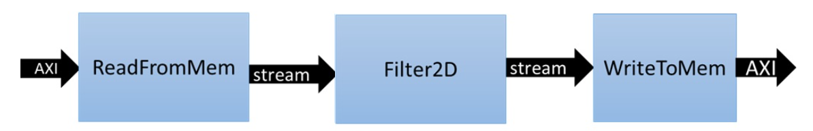
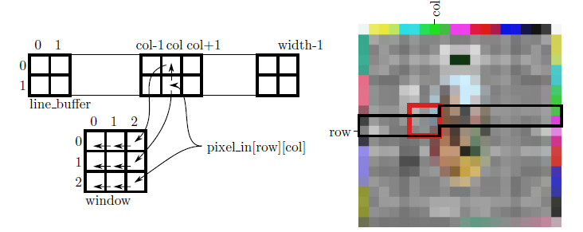
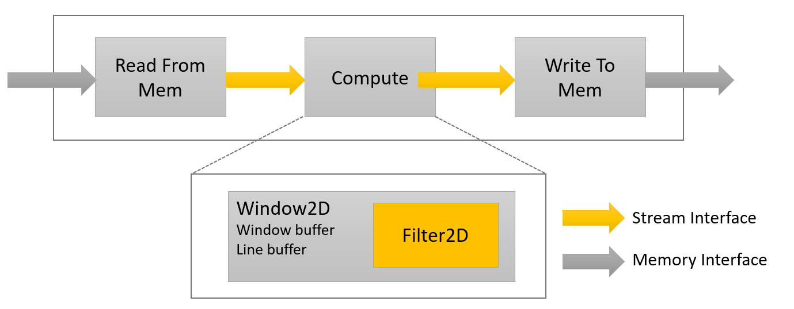
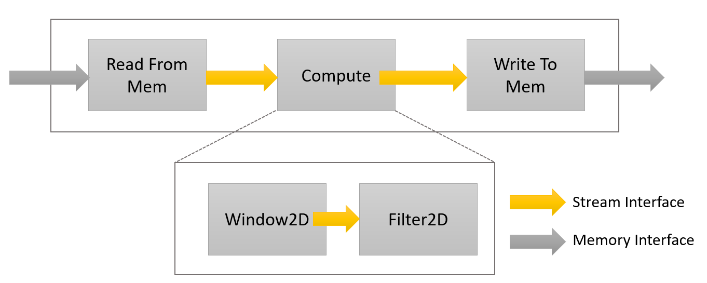
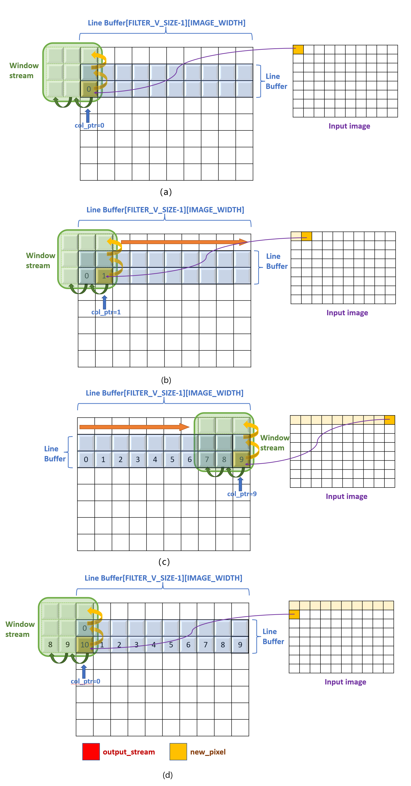
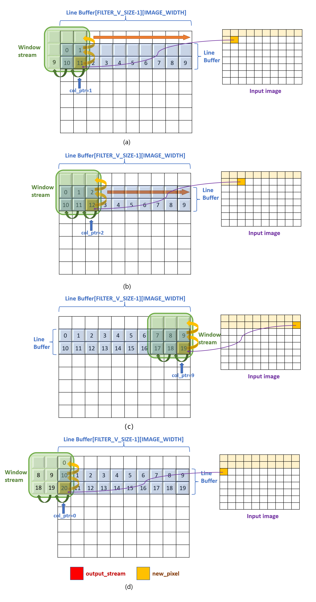
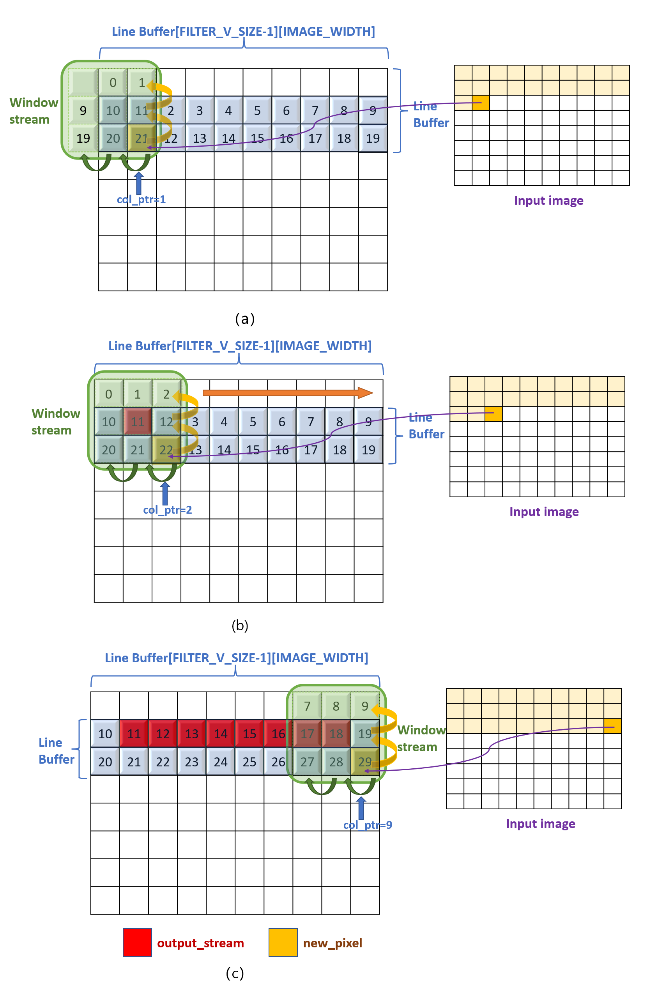
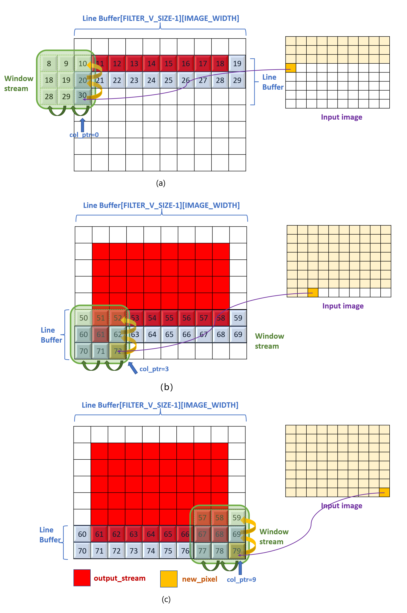

# Partition the Code into a Load-Compute-Store Pattern

The steps of optimize the convolution filter application from macro perspective consists the following:

- Step1: Partition the Code into a Load-Compute-Store Pattern
- Step2: Partition the Compute Blocks into Smaller Function
- Step3: Connect the Load, Compute, and Store Functions

Run the teaching optimized HLS application to measure performance as follows:

```
cd /BEST_PRACTICE_REPO_PATH/src/opt_128
vitis_hls -f script.tcl

```

## Step1: Partition the Code into a Load-Compute-Store Pattern

The load and store functions are responsible for moving data from global memory to kernel and moving data out of the kernel to global memory. Data transfers between the kernel and global memories have a big influence on overall system performance. If not properly done, they will throttle the kernel. Therefore, it is important to optimize the load and store functions to efficiently move data in and out of the kernel and feed the compute function optimally.

To successfully partition the code into a Load-Compute-Store Pattern in order to meet the given the performance constraints, we need to examine the convolution kernel in some detail:

1. The core compute is done in a 4-level nested loop, but you can break it to the compute per output pixel produced.
2. In terms of the output-pixels produced, it is clear from the filter source code that a single output pixel is produced when the inner two loops finish execution once.
3. These two loops are essentially doing the sum-of-product on a coefficient matrix and image sub-matrix. The matrix sizes are defined by the coefficient matrix, which is $3 \times 3$. The inner two loops are performing a dot product of size $9\  (3\times3)$. In other words, the two inner loops perform 9 multiply-accumulate (MAC) operations for every output pixel produced.
4. Loading the data from interface into the coefficient matrix and image sub-matrix should be separated from the nested loop.

One of the key advantages of custom design hardware accelerators, for which FPGAs are well suited, is the choice and architecture of custom data movers. These customized data movers facilitate efficient access to global device memory and optimize bandwidth utilization by reusing data. Specialized data movers at the interface with main memory can be built at the input and output of the data processing engine or processing elements. The convolution filter is an excellent example of this. Looking from a pure software implementation point of view, it seems that to produce a single sample at the output side requires 18 memory accesses at the input side and 1 write access to the output.

```
Memory Accesses to Read filter Co-efficients = 3x3 = 9
Memory Accesses to Read Neighbouring Pixels  = 3x3 = 9
Memory Accesses to Write to Output           = 1
Total Memory Accesses                        = 19
```

For a pure software implementation, even though many of these accesses can become fast because of caching, a large number of memory accesses will be a performance bottleneck. But designing on FPGA allows efficient data movement and access schemes to be easily built. One of the key and major advantages is the availability of substantial on-chip memory bandwidth (distributed and block memory) and the choice of a custom configuration of this bandwidth. This custom configuration choice essentially allows you to create an on-demand cache architecture tailored explicitly for the given algorithm.

In this project, `hls::stream` variable is chosen to pass the data between these functions. Although the address of the input image is not contiguous when the window filter slides over the input image, the line buffer and window buffer caching methods can be used to cache some data at the expense of acceptable amount of on-chip storage.

Two functions at the input and output read and write data from the device's global memory. The **ReadFromMem** function reads data and streams it for filtering. The **WriteToMem** function at the end of the chain writes processed pixel data to the device memory. The input data(pixels) read from the main memory is passed to the **Filter2D** function which can consume the pixel sample in a single cycle to perform MACs.



The **ReadFromMem** function and the **WriteToMem** function have something in common: they both convert data between the AXI memory map interface and the HLS data stream interface, but the data transfer direction is different. Here are three key points to note:

1. The height and width of the image are generally specified by the host side. When they are set as the boundary variables of the loop, HLS tool cannot infer the loop latency when synthesizing. This requires the use of assert statements to determine the maximum boundaries of the image height and width. Alternatively, the HLS Loop Tripcount directive can also be used to specify the maximum loop boundary.
2. While reading and writing pixels into the HLS streaming data, the total length of the data stream is generally specified as the boundary of the loop. The total length of data must be consistent with the actual amount of data transmitted to the computing module, otherwise it is possible to cause  the co-simulation failure.
3. The loop boundary variable can be multiplied by 64 and then divided by 64 to let the compiler know that the total number of pixels read and written is an integer multiple of 64. In this way, the compiler can automatically widen the interface data bit width and enhance data parallelism.

```C++
void ReadFromMem(
        int       width,
        int       height,
    const char        *coeffs,
        hls::stream<char>   &coeff_stream,
    short *src,
        hls::stream<short>     &pixel_stream)
{
    assert(width <= MAX_IMAGE_WIDTH);
    assert(height <= MAX_IMAGE_HEIGHT);

    unsigned num_coefs = 3*3;
//    unsigned num_coefs_padded = (((num_coefs-1)/64)+1)*64; // Make sure number of reads of multiple of 64, enables auto-widening
    read_coefs: for (int i=0; i<num_coefs; i++) {
        unsigned char coef = coeffs[i];
//        if (i<num_coefs)
            coeff_stream.write( coef );
    }

    width = (width/64)*64; // Makes compiler see that width is a multiple of 64, enables auto-widening
    int num_pixels=  height*width;
    unsigned offset = 0;
    unsigned x = 0;
    read_image: for (int n = 0; n < num_pixels; n++) {
        short pix = src[n];
        pixel_stream.write( pix );
     }
}
```

```C++

void WriteToMem(
    int     width,
    int     height,

    hls::stream<short>     &pixel_stream,
    short         *dst)
{
        assert(width <= MAX_IMAGE_WIDTH);
        assert(height <= MAX_IMAGE_HEIGHT);
        int num_pixels = (height-2)*(width-2);

    unsigned offset = 0;
    unsigned x = 0;
    write_image: for (int n = 0; n < num_pixels; n++) {
        short pix = pixel_stream.read();
        dst[n] = pix;
        if (x==(width-3)) x=0; else x++;
    }
}

```

## Step2: Partition the Compute Blocks into Smaller Functions

The figure below illustrates the operation and requirements for a line and Window buffer. Each time through the loop, the window is shifted and filled with one pixel coming from the input and two pixels coming from the line buffer. Additionally, the input pixel is shifted into the line buffer in preparation to repeat the process on the next line. Note that in order to process one pixel each clock cycle, most elements of the window buffer must be read from and written to every clock cycle. The overall scheme (data mover) is built to maximize the data reuse providing maximum parallel data to the processing element.



 The compute Blocks consists of two different functions as follows:

1. **Window2D**:

   1. The line buffer is used to buffer multiple lines of a full image, and specifically, here it is designed to buffer FILTER_V_SIZE - 1 image lines. Where FILTER_V_SIZE is the height of the convolution filter. The total number of pixels held by the line buffer is (FILTER_V_SIZE-1) * MAX_IMAGE_WIDTH.
   2. The Window buffer holds FILTER_V_SIZE * FILTER_H_SIZE pixels. The 2-D convolution filtering operation consists of centering the filtering mask (filter coefficients) on the index of output pixel and calculating the sum-of-product(SOP).
2. **Filter2D**: The filter 2D block performs the core kennel filtering algorithm.

In the traditional software development process, when we analyze the requirements of an algorithm and partition them into smaller functions, it is easy to use recursive, nested pattern to optimize algorithms. As shown in the figure below, some HLS developers will separate out the core compute unit for optimization, but in a nested way into the main function.



The code below illustrates how filter2D is included as a sub function within the Window2D function.

```C++
void Window2D(
    short       width,
    short       height,
    hls::stream<short>     &pixel_in_stream,
    hls::stream<short>     &coeff_stream,
    hls::stream<short>     &pixel_out_stream)
{
    short window[3][3];
    short kernel[3][3];
    short line_buffer[2][MAX_WIDTH];

i_loop: for (int i = 0; i < 3; i++) {
    j_loop: for (int j = 0; j < 3; j++) {
        kernel[i][j]=coeff_stream.read()；
    }

row_loop: for (int row = 0; row < MAX_HEIGHT; row++) {
    col_loop: for (int col = 0; col < MAX_WIDTH; col++) {
        rgb pixel window[3][3];

            short new_pixel = pixel_stream.read()；

            for(int i = 0; i < 3; i++) {
                window[i][0] = window[i][1];
                window[i][1] = window[i][2];
            }

            window[0][2] = (line_buffer[0][col]);
            window[1][2] = (line_buffer[0][col] = line_buffer[1][col]);
            window[2][2] = (line_buffer[1][col] =  new_pixel);

            if(col>1 || row >1)
            short pixel_out= filter_2D(window,kernel);
            pixel_out_stream.write(pixel_out);
            }
        }
    }
}

static short filter_2D(short WB[3][3], short K[3][3])
{
#pragma HLS PIPELINE
    int row, col;
    short int out_pix = 0;
    for(row = 0; row < 3; row++)
        for(col = 0; col < 3; col++)
            out_pix += WB[row][col] * K[row][col];

    return (short) out_pix;
}

```

In this way, II of the computing unit can be optimized separately, and the instance can be repeatedly invoked to save computing resources. But this design approach introduces a much larger latency than decomposing it into a sequence of smaller sub-functions. As discussed in the interface best practice section, We have already used the dataflow architecture for reading and writing data, so it would be more reasonable to split the calculation part into sub functions and link all the modules using the stream interfaces shown in the following figure, the window2D and the filter2D function are connected using the hls::stream objects.

With the following block diagram in mind, the next step is to understand how to customize data movers within the compute blocks using `hls::stream` object. The most challenging part is how to feed the input pixels stream into the line buffer and the window buffer of the WIndow2D function. Then, after a series of cache and data shifting operations, the convolution calculation matrix data can be pass on to the filter2D module in the form of streaming data.



The use of streaming interface means that such data movement cannot be mapped using the traditional two-dimensional array addressing method. The data flow between the LOAD function and the filter2D functions forms the relationship between producer and consumer. This relationship determines that the data will be read only once from the consumer, and if not properly cached, the data will be permanently lost.

If the data stream of the input image is described as a water gun, the line buffer is a pool that designed to buffer FILTER_V_SIZE - 1 image lines. When the input image data flows out like water gun water, it has the following two characteristics:

1. The data stream itself does not carry the coordinate features of the data on the original image.
2. Spilled water cannot be gathered up, the data has been read cannot be read twice.

There are two ways to solve this problem:

1. Set a column pointer to confirm the location of the input pixel in the original image, line buffer, and window buffer. This pointer is so important that the data in both buffer will be shifted according to this pointer.
2. Construct a loop with a counter, one pixel is read from the input data stream in each cycle. After each pixel is read, the counter is increased by one. The counter is cleared when all pixels of the entire input image has been read. It is important in the dataflow function to prevent the data stream from reading too much or too little.

***Part1: Window2D***

Before writing down any code, a series of diagrams will be displayed to visualize the mapping conditions between the input image and the line buffer and window buffer. They shows the how the input pixels filling the line buffer and window buffer before the first output pixel arrives.





Below are some considerations and snippets of code that reveal the above image caching process.

1. Construct a loop with a counter to calculate and make sure all pixels of the entire input image has been read.

```C++
unsigned num_iterations = width*height;
    for (int n=0; n<num_iterations; n++) {}
```

2. Static variable Col_ptr is the column pointer created to mark the column coordinates for both line buffer and input image. And update the line buffer column pointer when the pointer reaches the max width of input image.

```C++
    static unsigned col_ptr = 0;
    if (col_ptr==(width-1)) {
        col_ptr = 0;
    } else {
        col_ptr++;
    }
```

3. The input pixel will be placed at the bottom of the line buffer according to the column pointer and at the bottom right of the window buffer.

```cpp
    LineBuffer[FILTER_V_SIZE-2][col_ptr] = new_pixel;
    Window.pix[i][FILTER_H_SIZE-1] = (i<FILTER_V_SIZE-1) ? Line-Buffer[i][col_ptr] : new_pixel;
```

4. Each cycle, the data in the line buffer corresponding to the periodic column pointer will be moved up one row as the yellow arrow in the figure.

```C++
    for(int i = 0; i < FILTER_V_SIZE-1; i++) {
         LineBuffer[i][col_ptr] = LineBuffer[i+1][col_ptr];
     }
```

5. Each cycle, the window buffer moves the data to the left by one column, and the column in the line buffer corresponding to the column pointer will be copied into the rightmost column of the window cache.

```C++
    for(int i = 0; i < FILTER_V_SIZE; i++) {
        for(int j = 0; j < FILTER_H_SIZE-1; j++) {
            Window.pix[i][j] = Window.pix[i][j+1];
        }
        Window.pix[i][FILTER_H_SIZE-1] = (i<FILTER_V_SIZE-1) ? Line-Buffer[i][col_ptr] : new_pixel;
    }
```

Let's look at the following diagrams below and think about what key points need to be added to the code as output data starts to be written out.




1. The output 2D window buffer should be defined as a `hls::stream` object.

```C++
struct window {
    short pix[FILTER_V_SIZE][FILTER_H_SIZE];
};
```

7. Because this design assumes that the bounding box has no output. Therefore, you need to set up a if-else statement to analyze whether the output condition is met and Write output only when enough pixels have been read the buffers and ramped-up.

```C++
    unsigned ramp_up = width*(FILTER_V_SIZE-1)+(FILTER_H_SIZE-1); //258
    if (n >= ramp_up && col_ptr>1) {
        window_stream.write(Window);
    }
```

**TIPS:** If there is a design that needs to pad zero in the output bounding box or around the input data, it is necessary to modify or add the lines of boundary condition judgment here.

***Part2: Filter2D***

The filter2D function is well understood in principle. Its core calculation is the the accumulation of 2D matrix from the convolution parameter data stream and the window buffer data stream.

1. Load the coefficients into local storage:

Because the convolution parameters remain unchanged during the filtering of the entire image and are passed through the hls::stream interface, the filtering parameters need to be read only once.

```C++
    load_coefs: for (char i=0; i<FILTER_V_SIZE; i++) {
        for (char j=0; j<FILTER_H_SIZE; j++) {
            coeffs[i][j] = coeff_stream.read();
        }
    }
```

2. Read a 2D window of pixels and apply filter to the 2D window.

It is necessary to build a four-level loop for 2D window filtering on 2D images. How to insert the pipeline directive of this four-level loop is a typical issue for optimizing performance and reducing latency in HLS tools, which will be discussed in the next section.

```C++
    apply_filter: for (int y = 0; y < (height-2); y++)
    {
        for (int x = 0; x < (width-2); x++)
        {
            // Read a 2D window of pixels
            window w = window_stream.read();
            // Apply filter to the 2D window
            int sum = 0;
            for(int row=0; row<FILTER_V_SIZE; row++)
            {
                for(int col=0; col<FILTER_H_SIZE; col++)
                {
                    DTYPE pixel;
                    pixel = w.pix[row][col];
                    sum += pixel*coeffs[row][col];
                }
            }
            pixel_stream.write(sum);
        }
    }
```

## Step3: Connect the Load, Compute, and Store Functions

At this point, the developer has created the top-level function of the kernel, coded the interfaces and the load/store functions with the objective of moving data through the kernel at the desired throughput.

```C++
void filter2d_accel(
        const char kernel[9],
        int height,
        int width,

        DTYPE src[MAX_IMAGE_WIDTH*MAX_IMAGE_HEIGHT],
        DTYPE dst[(MAX_IMAGE_WIDTH-2)*(MAX_IMAGE_HEIGHT-2)]
)
{
#pragma HLS INTERFACE mode=m_axi bundle=msrc depth=16384 port=src //bundle=IMG
#pragma HLS INTERFACE mode=m_axi bundle=mdst depth=15876 port=dst //bundle=IMG

#pragma HLS DATAFLOW

    // Stream of pixels from kernel input to filter, and from filter to output
    hls::stream<char,3>      coefs_stream;
    hls::stream<DTYPE,2>      pixel_stream;
    hls::stream<window,3>     window_stream; // Set FIFO depth to 0 to minimize resources
    hls::stream<DTYPE,3>     output_stream;

    // Read image data from global memory over AXI4 MM, and stream pixels out
    ReadFromMem(width, height, kernel, coefs_stream, src, pixel_stream);

    // Read incoming pixels and form valid HxV windowsm
    Window2D(width, height, pixel_stream, window_stream);

    // Process incoming stream of pixels, and stream pixels out
    Filter2D(width, height, coefs_stream, window_stream, output_stream);

    // Write incoming stream of pixels and write them to global memory over AXI4 MM
    WriteToMem(width, height, output_stream, dst);

  }

```

---

<p align="center">Copyright© 2024 Advanced Micro Devices</p>
