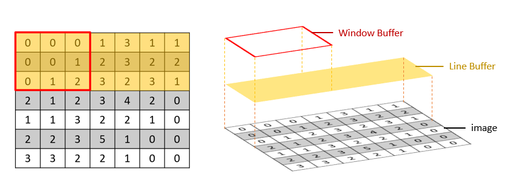

# Part 2.1 Hand-Coded Sobel HLS Kernel to Extract Lena edges

## Step 1: Architecture Optimization

Image processing using FPGAs is a very common industrial application and a very suitable application area for HLS. In this section we will give two Sobel IP designs, a basic implementation based on a simple sliding window, and a more efficient implementation using a window buffer and a line buffer, and you will see how placing some suitable caches will help with the performance improvement.

First, let's look at the basic implementation. One of the most intuitive and simple ideas is to read 9 pixels into memory each time for multiplication and addition, then move one grid and repeat the operation.

#### 1.1 3*3 Convolution Kernel

We first consider the design of the convolution kernel. Since the convolution kernel will be called repeatedly in the computation to perform multiplication and addition, it will be important that the convolution kernel is efficient. The code for the convolution kernel used to compute $G_x$ is as follows.

```cpp
static PIXEL Gradient_X(PIXEL WB[3][3])  
{  
    short int M00 = ((short int)WB[1][0] << 1);  
    short int M01 = ((short int)WB[1][2] << 1);  
    short int A00 = (WB[0][2] + WB[2][2]);  
    short int S00 = (WB[0][0] + WB[2][0]);  
    short int out_pix;  
    out_pix = M01 - M00;  
    out_pix = out_pix + A00;  
    out_pix = out_pix - S00;  
 
    if(out_pix < 0)  
    {  
        out_pix = 0;  
    }  
    else if(out_pix>255)  
    {  
       out_pix = 255;  
   }  
   return (PIXEL) out_pix;  
}
```

The function `Gradient_X` will take a 3x3 two-dimensional array, multiply it and output a pixel value. You will notice that the multiplication sign does not appear inside the function. This is actually a very interesting optimization point, because multiplication in computation is much more expensive to implement than addition or subtraction. Therefore we always try to minimize the appearance of multiplication. Due to the specificity of the values on the convolution kernel, the 0 in the second column can actually be skipped directly from the computation, and the elements in the corresponding positions can be not accumulated. The four +1s and -1s that appear in the convolution kernel also do not need to be multiplied with the elements on the original image. It is enough to subtract the elements corresponding to -1 and add the elements corresponding to +1 when accumulating the results.


For the +2 and -2 that appear in the convolution kernel, it looks like we have to use multiplication. But due to the special nature of their values, we can actually multiply them by shifting them left, i.e. `WB[1][0] << 1` in the code. For example, a pixel value of 16 is converted to 10000 in binary, and after shifting it left by one bit and filling the right side with 0, it becomes 100000, which is 32 in decimal. This method converts multiplication into a shift operation, which is very cheap to implement in the hardware design, because it only requires modifying the connecting lines in the corresponding positions.

For the convolution kernel `Gradient_Y` function used to compute $G_y$, the implementation is consistent except for the position swapping of the individual connecting lines since only the position of the parameters on the convolution kernel is changed, and we will not repeat it.

In the following, we add the results of `Gradient_X` and `Gradient_Y` to get the total gradient at that position and truncate the values that are out of range.

```cpp
static PIXEL sobel3x3_kernel(PIXEL WB[3][3])  
{  
    PIXEL g_x, g_y, sobel;  
    short temp;  
    g_x = Gradient_X(WB);  
    g_y = Gradient_Y(WB);  
    temp = g_x + g_y;  
    if(temp > 255) sobel = 255;  
    else sobel = temp;  
  
    return sobel;  
}  
```

The `sobel3x3_kernel` function already contains operators to extract the gradient for both horizontal and vertical directions. Unlike the above Python implementation where the complete $G_x$ and $G_y$ are obtained successively and then added together (two traversals of the image), the implementation of `sobel3x3_kernel` only requires one traversal of the image. Also, the implementation of `sobel3x3_kernel` does not use any pragma, as it is a simple form of combinatorial logic that does not contain loop control.

#### 1.2 Sliding Window

After completing the `sobel3x3_kernel`, all we need to consider is how to traverse the entire image and "feed" the `sobel3x3_kernel` with the 9 adjacent pixels in turn. The simplest idea is to leave the edge area to get the rectangle in the center of the convolution kernel that needs to be traversed (in the dark red box in the figure below), and then "drag" the center of the convolution kernel (the yellow area in the figure below) to traverse the entire image in turn. When the kernel reaches a new position, it reads the 9 pixel values of the covered area from memory and feeds them to `sobel3x3_kernel` for calculation.


The code is implemented as follows, and mainly contains a four-layer loop structure. The two outer loops are used to traverse the entire image, and the two inner loops are used to extract the nine pixel values sent to the `sobel3x3_kernel`.

You can see that the `LOOP_TRIPCOUNT pragma` statement is used, and the purpose of this statement is to mark the number of loops. This is because for designs with variable loop boundaries, such as this case, the number of loops is passed into the design as a variable. Without manually marking a loop boundary in the pragma, the tool will not be able to give a basic estimate of the computation time during synthesis.

```cpp
void naive_sobel(PIXEL* src, PIXEL* dst, int rows, int cols)  
{  
    int row, col;  
    PIXEL sobel_kernel[3][3];  
    for(row = 0; row < rows+1; row++)  
    {  
#pragma HLS LOOP_TRIPCOUNT min=1 max=720  
        for(col = 0; col < cols+1; col++)  
        {  
#pragma HLS LOOP_TRIPCOUNT min=1 max=1280  
            PIXEL _sobel;  
  
            if(row<=1 || col<=1 || row>(rows-1) || col>(cols-1))  
                _sobel = 0;  
	        else  
	        {  
	            for(int i=0; i<3; i++)  
	            {  
	                for(int j=0; j<3; j++)  
	                {  
	                    sobel_kernel[i][j] = src[(row+i-1)*cols+(col+j-1)];  
	                }  
	            }  
	            _sobel = sobel3x3_kernel(sobel_kernel);  
	       }  
	        if(row>1 && col>1)  
	        dst[(row-1)*cols+(col-1)] = _sobel;  
	    }  
	}  
}  
```

The basic sobel HLS kernel synthesis report is shown as below.


#### 1.3 Read/Write Optimization of Sliding Window

In fact, such a sliding-window design often does not have appreciable performance. A major reason is that the design requires frequent reading of large amounts of data from memory. For example, a single 3\*3 convolution of a standard size 1280\*720 image requires accessing (1278\*718)\*(3\*3) = 8258K pixel values. The more puzzling point is that the whole picture has only 910,000 pixels, but our design has to visit more than 8 million times, so there is a very large space for read/write optimization.


As shown above, the main cause of this problem is redundancy when accessing pixels in memory, where pixels are accessed repeatedly to multiple times. For example, on the first access, the gas pedal accesses the 9 pixels in the red box in the figure. When the next access is made one frame to the right, the 9 pixels in the blue box are accessed, but 6 of these two accesses are duplicated. This is unnecessary to do, and we can reduce the number of visits by storing these 6 pixels locally in the gas pedal.

On the other hand, the gas pedal is also not completely contiguous for each pixel visit. Let's take the example of the visit marked in red. After reading "0, 0, 0" in the first row, the access address needs to be changed to the start of the second row, and then the three pixels "0, 0, 1" are read again, and then the access address is switched to the start of the third row for reading. Such discontinuous data access also affects the performance.

### Step 2: Optimizing Memory Access Using Caching

An important idea for optimizing memory access is the localization of data. Simply put, assuming that our computation needs to access a certain data and its adjacent data before and after each time, we can place a buffer in our design to cache all the relevant data that may be used locally. This way, we can directly access the locally available data during computation, instead of repeatedly reading it into memory.

#### 2.1 Window Buffer and Line Buffer

So how to implement it in the convolution problem? We use both "window buffer" and "line buffer" structures in our optimization, and their basic structure is as follows.



The left side of the figure above shows the basic structure of the window buffer and the line buffer, and the right side shows their relationship. The row buffer sits on top of the image and is intuitively a long cache area that fetches data from memory with some pixels. The window buffer is built on top of the row buffer, and it fetches data from the row buffer. The window buffer here performs the same multiplication and addition of the corresponding positions as the convolution kernel design above, except that when reading the nine numbers, the window buffer does not fetch them directly from memory, but from the gas pedal's local row buffer, and thus has a higher reading efficiency.

#### 2.2 Cache Updating

In the following, let's focus on the usage of window buffer and line buffer, i.e., analyze the process of updating the cache at each step. In the figure below, for example, if we want to perform a 3\*3 convolution on a 7\*7 image, we need a 7\*3 line buffer (yellow area) and a 3\*3 window buffer (red box area), which correspond to a series of registers in hardware.

In step 1, we initialize the line buffer and the window buffer, and fill the line buffer with 2\*7+3 pixels (dark yellow area) from the beginning of the image in succession, so that the first 9 pixels to be processed are actually encapsulated in the line buffer. After that, the 9 pixels in the corresponding position are filled into the window buffer, and then the above multiplication and addition operations are performed.

In step 2, the values of the line buffer and window buffer are updated. If we follow the plain sliding window design above, the window buffer will need to read 9 new pixels into memory. But here, we will only need to read 1 new pixel from memory, which is the pixel "3" in the figure below (the area in step 2 is marked with a blue box). We fill the "3" to the end of the line cache, i.e., the 2\*7+4th element, and the line buffer is updated. At this point, all the pixels needed for the current calculation of the window buffer can be found in the line buffer. It is enough to intercept the data in the line buffer according to the index, without accessing the memory anymore.

The same is true for the later steps. The line buffer reads in a new pixel per step to fill the end. The window buffer in turn shifts right in the row cache and takes 9 pixels from the line buffer to complete the calculation.


Of course, once the line buffer is initially filled, the line buffer is updated not only by filling it with new pixels, but also by throwing away old pixels that are not needed at the end of the queue (consider the concept of "queueing" that you may have learned about). In the figure below, let's take the process from step i to step i+1 as an example. The line buffer will read in a new pixel "2" (marked in blue) and throw out the old pixel "2" (marked in green) at the end of the original queue. Since the line buffer is designed in hardware to store only 3\*7 pixels, the old pixels before that are actually meaningless for our subsequent calculations.


During the update process, the line buffer advances a little bit on the square grid, and the convolution kernel takes values on this line buffer for computation. When the line buffer touches the last pixel at the bottom of the image, the convolutional computation is complete.

#### 2.3 Cache Optimization Comparison

We can compare the results of the cache optimization. The red box represents the pixels currently being processed by the convolutional kernel, and the blue box represents the pixels that will be read next. The number of pixels to be accessed per iteration will drop from 9 to 1, and the total number of pixel accesses will drop from 1278\*718\*9 = 8,258K to 1278\*718 = 921K, a direct drop of one order of magnitude.


#### 3. Full Version of Hand-Coded Sobel HLS Kernel

Here is the full version of sobel operator code optimized for memory access using caching.

```cpp
void sobel(hls::stream<trans_pkt>& src, hls::stream<trans_pkt>& dst, int rows, int cols)
{
	trans_pkt data_p;

	PIXEL _sobel;

	PIXEL LineBuffer[3][WIDTH];
#pragma HLS ARRAY_PARTITION variable=LineBuffer complete dim=1

	PIXEL WindowBuffer[3][3] = {{0,0,0},{0,0,0},{0,0,0}};
#pragma HLS ARRAY_PARTITION variable=WindowBuffer complete dim=0

	ap_uint<13> row, col;
	ap_uint<2> lb_r_i;
	ap_uint<2> top, mid, btm;//line buffer row index

Loop initialing the row buffer:
	for(col = 0; col < cols; col++)
	{
#pragma HLS LOOP_TRIPCOUNT min=1 max=1280
#pragma HLS pipeline
		LineBuffer[0][col] = 0;
		data_p = src.read();
		LineBuffer[1][col] = (PIXEL) data_p.data;
	}

	lb_r_i = 2;
	for(row = 1; row < rows + 1; row++)
	{
#pragma HLS LOOP_TRIPCOUNT min=1 max=720
// Rotate the relative order among LineBuffer
		if(lb_r_i == 2)
		{
			top = 0; mid = 1; btm = 2;
		}
		else if(lb_r_i == 0)
		{
			top = 1; mid = 2; btm = 0;
		}
		else if(lb_r_i == 1)
		{
			top = 2; mid = 0; btm = 1;
		}

		WindowBuffer[top][0] = WindowBuffer[top][1] = 0;
		WindowBuffer[mid][0] = WindowBuffer[top][1] = 0;
		WindowBuffer[btm][0] = WindowBuffer[top][1] = 0;

Loop iterating over images：
		for(col = 0; col < cols; col++)
		{
#pragma HLS LOOP_TRIPCOUNT min=1 max=1280
#pragma HLS pipeline
			if(row < rows)
			{
				data_p = src.read();
				LineBuffer[btm][col] = (PIXEL) data_p.data;
			}
			else
				LineBuffer[btm][col] = 0;
// Update the WindowBuffer
			WindowBuffer[0][2] = LineBuffer[top][col];
			WindowBuffer[1][2] = LineBuffer[mid][col];
			WindowBuffer[2][2] = LineBuffer[btm][col];
			_sobel = sobel3x3_kernel(WindowBuffer);
			WindowBuffer[0][0] = WindowBuffer[0][1];
			WindowBuffer[1][0] = WindowBuffer[1][1];
			WindowBuffer[2][0] = WindowBuffer[2][1];
			WindowBuffer[0][1] = WindowBuffer[0][2];
			WindowBuffer[1][1] = WindowBuffer[1][2];
			WindowBuffer[2][1] = WindowBuffer[2][2];

			if ((row == rows ) && (col == cols - 1))
				data_p.last = 1;
			else
				data_p.last= 0;
			data_p.data = _sobel;
			dst.write(data_p);
		}
		lb_r_i++;
		if(lb_r_i == 3) lb_r_i = 0;
	}
}
```

From the code structure, the four-layer nested loop of the plain implementation becomes two layers. Because only 1 pixel at a time needs to be read into the line buffer, the inner 3\*3 loop is eliminated. We define `LineBuffer[3][WIDTH]` as the line buffer, and the variables `top`, `mid` and `btm` will be used to rotate the relative order between the three lines of the line buffer. The `if-else` branch after the comment `Rotate the relative order among LineBuffer` shows this process. The code after the `Update the WindowBuffer` comment performs the update of the window buffer. Specifically, the left two columns of pixels in the window are moved one frame to the left, and a new column of pixels is raised from the line buffer, filled into the window buffer, and then `sobel3x3_kernel` is performed.

From the pragma point of view, `array partition` completely partitions the two cache data to obtain a high-performance memory array. The `Loop initializing the row buffer` loop is pipelined. The `Loop iterating over images` loop pipelines the operations used to traverse an entire row of pixels in the image, increasing the parallelism of the system. You may have some questions about `hls::stream<trans_pkt>& src, hls::stream<trans_pkt>& dst` in line 1 of the HLS code, which we will cover in the next section.

### Stretch goals

1. Use caching to optimize the computation of multiplying two matrices together.
2. When using a data streaming approach with the convolution filter operation, how many rows are required caching in the line buffer?

---

<p align="center">Copyright© 2024 Advanced Micro Devices</p>
