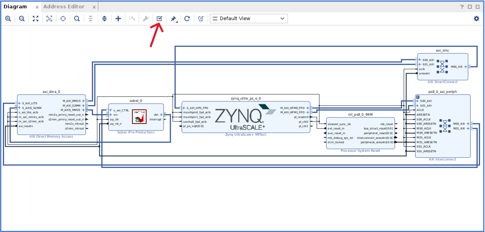

# GUI Flow Tutorial: Implementing Hand-coded Sobel Filter to PYNQ Framework

## Objective

Upon completion of this lab, you should have learned:

- How to build a project using Vitis HLS
- Simulation, synthesis and IP export in Vitis HLS
- Integrating HLS exported IP using Vivado
- Build a simple application using PYNQ

In short, you will learn the basic flow of accelerated core design and deployment to PYNQ using HLS. Due to space limitation, this experiment only introduces the basic tool operation process.

## Environmental equirements

- KV260 remote lab service or physical board
- Vitis HLS 2023.2
- Vivado 2023.2

## Experimental steps

### 1. Design Sobel IP in Vitis_HLS

#### 1.1 Create a new project

1. Open the **Vitis HLS** software and click on **Create Project** to create a new project
2. Enter the project name sobe_opt in **Project name**, click **Browse** to select an appropriate directory location, and click **Next**.

   
3. Click **Add Files... **, add **sobel.hpp** and **sobel_opt.cpp** from **kernel** directory to the project
   ``
4. Click on the **Browse** button in the **Top Function** column, select **sobel**, which is the top-level function when we do the synthesis, and click on **Next**

   
5. Click **Add Files... **, add sobel_tb**.cpp** in **src** directory to the project, click **Next**

   
6. Next, go to the **Solution Configuration** interface.

   1. Keep the other options unchanged, click **...** on the far right of the **Part Selection**.
   2. Click **Boards** and search **KV260** (Kira KV260 Vision Starter Kit SOM).
   3. Select and click **OK**.

   
7. Click **Finish** to complete the creation of the project

#### 1.2 C-Simulation

1. After completing the project creation, **Vitis HLS** jumps to a new interface, which consists of four main parts:

   1. The **Explorer** at the top left, which contains the various files in the project
   2. The **Flow Navigator** at the bottom left, which shows the various parts of the HLS design
   3. The **editor area** at the top right, where developers modify the code of the design
   4. The **Console** at the bottom right contains the console, error messages, version control, etc.

      
2. Next, we perform C simulation on the design.

   1. Click **Run C Simulation** in the **Flow Navigator** at the bottom left.
   2. In the **C Simulation Dialog** window that pops up, make no changes.
   3. Click **OK** for C simulation

      
3. Wait a few seconds, after the simulation is complete **Vitis HLS** automatically opens a log file and you can see that the design has passed the C simulation

   

#### 1.3 C-Synthesis

1. Next, we perform C synthesis on the design. Click on **Run C Synthesis** in the **Flow Navigator** at the bottom left, and in the **C Synthesis - Active Solution** window that pops up, leave the options unchanged and click on **OK** to start synthesis.

   
2. Wait a few seconds and **Vitis HLS** will print the information of its combined steps in **Console**
3. After the synthesis is completed, the **Systhesis Summary(solution1)** window will pop up, where we can see the clock frequency information, the number of clock cycles and resource consumption given by **Vitis HLS** (in different versions of Vitis HLS, the synthesis results may vary and the resource usage estimates are more conservative, the final resource usage should be based on the implementation results)

   

#### 1.4 C/RTL Co-simulation

1. In the following, we perform a C-RTL co-simulation of the design. Click **RUN C/RTL COSIMULATION** in the **Flow Navigator** at the bottom left, keep the options unchanged in the **Co-simulation Dialog** window that pops up, and click **OK** to start the synthesis

   
2. Waiting for about 1 minute, the synthesis time of C/RTL co-simulation is usually longer, after the end of the simulation will pop up **Co-simulation Report(solution1)** window, containing information such as whether to pass the simulation, performance estimation, etc.

   

#### 1.5 Export RTL

1. Next, we perform an RTL export of the design. Click **Export RTL** in the **Flow Navigator** at the bottom left, keep the options unchanged in the pop-up window of **Export RTL**, and click **OK** to start the RTL export

   
2. Wait about half a minute, **Console** prints **Finished Export RTL/Implementation.** indicating that the RTL design has been exported, you can find the exported file in **\kernel\sobel_opt\solution1\impl\export.zip**
3. For subsequent use, please extract the **\fir_hls_prj\solution1\impl\export.zip** file to its directory to get a **\kernel\sobel_opt\solution1\impl\export** folder

   
4. At this point, we have completed the design and export of the **Sobel** acceleration core

### 2. IP Integration in Vivado

#### 2.1 Create a new Vivado project

1. Open the **Vivado** software, click **Create Project**, create a new project, and click **Next**.
2. Enter the project name **sobel_opt** in **Project name** and click **... on the right side. ** button to select a suitable directory location and click **Next**.

   
3. Enter the **Project Type** interface, check the box **Do not specify sources at this time**, then click **Next**.
   
4. Enter the **Default Part** interface, click **Boards**, search for **KV260** in the **Search** field, select it, and click **Next**.

   
5. Click **Finish** to complete the project creation

#### 2.2 Import IP

1. We need to first import the IP exported from **Vitis HLS** into **Vivado** by clicking on the **Settings** option in the left window **Flow Navigator** to bring up the **Settings** window
2. Expand the **IP** column in the **Project Settings** on the left, select the **Repository** item, click the **+** button in the right panel, select the IP you just extracted in the pop-up window, i.e. **\sobel_opt\solution1\impl\export**, and then click **Select**.

   
3. You can see that the corresponding IP has been successfully added to the project, click **OK** in both windows in turn to close these windows.

#### 2.3 Create a Block Design

1. Here we create a **Block Design** to build the complete system using the IP integration feature of **Vivado**. Click **IP INTEGRATOR > Create Block Design** in the **Flow Navigator** on the left, leave the options unchanged in the **Create Block Design** pop-up window, use the default **design_1** for the design name, and click **OK** to create the **Block Design**

   
2. Click the **+** button at the top of the **Diagram** window that appears, a search box will pop up, type **mpsoc** in the input field and double click on the **Zynq UltraScale+ MPSoC** that appears in the backup options to add the IP to the design

   
3. At the top of the window will appear a blue underline prompt **Run Block Automation**, click on the area to pop up the corresponding window, we keep the default settings unchanged, directly click **OK**

   
4. Next, we need to configure the above **Zynq UltraScale+ MPSoC** by adding an **HP** port

   - Double-click the **zynq_ultra_ps_e_0** module in the **Diagram** to bring up the **Re-customize IP** window.
   - Select the **PS-PL Configuration** page in the **Page Navigator** on the left, expand the **Slave Interface** -> **AXI HP** in the options on the right, and check the **AXI HP0 FPD** option.
   - Click **OK**.

   
5. Click on the **+** button at the top of the Diagam window and search for **Sobel**, you can see that the IP we just imported is already available, double click on **Sobel** to add it to the design.

   
6. Here we perform the automatic connection of the design.

   1. Click on the blue underlined prompt **Run Connection Automation** at the top of the window to bring up the corresponding window.
   2. Check the **All Automation** option on the left.
   3. Click **OK**.

   
7. The system will automatically connect according to the corresponding interface, we can get the following design.
8. Click the **+** button at the top of the **Diagram** window that appears, a search box will pop up, type **dma** in the input field and double click on the **AXI Driect Memory Access** that appears in the backup options to add the IP to the design

   
9. Next, we need to configure the above **AXI DMA**

   1. Double-click the **axi_dma_0** module in the **Diagram** to bring up the **Re-customize IP** window.
   2. Uncheck **Enble Scatter Gather Engine**.
   3. Adjust the **Width of Buffer Register (8-26)** to **26** bits.
   4. Check **Enable Read Channel** and **Enable Write Channel**.
   5. Change **Read Channel--Stream Data Width** to **8**.
   6. Click **OK**.

   
10. Here you need to connect 2 wires manually.

    1. Connect **dst** of **sobel_0** to **S_AXIS_S2MM** of **axi_dma_0**.
    2. Connect **src** of **sobel_0** to **M_AXIS_MM2S** of **axi_dma_0**.
       
11. Here we perform the automatic connection of the design.

    1. Click on the blue underlined prompt **Run Connection Automation** at the top of the window to bring up the corresponding window.
    2. Check the **All Automation** option on the left.
    3. Click **OK**.
    4. Repeat the above steps until no more occurrences of **Run Connection Automation** appear.

    
12. Click on the tick icon **Validate Design** in the toolbar on the top side of **Diagram** to validate the design. If validation successful, it will show a pop-up window, then click **OK**.
    
    
13. Here we will create HLD Warpper of our block design.

    1. Right click on the **Source > Design Sources > design_1** option on the left and select **Creat HDL Warpper...**.
    2. In the following pop-up window, choose **Let Vivado manage the warpper and auto-update**, and click **OK**.
       

#### 2.4 Synthesis and generation of bitstreams

1. Click **Generate Bitstream**, and in the following pop-up window, click **Yes**.

   
2. Wait until Vivado fininsh synthesis, implementation and generating bitstream. When finished, the **Bitstream Genreation Completed** window will pop up, click **Cancel**.

   
3. At this point, we have completed the design and export of the hardware part.

### 3. Build PYNQ design

#### 3.1 Extract bit and hwh files

1. Visit the **overlay\sobel_opt\sobel_opt.runs\impl_1** directory in the file manager, the **design_1_wrapper.bit** file in that directory is the generated bitstream file, copy it to your own folder to save it and rename it to **sobel_opt.bit**

   
2. In the file manager, access the **\overlay\sobel_opt\sobel_opt.gen\sources_1\bd\design_1\hw_handoff** directory, where **design_1.hwh** is the **hardware handoff** file we need Copy it to your own folder and rename it to **sobel_opt.hwh**.

   

#### 3.2 Visit Jupyter

1. Please complete the PYNQ Remote Lab account registration and **Jupyter** access first
2. Login to the **Jupyter** interface, click the **upload** button at the top right of the interface, and upload the following files and folders to the development board

   - **image/**, **sobel_all.ipynb** in the **sobel/notebook** directory.
   - The **fir.bit** and **fir.hwh** files obtained in the previous step.

   

#### 3.3 Deploy and run Overlay

1. Go to the **sobel_all.ipynb** page in **Jupyter** and **Kernel** is automatically loaded with the word **Python3**
2. Click the **Run** button on the top side of the window, **Jupyter Notebook** will execute the current **Cell** and automatically switch to the next **Cell** at the same time

   
3. Just click **Run** in order to finish, the meaning of each code block has been marked in **Jupyter Notebook**, please read the information in **Jupyter Notebook** to continue to complete the experiment.

---

Copyright© 2024 Advanced Micro Devices

